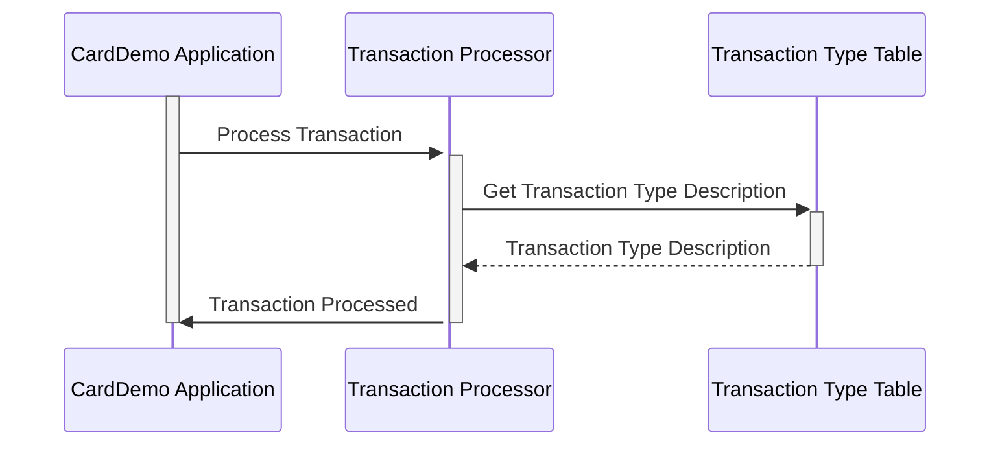

Generated at: 1st October of 2024

**Title Document:** CardDemo Transaction Type Data Structure Specification

**Summary Description:** 
This document outlines the structure and purpose of the `TRAN-TYPE-RECORD` data structure within the CardDemo application. This structure is crucial for categorizing and describing different types of credit card transactions, ensuring accurate processing and reporting.

**User Stories:** 
As a data analyst, I need to easily identify and understand the types of credit card transactions being processed so I can perform accurate analysis and reporting.

**Related Epic:** 4 - Transaction Processing

**Functional Requirements:**
- The system shall define a standard data structure (`TRAN-TYPE-RECORD`) for storing transaction type information.
- The data structure shall include a two-character code (`TRAN-TYPE`) to represent the transaction type.
- The data structure shall include a descriptive label (`TRAN-TYPE-DESC`) for the transaction type.

**Non-Functional Requirements:**
- N/A

**Acceptance Criteria:**
- The `TRAN-TYPE-RECORD` data structure is defined in the system.
- Each defined transaction type has a unique two-character code and a descriptive label.
- The system uses the `TRAN-TYPE-RECORD` structure to categorize and store transaction type information.

**Code Improvements:**
- Add inline comments to clarify the purpose and usage of each field in the data structure.
- Create a separate program or module to manage the list of transaction types and their corresponding codes and descriptions. This would improve maintainability and reduce the risk of errors.

**Security Improvements:**
- N/A

**Conceptual Diagram:**

--Made by "Smart Engineering" (by Compass.UOL)--