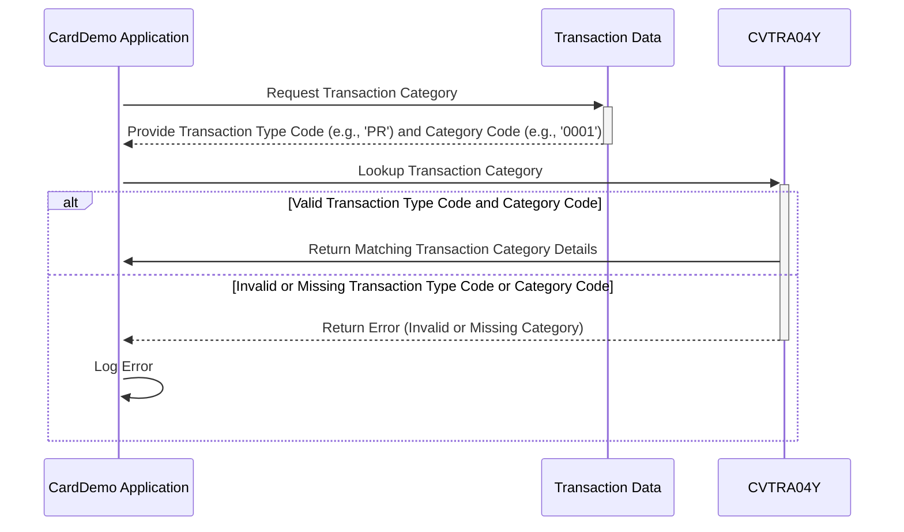

Generated at: 1st October of 2024

# **Title Document:** CardDemo Transaction Category Data Structure Specification

# **Summary Description:**
This document describes the data structure used by the CardDemo application to categorize credit card transactions. This categorization is essential for accurate reporting and analysis of transaction data.

# **User Stories:**
As a data analyst, I need to ensure that all transactions are consistently categorized so I can generate accurate reports and perform meaningful analysis on transaction trends.

# **Related Epic:**
4 - Transaction Processing

# **Functional Requirements:**
- The system shall provide a standardized structure to define and store information about different transaction categories.
- Each transaction category shall be uniquely identified by a combination of a two-character Type Code and a four-digit Category Code.
- Each transaction category shall have a clear and concise description to facilitate understanding and reporting.
- The system shall ensure that each transaction is associated with a valid transaction category.

# **Non-Functional Requirements:**
- **Performance:** The transaction categorization process should be efficient and not impact the overall performance of the system.
- **Maintainability:** The data structure should be easily maintainable and extensible to accommodate new transaction categories as needed.
- **Usability:** The category codes and descriptions should be easy to understand for users who are not familiar with the technical details of the system.

# **Acceptance Criteria:**
- The system successfully categorizes transactions based on the defined Type and Category Codes.
- Each transaction category has a unique combination of Type Code and Category Code.
- All transaction categories have clear and concise descriptions.
- The system handles invalid or undefined transaction categories gracefully and logs appropriate error messages.

# **Code Improvements:**
- Implement data validation checks to ensure that the Type Code and Category Code values are within the defined ranges and formats.
- Add error handling logic to gracefully handle situations where a transaction cannot be categorized due to missing or invalid category information.
- Create a separate module or class to encapsulate the transaction category data structure and related functionalities.
- Provide comprehensive documentation for the data structure and its usage.

# **Security Improvements:**
- Implement access control mechanisms to restrict unauthorized modifications to the transaction category data.
- Log all changes made to the transaction category data for auditing purposes.
- Regularly review and update the transaction category definitions to ensure they align with the latest business requirements and security standards.

# **Conceptual Diagram:**

--Made by "Smart Engineering" (by Compass.UOL)--