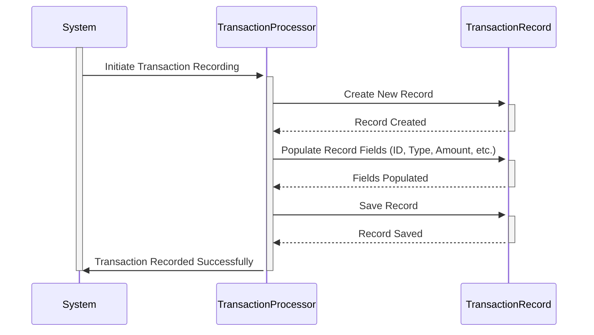

Generated at: 1st October of 2024

# **Title Document:** Credit Card Transaction Record Specification

# **Summary Description:**
This document outlines the data structure for recording individual credit card transactions within a COBOL-based financial system. It aims to ensure uniformity and consistency in how this information is captured and stored.

# **User Stories:**
As a financial analyst, I need a standardized format for recording transaction details so that I can accurately analyze spending patterns, identify trends, and generate comprehensive reports.

# **Related Epic:**
4 - Transaction Processing

# **Functional Requirements:**
- The system shall support a variety of transaction types, each identified by a unique two-character code (e.g., "SA" for Sale, "CR" for Credit).
- Each transaction record shall include a detailed breakdown of the merchant involved, including their unique ID, name, city, and ZIP code.
- The system shall accurately record the monetary value of each transaction, capturing the amount with two decimal places for precision.
- Each transaction record shall be time-stamped to indicate both the original transaction time and when it was processed by the system.

# **Non-Functional Requirements:**
- **Performance:** The system should be able to process and store a high volume of transaction records efficiently without impacting overall system performance. 
- **Data Integrity:** The system should enforce data validation rules to ensure the accuracy and consistency of transaction data (e.g., valid date formats, mandatory fields).
- **Auditability:** All transaction records should be readily accessible for auditing purposes, with clear traceability back to the source of the transaction.

# **Acceptance Criteria:**
- The system can successfully record a new transaction with all required data fields accurately populated.
- The system enforces data validation rules, rejecting transactions with invalid or missing data.
- Transaction records can be easily retrieved and filtered based on criteria such as date range, transaction type, or card number.

# **Code Improvements:**
- **Error Handling:** Implement more robust error handling to gracefully manage scenarios such as invalid data inputs or system failures during transaction processing.
- **Code Comments:**  Add clear and concise comments within the COBOL code to explain the purpose and functionality of different data fields and sections.

# **Security Improvements:**
- **Data Encryption:** Explore encrypting sensitive data within the transaction record, such as the credit card number, to protect it from unauthorized access.
- **Access Control:** Implement strict access control measures to ensure that only authorized personnel can view, modify, or delete transaction records.

# **Conceptual Diagram:**

--Made by "Smart Engineering" (by Compass.UOL)--