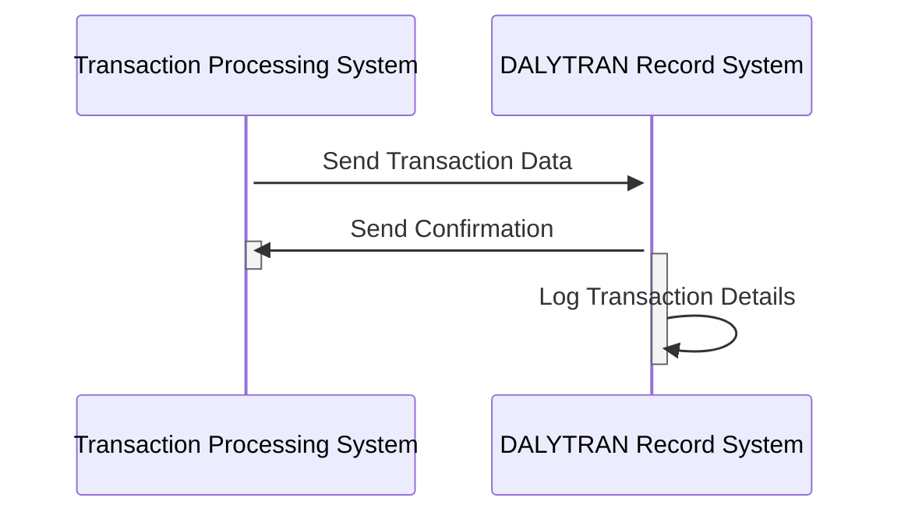

Generated at: 1st October of 2024

# **Title Document:** Card Transaction Record Specification

# **Summary Description:**
This document outlines the structure and data elements of the Daily Transaction Record, which captures comprehensive information for each credit card transaction, ensuring organized data for processing, analysis, and reporting.

# **User Stories:**
As a data analyst, I need to ensure that all credit card transactions are accurately logged and categorized so I can perform meaningful analysis on spending patterns, merchant activity, and potential fraud.

# **Related Epic:** 
4 - Transaction Processing

# **Functional Requirements:**
- The system shall record each credit card transaction with a unique ID, transaction type code, category code, source, description, amount, merchant details (ID, name, city, ZIP), card number, and timestamps for initiation and processing.
- The system shall validate the uniqueness of each transaction ID to prevent duplication.
- The system shall ensure that transaction type and category codes adhere to predefined values to maintain data consistency.

# **Non-Functional Requirements:**
- **Security:** The system shall encrypt sensitive data, including credit card numbers, to protect against unauthorized access. Access to transaction records shall be restricted to authorized personnel.
- **Performance:** The system shall handle a high volume of transactions efficiently, ensuring timely recording and retrieval of data.
- **Availability:** The system shall be available 24/7 with minimal downtime to support real-time transaction processing.
- **Auditability:** The system shall log all actions related to transaction records for auditing and tracking purposes.

# **Acceptance Criteria:**
- The system successfully records all credit card transactions with complete and accurate information.
- The system prevents duplicate transaction records based on the unique transaction ID.
- The system enforces data validation rules for transaction types and category codes.
- The system protects sensitive data through encryption and access control mechanisms.
- The system exhibits satisfactory performance in handling a high volume of transactions.

# **Code Improvements:**
- Implement data validation checks for all fields within the DALYTRAN-RECORD to ensure data integrity.
- Incorporate error handling mechanisms to gracefully manage unexpected events during transaction recording.
- Add comprehensive logging to track all actions and events related to transaction records.
- Explore performance optimization techniques, such as indexing or data partitioning, to enhance efficiency.

# **Security Improvements:**
- Implement strong encryption algorithms for sensitive data, both in transit and at rest.
- Enforce strict access control measures based on user roles and permissions.
- Regularly audit the system for security vulnerabilities and implement necessary patches.

# **Conceptual Diagram:**

--Made by "Smart Engineering" (by Compass.UOL)--