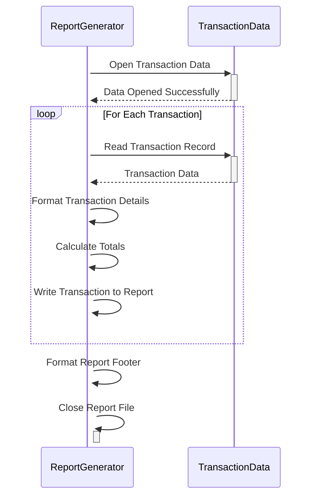

Generated at: 1st October of 2024

**Title Document:** Card Transaction Report Layout Specification

**Summary Description:** This document defines the layout of a transaction report for a credit card system, detailing how transaction data should be organized and presented.

**User Stories:** As a data analyst, I need a standardized transaction report so I can analyze daily transaction patterns, identify trends, and generate insights for business decisions.

**Related Epic:** 5 - Reporting and Analytics

**Functional Requirements:**
1. **Report Header:** The report must include a header section displaying:
    - Report Title: "Daily Transaction Report"
    - Date Range: The start and end dates of the transactions covered in the report.
2. **Transaction Details:** Each transaction record in the report must contain the following details:
    - Transaction ID: Unique identifier for each transaction.
    - Account ID: The account associated with the transaction.
    - Transaction Type: Code and description of the transaction type (e.g., purchase, payment, withdrawal).
    - Category: Code and description of the transaction category (e.g., dining, travel, entertainment).
    - Transaction Source: The channel through which the transaction was made (e.g., online, POS terminal, ATM).
    - Amount: The monetary value of the transaction.
3. **Column Headers:**  The report should have clear and concise column headers for each data field in the transaction details section.
4. **Totals:** The report must calculate and display totals at three levels:
    - Page Total: The sum of transaction amounts on each page.
    - Account Total: The sum of transaction amounts for each unique account.
    - Grand Total: The sum of all transaction amounts in the report.

**Non-Functional Requirements:**
1. **Readability:** The report should be easy to read and understand, using appropriate formatting, alignment, and spacing.
2. **Accuracy:** All calculations in the report, including page totals, account totals, and the grand total, must be accurate and consistent with the transaction data.
3. **Consistency:** The report format should be consistent across different report generations, ensuring uniformity for analysis and comparison.

**Acceptance Criteria:**
- The generated report accurately reflects the defined layout, including all required header information, transaction details, and totals.
- The report is generated in a timely manner upon request or trigger.
- All data in the report is accurate and consistent with the source transaction data.
- The report's formatting and layout enhance readability and facilitate easy analysis of transaction data.

**Code Improvements:**
- Implement a logging mechanism to track report generation events, including timestamps, user IDs, and any errors encountered.
- Introduce error handling to gracefully manage scenarios where data is missing or invalid, preventing report generation failures.
- Add comments to the code to explain the purpose and logic of different sections, improving code maintainability.

**Security Improvements:**
- Implement access controls to restrict report generation and viewing to authorized personnel only.
- If the report contains sensitive data, consider incorporating data masking or encryption techniques to protect sensitive information.
- Maintain an audit trail of report access and generation activities to ensure accountability and track potential unauthorized access.

**Conceptual Diagram:**

--Made by "Smart Engineering" (by Compass.UOL)--