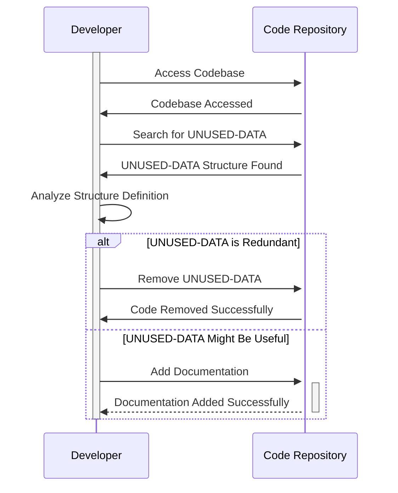

Generated at: 1st October of 2024

# **Title Document:** UNUSED-DATA Structure Specification

# **Summary Description:**
This document describes a data structure named `UNUSED-DATA` found within the CardDemo application's codebase. The structure appears to be a remnant from a previous version and is not actively used in the current system. 

# **User Stories:**
As an Application Developer, I need to understand the purpose and relevance of all data structures in the codebase, including those marked as unused, to maintain code clarity and potentially repurpose existing structures.

# **Related Epic:** 9 - System Utilities

# **Functional Requirements:**
None. The `UNUSED-DATA` structure is not currently utilized and has no associated functionalities.

# **Non-Functional Requirements:**
N/A

# **Acceptance Criteria:**
N/A

# **Code Improvements:**
1. **Investigate Purpose:** Conduct a thorough review of the codebase and version history to determine the original purpose of the `UNUSED-DATA` structure.
2. **Consider Removal:** If the structure is confirmed as unused and has no future planned use, remove it from the codebase to reduce clutter and improve maintainability. 
3. **Document Rationale:** If the structure is kept for historical purposes or potential future use, add clear and detailed comments explaining its history, the reason for its "unused" status, and any potential future plans for its utilization.

# **Security Improvements:**
N/A

# **Conceptual Diagram:**

--Made by "Smart Engineering" (by Compass.UOL)--