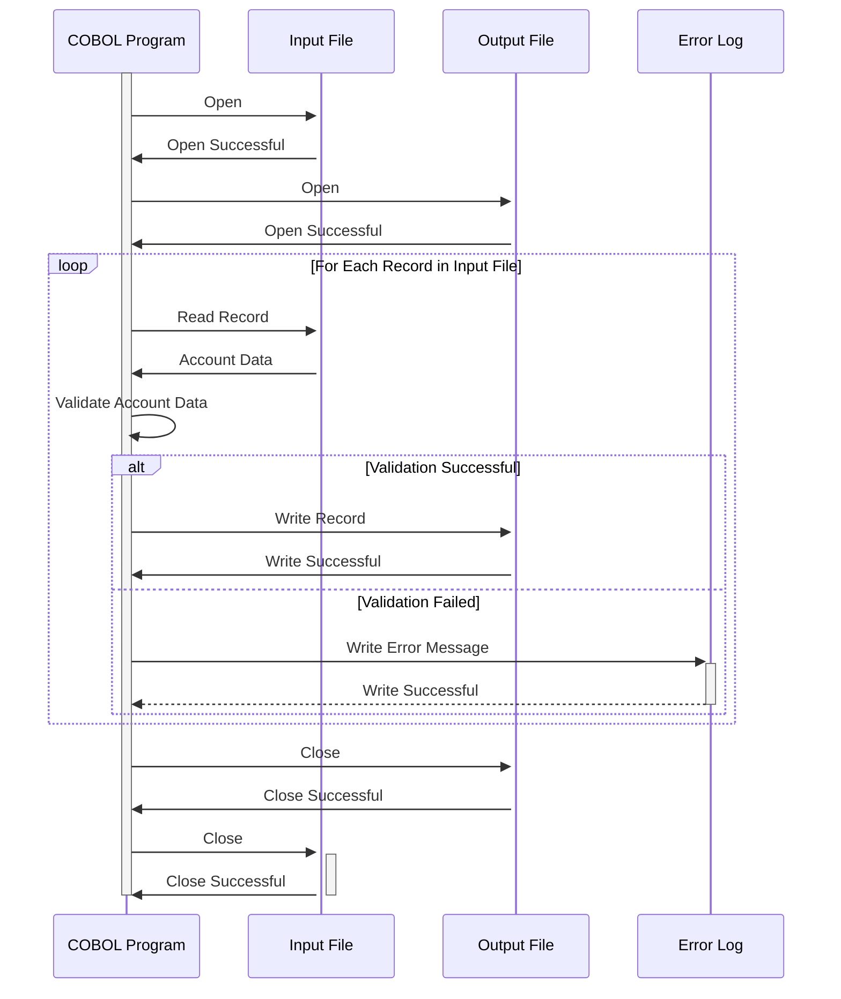

Generated at: 1st October of 2024

# **Title Document:** Credit Card Account Update Processor

# **Summary Description:**
This document outlines the specifications for a COBOL program designed to process credit card account updates. The program reads account data from an input file, validates the data according to predefined business rules, and writes valid records to an output file. Any errors encountered during processing are logged for further investigation and correction.

# **User Stories:**
As a data analyst, I need to ensure that only valid and updated credit card account information is used for analysis and reporting. This program helps me achieve this by validating data and isolating any records that do not meet the defined criteria.

# **Related Epic:**
2 - Account Management

# **Functional Requirements:**

1.  **Input File Reading:**
    *   The program should be able to read credit card account data from a predefined input file.
    *   The input file format and record layout should adhere to the structure defined in the `COACTUP.CPY` copybook.

2.  **Data Validation:**
    *   **Account Status:** Verify that the account status code (`ACSTTUSI`) is valid (e.g., 'A' for Active, 'C' for Closed). If an invalid code is encountered, the record should be flagged as invalid, and an error should be logged.
    *   **Credit Limit:** Check if the credit limit (`ACRDLIMI`) is a numeric value and falls within acceptable bounds. If not, flag the record as invalid and log an error.
    *   **Dates:** Validate all date fields (opening date, expiry date) to ensure they are in the correct format (YYYYMMDD) and are logically valid. For example, the expiry date should be greater than the opening date. Flag and log errors for any invalid date values.
    *   **Name and Address:** Validate that mandatory fields like First Name (`ACSFNAMI`), Last Name (`ACSLNAMI`), Address Line 1 (`ACSADL1I`), State (`ACSSTTEI`), Zip Code (`ACSZIPCI`), and City (`ACSCITYI`) are present and meet length requirements.
    *   **Social Security Number:** If applicable, validate the Social Security Number (SSN) for correct format (9 digits) and potentially against a database or external service for verification if required.
    *   **Phone Number:** Validate phone number fields (`ACSPH1A`, `ACSPH1B`, `ACSPH1C`) to ensure they contain only numeric values and meet length requirements.

3.  **Output File Writing:**
    *   Valid records, after passing all validation checks, should be written to the output file.
    *   The output file format and record layout should adhere to the structure defined in the `COACTUP.CPY` copybook.

4.  **Error Handling and Logging:**
    *   If a record fails validation, write a detailed error message to an error log file.
    *   The error message should include the account number, the specific field that failed validation, and the reason for failure.
    *   Provide options for the user to review the error log and potentially correct the input data for reprocessing.

# **Non-Functional Requirements:**

1.  **Performance:**
    *   The program should be optimized for performance to handle large volumes of account data efficiently.
    *   Processing time for a given dataset should be within acceptable limits defined by business requirements.

2.  **Reliability:**
    *   The program should be reliable and robust, capable of handling unexpected errors gracefully without data corruption.
    *   Implement appropriate error handling and recovery mechanisms to ensure data integrity.

3.  **Maintainability:**
    *   The code should be well-structured, modular, and documented to facilitate easy maintenance and future enhancements.
    *   Use meaningful variable names and comments to improve code readability.

4.  **Security:**
    *   Access to the program, input files, output files, and error logs should be restricted to authorized personnel only.
    *   Sensitive data, such as account numbers and SSNs, should be encrypted both during processing and storage if regulations require it.

# **Acceptance Criteria:**

1.  **Successful Data Validation and Processing:**
    *   The program should correctly validate all input records against the defined business rules.
    *   Only valid records should be written to the output file, ensuring data accuracy and consistency.

2.  **Comprehensive Error Handling:**
    *   The program should capture and log all errors encountered during validation and processing.
    *   Error messages should be informative and helpful for troubleshooting.

3.  **Performance and Efficiency:**
    *   The program should process a significant volume of account data within an acceptable timeframe.
    *   Performance testing should be conducted to validate processing speed and resource utilization.

# **Code Improvements:**

1.  **Modularization:** Break down the code into smaller, manageable modules or subroutines for improved readability and maintainability.
2.  **Error Handling:** Implement a centralized error-handling routine to avoid redundant code and ensure consistent error logging.
3.  **Documentation:** Add clear and concise comments to explain the logic and purpose of different code sections.
4.  **Performance Optimization:** Use appropriate data structures and algorithms to optimize data processing speed.

# **Security Improvements:**

1.  **Access Control:** Implement strict access controls to restrict program execution and data access to authorized users.
2.  **Data Encryption:** Consider encrypting sensitive data elements both in transit and at rest to protect against unauthorized access.
3.  **Audit Trail:** Implement an audit trail to log all program executions, user actions, and data changes for security and compliance purposes.

# **Conceptual Diagram:**

--Made by "Smart Engineering" (by Compass.UOL)--