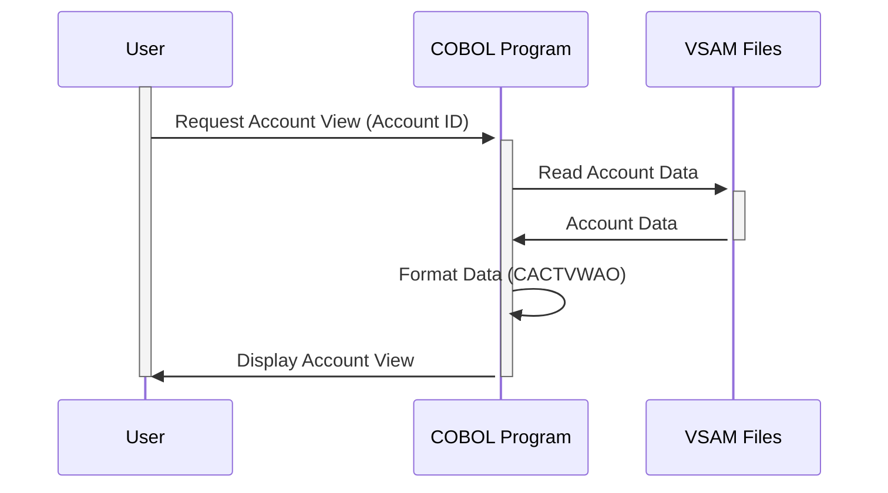

Generated at: 1st October of 2024

# **Title Document:** Card Account View Specification

# **Summary Description:**
This document outlines the specifications for the Card Account View module within the CardDemo application. This module is responsible for presenting a comprehensive view of customer account information, including account status, balances, limits, and customer details. It ensures standardized data presentation and consistency in handling account data throughout the system.

# **User Stories:**
As a data analyst, I need to ensure that only valid records are used in analysis. This means having access to a clear and comprehensive view of each customer's account information, including their status, balances, limits, and personal details. This view should be presented in a standardized and easily understandable format.

# **Related Epic:**
2 - Account Management

# **Functional Requirements:**
1. **Retrieve account information:** The system shall retrieve all necessary account information from the relevant VSAM files based on a provided account ID.
2. **Data validation:** The system shall validate the retrieved data to ensure its integrity and completeness. Any discrepancies or missing data should be flagged and reported.
3. **Format data for display:** The system shall format the retrieved account data into a user-friendly layout using the CACTVWAO structure. This includes:
    - Formatting numeric values (e.g., balances, limits) with commas and decimal points for readability.
    - Arranging fields in a logical and organized manner for easy comprehension.
    - Handling any necessary data conversions (e.g., date formats) for consistency and user preference.
4. **Display account information:** The system shall present the formatted account information to the user or to the requesting system component. This can be through:
    - Displaying the information on a user interface screen for direct viewing.
    - Sending the formatted data to another program module for further processing.
    - Generating a report containing the account information.

# **Non-Functional Requirements:**
1. **Performance:** The system shall retrieve and display account information with minimal latency, ensuring a responsive user experience.
2. **Reliability:** The system shall consistently and accurately retrieve and display account information, minimizing errors and ensuring data integrity.
3. **Maintainability:** The code shall be well-structured, documented, and easy to understand, facilitating future maintenance and enhancements.
4. **Security:** 
    - Access to account information shall be restricted to authorized personnel only, adhering to the principle of least privilege. 
    - User authentication and authorization mechanisms should be implemented to control access to sensitive data.

# **Acceptance Criteria:**
1. The system successfully retrieves and displays all required account information from the VSAM files.
2. The retrieved data is validated for completeness and integrity, with discrepancies flagged and reported.
3. Account information is formatted according to the CACTVWAO structure, ensuring readability and consistency.
4. The system provides a responsive and user-friendly experience for viewing account information.
5. Access to account information is secure and restricted to authorized personnel only.

# **Code Improvements:**
1. Implement a centralized error handling mechanism to log and report errors consistently throughout the module.
2. Add comprehensive code comments to improve readability and facilitate future maintenance.
3. Explore performance optimization techniques, such as data caching or query optimization, to reduce data retrieval time.

# **Security Improvements:**
1. Implement robust user authentication mechanisms, such as multi-factor authentication, to prevent unauthorized access.
2. Encrypt sensitive account information both in transit and at rest to protect against data breaches.
3. Implement an audit trail to track all access to account information, providing accountability and aiding in security investigations.

# **Conceptual Diagram:**

--Made by "Smart Engineering" (by Compass.UOL)--