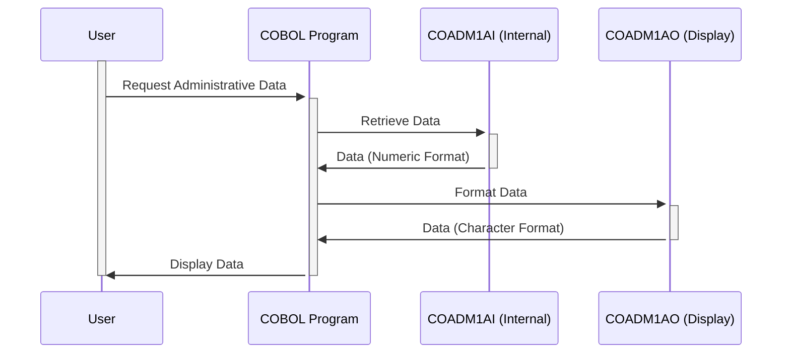

Generated at: 1st October of 2024

# **Title Document:** CardDemo Administrative Data Management

# **Summary Description:**
This document outlines the functionality of a COBOL program that manages administrative data within the CardDemo application. This data is crucial for presenting consistent information to users and includes elements like screen titles, dates, times, program names, menu options, and error messages. The program uses two main data structures: one for efficient internal storage and another for user-friendly display.

# **User Stories:**
As a system administrator, I need a reliable way to manage and display administrative information consistently across the CardDemo application to ensure a clear and user-friendly experience.

# **Related Epic:**
6 - User Management and Security

# **Functional Requirements:**
1.  **Define Data Structures:**
    *   The program defines two data structures: `COADM1AI` and `COADM1AO`.
    *   `COADM1AI` stores data in a compact, numeric format optimized for internal processing.
    *   `COADM1AO` redefines `COADM1AI`, mapping the numeric data to corresponding character-based fields for display on screens or reports.

2.  **Manage Administrative Data:**
    *   The program handles various administrative data elements:
        *   Transaction Name: Used for internal identification and logging.
        *   Screen Titles: Displayed at the top of screens for user orientation.
        *   Current Date and Time: Shown for user reference.
        *   Program Name: Used for identification and navigation.
        *   Menu Options: Presented to the user for interaction.
        *   Selected Option: Stores the user's choice from the menu.
        *   Error Message: Conveys system messages or error notifications to the user.

3.  **Ensure Consistent Display:**
    *   The program uses `COADM1AO` to present data in a user-friendly, character-based format, ensuring consistency across different screens and reports.

# **Non-Functional Requirements:**
*   **Performance:** The program should process and display administrative data quickly and efficiently.
*   **Reliability:** The program must reliably manage and present data without errors or inconsistencies.
*   **Maintainability:**  The code should be well-structured and documented to facilitate easy maintenance and updates.

# **Acceptance Criteria:**
*   The program successfully defines and populates both `COADM1AI` and `COADM1AO` data structures.
*   Administrative data is displayed accurately and consistently on screens and reports.
*   The program handles date and time formatting according to system requirements.
*   Error messages are clear, concise, and informative for users.

# **Code Improvements:**
*   **Error Handling:** Implement more robust error handling, including logging errors to a file for debugging.
*   **Code Documentation:** Add clear and concise comments to explain the purpose and functionality of different code sections.
*   **Data Validation:** Include data validation checks for user inputs to prevent invalid data from being stored.

# **Security Improvements:**
*   **Access Control:** Implement access control mechanisms to restrict unauthorized modification of administrative data.
*   **Audit Logging:** Log all changes made to administrative data for auditing and tracking purposes.

# **Conceptual Diagram:**

--Made by "Smart Engineering" (by Compass.UOL)--