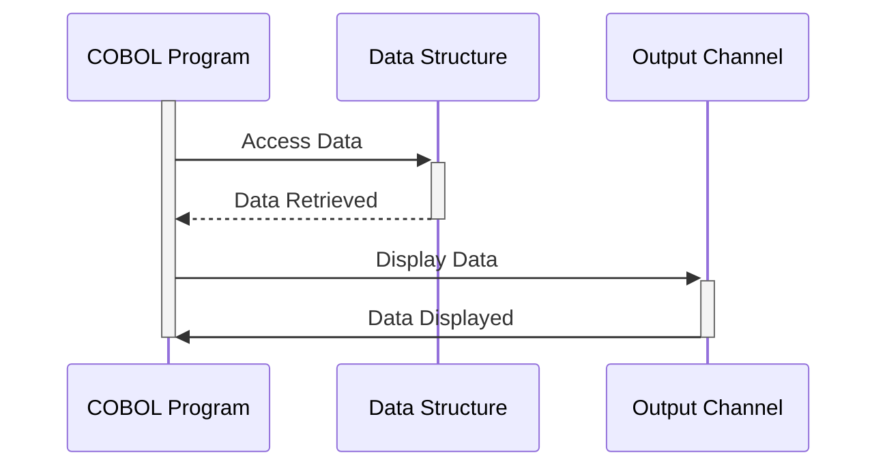

Generated at: 1st October of 2024

# **Title Document:** Bill Payment Data Structure Specification

# **Summary Description:**
This document outlines the data structure for handling bill payment transactions within a COBOL program. It defines how the program stores and organizes information related to each payment, including details like transaction ID, account information, payment amount, and processing status. This structure ensures that data is consistently formatted and readily accessible for processing and display.

# **User Stories:**
As a system auditor, I need to be confident that all financial transactions, including bill payments, are accurately recorded and easily traceable to ensure compliance with regulations and internal controls.

# **Related Epic:**
4 - Transaction Processing

# **Functional Requirements:**
* The system shall provide a structured format for storing bill payment transaction details.
* The data structure shall include fields for:
    * Transaction name or identifier
    * Transaction date and time
    * Program name for tracking
    * Account ID
    * Current account balance
    * Payment confirmation flag
    * Error message storage
* The system shall support both internal and external representations of the data.
    * Internal format optimized for COBOL processing.
    * External format suitable for display on screens or reports.

# **Non-Functional Requirements:**
* **Performance:** The data structure should be designed for efficient access and processing within the COBOL program.
* **Maintainability:** The structure should be well-documented and easy to understand for future modifications.
* **Reliability:** Data integrity should be maintained through appropriate data type validation.

# **Acceptance Criteria:**
* The defined data structure should compile without errors within the COBOL program.
* All required fields should be present and correctly defined in terms of data type and length.
* The internal and external representations of the data should be consistent and accurately reflect the same information.

# **Code Improvements:**
* Implement data validation checks for each field to ensure data integrity.
* Add comments to the code to explain the purpose of each field and how it is used.
* Consider using a data dictionary to manage and document the data structure.

# **Security Improvements:**
* If sensitive data is being stored (like account numbers), consider implementing encryption or other security measures to protect the data.
* Ensure appropriate access controls are in place to restrict unauthorized access to the data.

# **Conceptual Diagram:**

--Made by "Smart Engineering" (by Compass.UOL)--