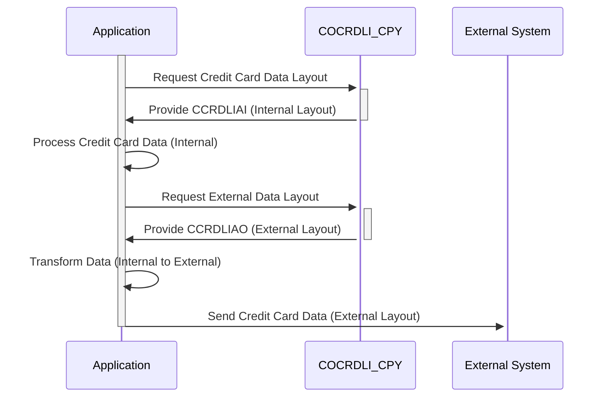

Generated at: 1st October of 2024

# **Title Document:** Credit Card Data Layout (Input/Output)

# **Summary Description:**
This document outlines the structure of credit card information used within the system. It defines two layouts - one for internal use (CCRDLIAI) and another for external communication (CCRDLIAO), ensuring consistency and security in handling data across different parts of the system and during interactions with external entities.

# **User Stories:**
As a Credit Card System Analyst, I need a standardized data format to ensure seamless processing of credit card information within our systems and during communication with external parties. This format should accurately represent transaction details, account information, and card data while adhering to security standards for handling sensitive information.

# **Related Epic:**
3 - Credit Card Management

# **Functional Requirements:**
- **Data Structure Definition:** Define a clear and consistent data structure for credit card information, including fields for transaction details, account data, card numbers, statuses, and messages.
- **Internal Layout (CCRDLIAI):** 
    - Define the layout for internal storage and processing of credit card information.
    - This layout should be optimized for efficient data handling within the system.
- **External Layout (CCRDLIAO):** 
    - Define the layout for exchanging credit card information with external systems or displaying it to users.
    - This layout may differ from the internal layout to meet external requirements or to mask sensitive data.
- **Data Mapping:** Establish clear mapping rules between the internal and external layouts to ensure data consistency during transformation.

# **Non-Functional Requirements:**
- **Security:** 
    - Implement robust encryption methods to protect sensitive credit card information during storage and transmission.
    - Enforce strict access control measures to restrict unauthorized access to credit card data.
- **Performance:** 
    - The data structures and mapping rules should be designed to minimize processing overhead and ensure efficient data handling.
- **Maintainability:** 
    - The code should be well-documented and modular to facilitate easy maintenance and updates.
- **Compliance:** 
    - Adhere to industry standards (e.g., PCI DSS) for handling and storing sensitive cardholder data.

# **Acceptance Criteria:**
- The defined data structures (CCRDLIAI and CCRDLIAO) should accurately represent all necessary credit card information.
- The mapping rules between internal and external layouts should ensure data consistency.
- The implementation should adhere to security standards for handling sensitive cardholder data.
- The system should be able to process credit card information efficiently without significant performance degradation.

# **Code Improvements:**
- Implement data validation checks for each field in the data structures to ensure data integrity.
- Add error handling mechanisms to gracefully manage any issues during data transformation or processing.
- Provide comprehensive documentation for the data structures, mapping rules, and any associated code modules.

# **Security Improvements:**
- Implement data masking or tokenization techniques to further enhance security by replacing sensitive cardholder data with non-sensitive substitutes.
- Maintain comprehensive logs of all access, modifications, and transmissions of credit card data for auditing and security monitoring purposes.

# **Conceptual Diagram:**

--Made by "Smart Engineering" (by Compass.UOL)--