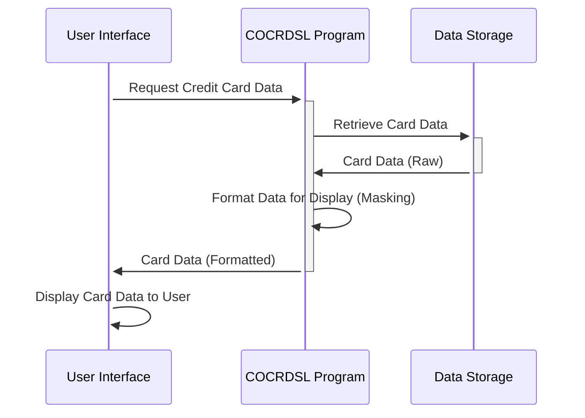

Generated at: 1st October of 2024

# **Title Document:** Credit Card Data Display Program Specification

# **Summary Description:**
This program defines how credit card information is structured for display in a user interface, ensuring clear and consistent presentation of sensitive data.

# **User Stories:**
As a customer service representative, I need to view credit card information on my screen in a clear and organized way, so I can assist customers efficiently and accurately.

# **Related Epic:**
3 - Credit Card Management

# **Functional Requirements:**
- Define a standard structure (`CCRDSLAI`) for storing raw credit card data, including transaction name, cardholder name, account and card IDs, expiry date, and system-generated messages.
- Define a display-oriented structure (`CCRDSLAO`) that mirrors `CCRDSLAI` but adds attributes for each field to control visual presentation, such as color, highlighting, and positioning on the screen. 
- Ensure that sensitive data, such as the full credit card number, is masked or truncated for security purposes when displayed.

# **Non-Functional Requirements:**
- **Usability:** The displayed information should be easy to read and understand, with clear labels and logical grouping of fields.
- **Performance:** The program should retrieve and display the credit card data quickly and efficiently, without noticeable delays.
- **Maintainability:** The code should be well-documented and structured to facilitate easy updates and modifications. 
- **Security:**  The program should adhere to security best practices, particularly regarding the display of sensitive cardholder data, with appropriate masking or truncation.

# **Acceptance Criteria:**
- The program successfully defines the `CCRDSLAI` and `CCRDSLAO` data structures with all required fields and display attributes.
- The program compiles without errors and integrates seamlessly with the user interface.
- Credit card information is displayed accurately and completely, with sensitive data appropriately masked.
- The display format is clear, consistent, and adheres to the defined display attributes.

# **Code Improvements:**
- Implement a logging mechanism to record instances of credit card data being accessed and displayed, including user IDs and timestamps, for audit and security purposes.
- Add error handling to gracefully manage situations where data is missing or invalid, displaying user-friendly messages instead of program crashes.
- Explore using a data dictionary to centrally manage data field definitions and display attributes for better consistency and maintainability.

# **Security Improvements:**
- Implement strict access control measures to ensure only authorized personnel can view credit card information.
- Consider additional data masking techniques, such as displaying only the last four digits of the credit card number, to further enhance security.
- Regularly review and update security measures in line with industry best practices and evolving threats.

# **Conceptual Diagram:**

--Made by "Smart Engineering" (by Compass.UOL)--