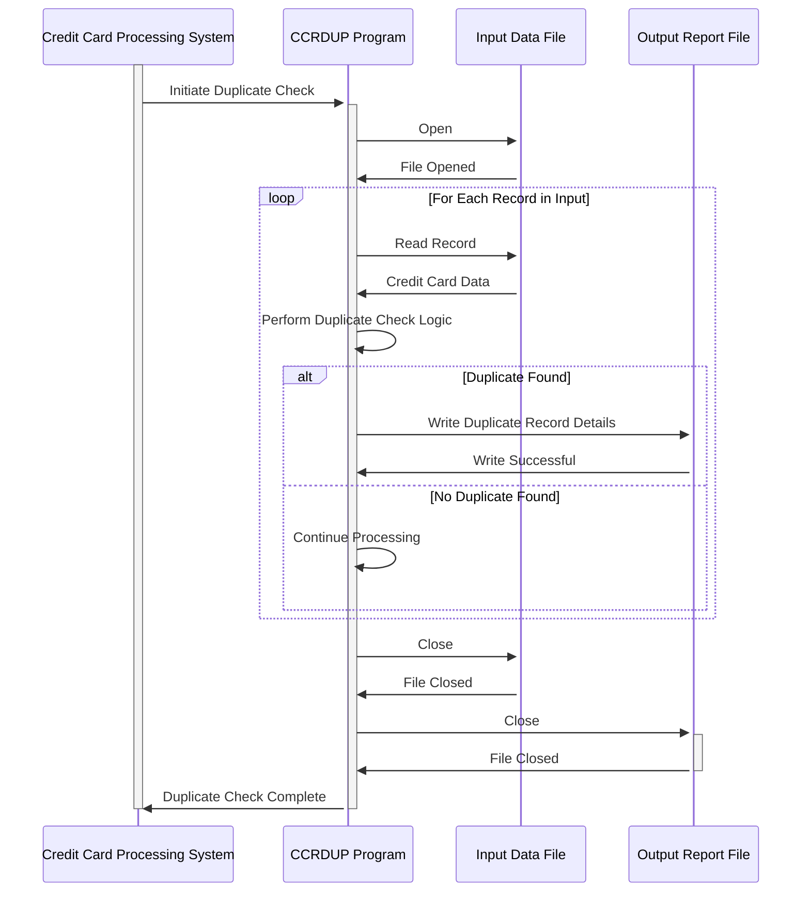

Generated at: 1st October of 2024

# **Title Document:** Credit Card Duplicate Check Program Specification

**Summary Description:**
This document outlines the data structure and processes involved in detecting duplicate credit card records within the CardDemo application. The system analyzes credit card details to identify potential duplicates, ensuring data accuracy and preventing fraudulent activities.

**User Stories:**
As a credit risk analyst, I need to ensure that our system can identify and flag potential duplicate credit card records to maintain data integrity and prevent fraudulent activities.

**Related Epic:** 3 - Credit Card Management

**Functional Requirements:**

1. **Data Input:** The program receives credit card data, including transaction details, card information, and system-generated messages.

2. **Data Structuring:** The program utilizes two data structures (`CCRDUPAI` and `CCRDUPAO`) to organize and represent credit card information:
    - `CCRDUPAI`: Designed for efficient internal processing of credit card data.
    - `CCRDUPAO`:  Structures the same data in a user-friendly format for display on screens.

3. **Data Validation (Implicit):** While not explicitly defined in the provided code, the system should incorporate validation rules to ensure data integrity. For instance:
    - Credit card numbers should adhere to specific formats and validation checks (e.g., Luhn algorithm).
    - Expiration dates should be validated to ensure they are not in the past. 

4. **Duplicate Check:** The system compares incoming credit card data with existing records to identify potential duplicates. The specific matching criteria and logic for determining duplicates are not detailed in the provided code snippet but are crucial aspects of the program's functionality.

5. **Output:**  The program provides output based on the duplicate check results. This could include:
    - **Flagged Records:**  Potential duplicate records are flagged for review.
    - **Reports/Logs:**  Detailed logs of duplicate check results, including matched records and any discrepancies found.
    - **User Notifications:**  Alerts or notifications may be generated for manual verification and action on potential duplicates. 

**Non-Functional Requirements:**

1. **Performance:** The duplicate check process should be efficient and have minimal impact on system performance, especially considering potential large volumes of credit card data.

2. **Accuracy:** The system must accurately identify duplicates based on predefined matching criteria to minimize false positives and negatives.

3. **Scalability:** The duplicate check process should be scalable to handle increasing data volumes as the system grows.

4. **Maintainability:** The code should be well-structured, documented, and easy to maintain and update as business rules evolve.

**Acceptance Criteria:**

- The program successfully compiles and executes without errors.
- The program correctly identifies duplicate credit card records based on predefined matching criteria.
- The program handles large volumes of data efficiently without noticeable performance degradation.
- The program generates accurate reports or logs of duplicate check results.
- The program's code is well-documented and maintainable.

**Code Improvements:**

- **Explicit Validation:** Incorporate explicit data validation rules for credit card numbers, expiration dates, and other relevant fields to ensure data integrity.
- **Error Handling:** Implement robust error handling mechanisms to gracefully manage exceptions and provide informative error messages.
- **Code Modularity:**  Structure the code into modular functions or subroutines to improve readability, maintainability, and reusability. 

**Security Improvements:**

- **Data Encryption:** Implement encryption for sensitive credit card information both during storage and transmission to protect against unauthorized access.
- **Access Control:** Enforce strict access control measures to restrict access to credit card data to authorized personnel only.
- **Audit Logging:**  Maintain comprehensive audit logs of all data access, modifications, and duplicate check operations for security and compliance purposes.

**Conceptual Diagram:**

--Made by "Smart Engineering" (by Compass.UOL)--