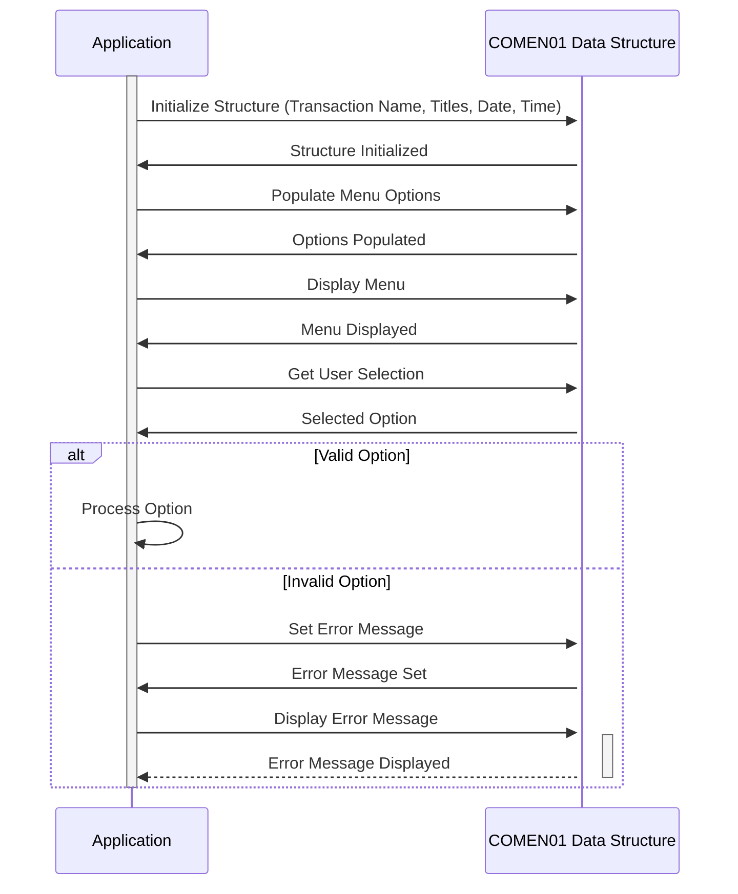

Generated at: 1st October of 2024

# **Title Document:** Common Data Structure for Menu-Driven Applications

# **Summary Description:**
The `COMEN01.CPY` file defines a standardized data structure in COBOL to manage information displayed on menu screens within an application. It stores elements like transaction names, screen titles, dates, times, menu options, user selections, and error messages, ensuring consistency and organization in handling user interactions.

# **User Stories:**
As an application developer, I need a structured way to handle common data elements displayed on menu screens, so that the presentation and behavior of menus are consistent throughout the application. 

# **Related Epic:**
9 - System Utilities: Provide a set of utility functions to support system maintenance, data management, and other operational tasks.

# **Functional Requirements:**
1.  **Store Transaction Name:**  The structure should hold the name of the current transaction being performed (e.g., "ACTVW" for Account View).
2.  **Display Screen Titles:**  The structure should store the main title for the screen (e.g., "Account Details") and an optional secondary title. 
3.  **Handle Date and Time:**  The structure needs to accommodate the current date and time, likely in different formats for display and internal processing.
4.  **Manage Menu Options:**  The structure should hold the text for each menu option presented to the user (up to twelve options).
5.  **Record User Selection:**  A field is needed to store the option selected by the user.
6.  **Display Error Messages:**  The structure should include a field for storing and displaying error messages to the user.
7.  **Flexibility in Data Representation:** The code uses REDEFINES to allow the same data to be accessed and presented in different formats (e.g., displayed on the screen, used in calculations).

# **Non-Functional Requirements:**
1.  **Data Integrity:**  Data types and lengths for each field should be strictly enforced to prevent data corruption.
2.  **Reusability:**  The structure should be designed to be reusable across different programs and modules within the application.
3.  **Maintainability:** The code should be well-documented and structured for easy understanding and modification.

# **Acceptance Criteria:**
1.  The data structure should successfully compile without errors in a COBOL environment.
2.  Applications using the structure should be able to store and retrieve data in all the defined fields.
3.  The REDEFINES implementation should function correctly, allowing for different representations of the same data.

# **Code Improvements:**
1.  **Add Data Validation:** Implement checks within the application logic to validate data being populated into the structure (e.g., ensure date formats are correct).
2.  **Centralize Error Message Handling:**  Consider creating a separate module for managing error messages, allowing for easier localization and customization.

# **Security Improvements:**
1.  **Access Control:**  Implement appropriate access control mechanisms within the application to restrict unauthorized modification of the data within the structure.
2.  **Data Masking:**  If sensitive information is being stored in the structure (like user IDs), consider masking or encrypting this data.

# **Conceptual Diagram:**

--Made by "Smart Engineering" (by Compass.UOL)--