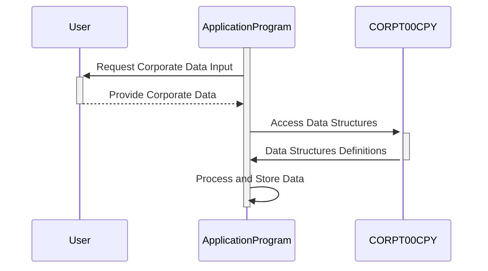

Generated at: 1st October of 2024

# **Title Document:** Corporate Data Structure Specification

# **Summary Description:**
This document describes the structure and purpose of the `CORPT00.CPY` COBOL copybook, which defines data structures used for managing and displaying corporate information within a larger application. This copybook likely supports generating reports or presenting data related to corporate operations, encompassing aspects like transaction details, report titles, dates, timeframes, and potential error messages.

# **User Stories:**
As a system administrator, I need a standardized way to handle corporate data across different programs so that reporting and data management remain consistent and reliable.

# **Related Epic:**
5 - Reporting and Analytics

# **Functional Requirements:**
- **Data Structure Definition:**
    - Define two data structures, `CORPT0AI` and `CORPT0AO`, to store corporate information.
    - `CORPT0AI` should hold data in a format suitable for user input, likely character-based.
    - `CORPT0AO` should mirror `CORPT0AI` but potentially represent data in a format more suitable for internal processing or output.
- **Field Definitions:**
    - Include fields for transaction name (`TRNNAMEx`), report titles (`TITLE01x`, `TITLE02x`), current date and time (`CURDATEx`, `CURTIMEx`), time frame indicators (`MONTHLYx`, `YEARLYx`, `CUSTOMx`), start and end dates (`SDTMMx`, `SDTDDx`, `SDTYYYx`, `EDTMMx`, `EDTDDx`, `EDTYYYx`), a confirmation flag (`CONFIRMx`), and an error message field (`ERRMSGx`).
- **Data Type and Format Enforcement:**
    - Ensure data types and formats are consistent with the intended use of each field (e.g., alphanumeric for titles, numeric for dates, single character flags for yes/no fields).

# **Non-Functional Requirements:**
- **Reusability:** The copybook should be designed to be included in multiple programs to ensure consistency in handling corporate data.
- **Maintainability:** The code should be well-commented and structured to facilitate easy maintenance and updates.

# **Acceptance Criteria:**
- The data structures defined in `CORPT00.CPY` should be successfully compiled and used by COBOL programs without errors.
- Data stored in these structures should be correctly interpreted and used by the application for report generation or other corporate data processing tasks.
- The copybook should be well-documented to ensure clarity for developers using it.

# **Code Improvements:**
- **Consider adding data validation rules directly within the copybook:** For example, you could use COBOL's `88` levels to define valid values for flags like `MONTHLYx`, `YEARLYx`, and `CONFIRMx`, enhancing data integrity.
- **Implement more descriptive field names:** While the current names convey the basic purpose, using more verbose names (e.g., `TRANSACTION_NAME`, `REPORT_TITLE_1`, `START_DATE_MONTH`) would improve code readability.

# **Security Improvements:**
- **No sensitive data:** The copybook itself doesn't appear to handle sensitive data like passwords or financial information. However, when using this copybook in applications that process sensitive data, ensure appropriate security measures are in place, such as data encryption and access control mechanisms.

# **Conceptual Diagram:**

--Made by "Smart Engineering" (by Compass.UOL)--