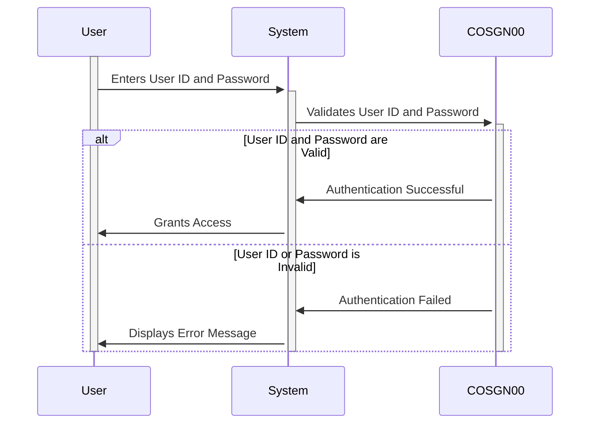

Generated at: 1st October of 2024

**Title Document:** User Login Information Management

**Summary Description:**  This document describes the structure and management of user login information within the CardDemo application. It focuses on how user details are collected, organized, and used during the login process.

**User Stories:**
As a system user, I need to provide my login credentials so that I can access the system.

**Related Epic:** 6 - User Management and Security

**Functional Requirements:**

* The system shall provide two data structures, COSGN0AI and COSGN0AO, to store user login information.
* COSGN0AI shall include fields for:
    - Transaction Name (e.g., login, logout)
    - Screen Titles
    - Date and Time of the action
    - User ID
    - Password
    - Error Message
* COSGN0AO shall use the REDEFINES clause to provide an alternate view of the data stored in COSGN0AI, allowing for flexible data interpretation.
* The system shall ensure the secure storage of User IDs and Passwords to prevent unauthorized access.
* The system shall provide clear and informative error messages to the user in case of invalid login attempts.
* The system shall maintain data integrity by ensuring the consistency and accuracy of user login information.

**Non-Functional Requirements:**

* **Security:** User login information, especially passwords, must be handled and stored securely to prevent unauthorized access and protect user privacy.
* **Performance:** The login process should be fast and efficient, minimizing the time it takes for a user to access the system.
* **Reliability:** The system should be reliable in handling user login information, ensuring that valid users can consistently access the system.
* **Maintainability:** The code for managing user login information should be well-structured, documented, and easy to maintain for future updates or modifications.

**Acceptance Criteria:**
* The system successfully stores and retrieves user login information.
* The system validates user credentials accurately, granting access to authorized users and denying access to unauthorized users.
* The system displays appropriate error messages for incorrect login attempts.
* The system ensures the security of user credentials, protecting them from unauthorized access.

**Code Improvements:**
* Implement a more robust password encryption mechanism to further enhance the security of stored passwords.
* Add detailed logging of login attempts, including timestamps and user IDs, for audit and security monitoring purposes.
* Consider using a centralized security module to handle authentication and authorization across the entire application.

**Security Improvements:**
* Implement multi-factor authentication to provide an additional layer of security beyond just username and password.
* Enforce strong password policies, requiring users to create passwords that meet certain complexity criteria.
* Regularly audit the system for security vulnerabilities and implement necessary updates or patches.

**Conceptual Diagram:**

--Made by "Smart Engineering" (by Compass.UOL)--