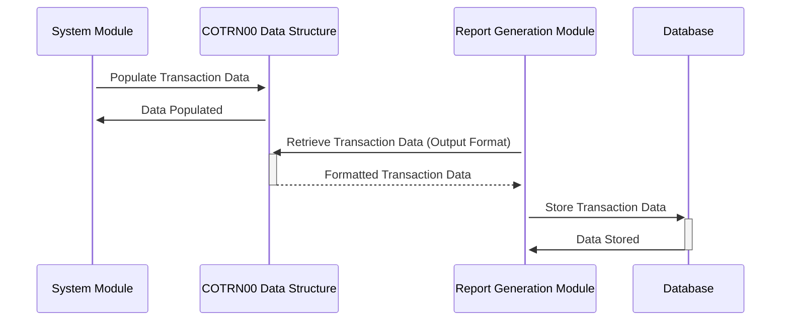

Generated at: 1st October of 2024

# **Title Document:** Transaction Data Structure Specification

# **Summary Description:**
This specification defines the data structure for financial transactions, ensuring a standardized format for processing and presenting transaction information within the CardDemo Application.

# **User Stories:**
As a data analyst, I want to ensure that all transaction records are stored in a consistent format so that I can easily analyze transaction patterns, track financial activities, and generate accurate reports.

# **Related Epic:**
4 - Transaction Processing

# **Functional Requirements:**
- The system must define a standard data structure for recording financial transactions.
- The data structure should include fields for transaction ID, date, description, amount, and selection flags.
- Two layouts of the data structure should be provided:
    - `COTRN0AI`: Internal format for processing transactions.
    - `COTRN0AO`: Output format for reports and displays, with formatting for readability.
- The system must be able to populate the data structure with transaction details received from various sources.
- The system must validate the data types and format of the transaction data before processing.

# **Non-Functional Requirements:**
- **Performance:** The data structure should be designed for efficient data retrieval and processing.
- **Reliability:** The data structure should ensure data integrity and consistency.
- **Maintainability:** The data structure should be well-documented and easy to understand for future modifications.
- **Security:** Access to the transaction data should be restricted based on user roles and permissions.

# **Acceptance Criteria:**
- The system successfully defines and implements the standardized transaction data structure.
- The system correctly populates the data structure with transaction details.
- The system validates the data types and format of the transaction data.
- The system generates reports and displays using the output format of the data structure.

# **Code Improvements:**
- Implement data validation checks for each field in the data structure to ensure data accuracy.
- Add error handling routines to gracefully handle invalid data or unexpected conditions during processing.
- Document the purpose and usage of each field in the data structure to improve code readability and maintainability.

# **Security Improvements:**
- Encrypt sensitive transaction data, such as the transaction amount, to protect it from unauthorized access.
- Implement audit trails to track all changes made to transaction records.
- Regularly review and update access control lists to ensure that only authorized personnel have access to transaction data.

# **Conceptual Diagram:**

--Made by "Smart Engineering" (by Compass.UOL)--