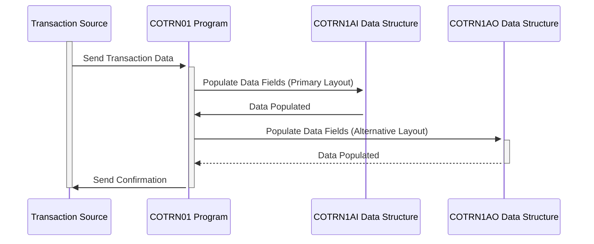

Generated at: 1st October of 2024

# **Title Document:** Credit Card Transaction Data Structure Specification

# **Summary Description:**
This document details the structure of credit card transaction records in our system. It acts as a blueprint for capturing, storing, and processing every credit card transaction, ensuring consistency and accuracy.

# **User Stories:**
As a financial analyst, I need a standardized way to access and analyze credit card transaction data to track spending patterns, identify potential fraud, and generate reports for business insights.

# **Related Epic:**
4 - Transaction Processing

# **Functional Requirements:**
* The system must capture all essential details of a credit card transaction, including:
    * Unique Transaction ID (TRNIDINI)
    * Credit Card Number (CARDNUMI)
    * Transaction Type Code (TTYPCDI): Purchase, refund, cash advance, etc.
    * Transaction Source (TRNSRCI): Online, POS terminal, ATM, etc.
    * Transaction Description (TDESCI)
    * Transaction Amount (TRNAMTI)
    * Merchant ID (MIDI)
    * Merchant Name (MNAMEI)
    * Timestamps: Origination (TORIGDTI), Processing (TPROCDTI)
    * Error Message (ERRMSGI): If any issues occur during processing
* The system must validate data types and field lengths to ensure data integrity.
* The system must support two data layouts:
    * `COTRN1AI`: Primary layout using character and packed-decimal formats.
    * `COTRN1AO`: Alternative layout with different character formatting for specific processing needs.

# **Non-Functional Requirements:**
* **Performance:**  Transaction record processing must be fast and efficient to handle high transaction volumes.
* **Reliability:** The system must accurately record and store all transaction data without loss or corruption.
* **Maintainability:** The data structure should be easily understandable and modifiable for future enhancements.
* **Security:** Sensitive transaction data must be protected from unauthorized access and modification.

# **Acceptance Criteria:**
* All defined data fields are captured accurately and completely for each transaction.
* Data type and field length validations are implemented and functioning correctly.
* Both `COTRN1AI` and `COTRN1AO` layouts are supported and can be processed by the system.
* The system handles high transaction volumes without performance degradation.
* Security measures are in place to protect sensitive transaction data.

# **Code Improvements:**
* Implement data encryption for sensitive fields like credit card numbers to enhance security.
* Add data masking techniques to protect sensitive data during display or logging.
* Implement logging mechanisms to track transaction record creation, access, and modifications for auditing purposes.
* Consider using a data dictionary to centralize data element definitions and ensure consistency across the application.

# **Security Improvements:**
* Implement access control mechanisms to restrict access to transaction data based on user roles and permissions.
* Regularly audit the system to ensure compliance with security policies and identify potential vulnerabilities.
* Implement data retention policies to securely archive or purge transaction data according to regulatory requirements.

# **Conceptual Diagram:**

--Made by "Smart Engineering" (by Compass.UOL)--