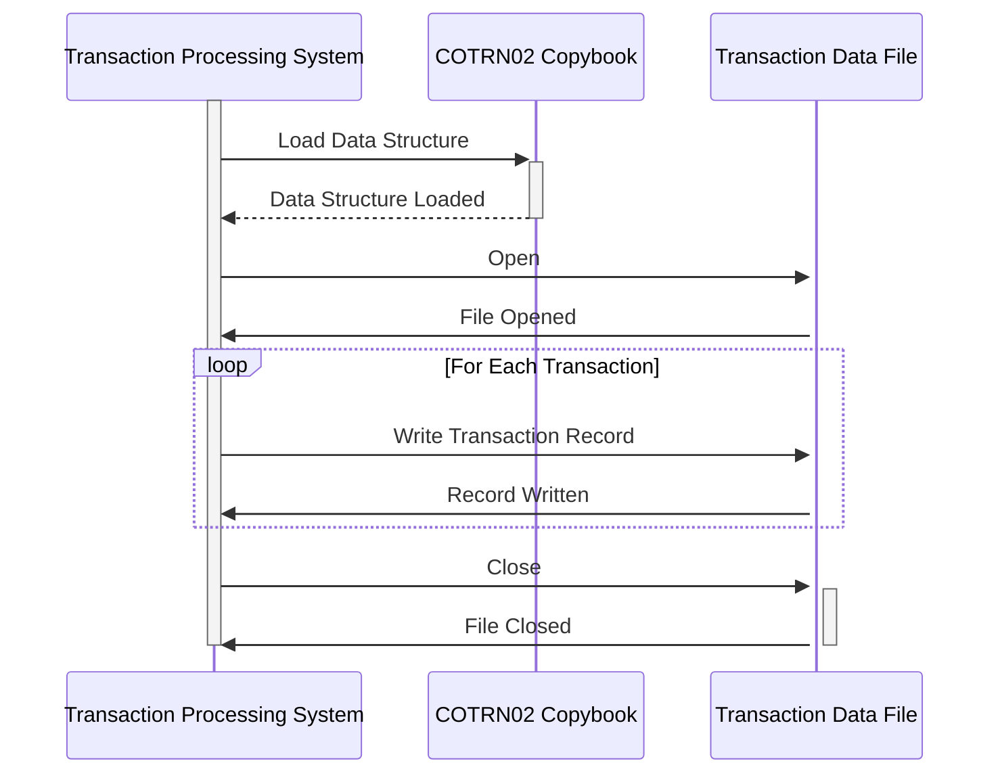

Generated at: 1st October of 2024

# **Title Document:** Card Transaction Data Structure Specification

# **Summary Description:**
This document outlines the structure of data related to credit card transactions within the CardDemo application. It defines a standardized format for capturing and storing crucial transaction details, ensuring consistency and facilitating efficient processing and analysis.

# **User Stories:**
As a data analyst, I need to ensure that all credit card transactions are recorded in a standardized format so that I can easily analyze transaction trends and generate accurate reports.

# **Related Epic:**
4 - Transaction Processing

# **Functional Requirements:**
- The system shall provide a standardized data structure for recording credit card transactions.
- The data structure shall include fields for capturing all essential transaction details, including:
    - Transaction Name
    - Transaction Date and Time
    - Activity ID
    - Card Number
    - Transaction Type Code
    - Transaction Category Code
    - Transaction Source
    - Transaction Description
    - Transaction Amount
    - Transaction Origination Date
    - Transaction Processing Date
    - Merchant ID
    - Merchant Name
    - Merchant City
    - Merchant ZIP Code
    - Confirmation Status
    - Error Message
- The system shall enforce data type and format validation for each field in the data structure.

# **Non-Functional Requirements:**
- **Performance:** The transaction data structure should be designed for efficient data storage and retrieval.
- **Scalability:** The structure should be able to accommodate increasing transaction volumes.
- **Maintainability:** The data structure should be well-documented and easy to understand and modify.

# **Acceptance Criteria:**
- The transaction data structure is defined in a COBOL copybook.
- All required fields are included in the data structure.
- Data type and format validation is implemented for all fields.
- The data structure is successfully used by COBOL programs for recording transactions.

# **Code Improvements:**
- Implement data validation rules for specific fields, such as card number validation using Luhn's algorithm.
- Add comments to the copybook to improve readability and understanding.
- Consider using a data dictionary to manage data definitions centrally.

# **Security Improvements:**
- Encrypt sensitive transaction data, such as card numbers, to protect against unauthorized access.
- Implement access controls to restrict access to transaction data based on user roles and permissions.
- Log all access and modifications to transaction data for auditing purposes.

# **Conceptual Diagram:**

--Made by "Smart Engineering" (by Compass.UOL)--