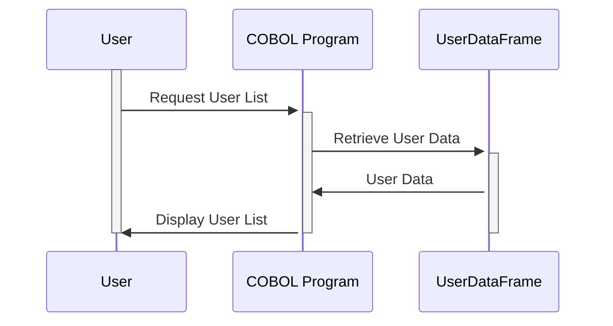

Generated at: 1st October of 2024

# **Title Document:** User Management Data Structure Specification

## **Summary Description:**

This document details the data structure used for managing user information within an application. It defines how user data is organized, stored, and presented on a user management screen. This is crucial for maintaining consistent user data across the system.

## **User Stories:**

As an administrator, I need to be able to view a list of users with their key information, so I can manage user accounts effectively.

## **Related Epic:**

6 - User Management and Security: This Epic aims to provide functionalities for managing user access, roles, and permissions to ensure system security and data confidentiality.

## **Functional Requirements:**

- The system must store and retrieve user information, including User ID, First Name, Last Name, and User Type.
- The system must display this information in a clear and organized manner on the user management screen.
- Each user entry on the screen should include a selection flag (checkbox) to enable bulk actions on multiple users.
- The system should display system-level information, including the current date, time, and page number.

## **Non-Functional Requirements:**

- **Performance:** The system should retrieve and display user information with minimal latency.
- **Usability:** The user interface should be intuitive and easy to navigate.
- **Maintainability:** The code should be well-structured and documented for ease of maintenance.

## **Acceptance Criteria:**

- The user management screen should accurately display all required user information.
- The selection flags should function correctly, allowing administrators to select and deselect users.
- The system-level information (date, time, page number) should be updated dynamically.

## **Code Improvements:**

- Implement pagination to handle large numbers of users effectively.
- Add sorting functionality to the user list.
- Use a more descriptive naming convention for the fields (e.g., `USER-ID` instead of `USRID`).

## **Security Improvements:**

- Implement access control measures to restrict access to the user management screen to authorized personnel only.
- Store sensitive user information (e.g., passwords) securely using encryption.

## **Conceptual Diagram:**

--Made by "Smart Engineering" (by Compass.UOL)--