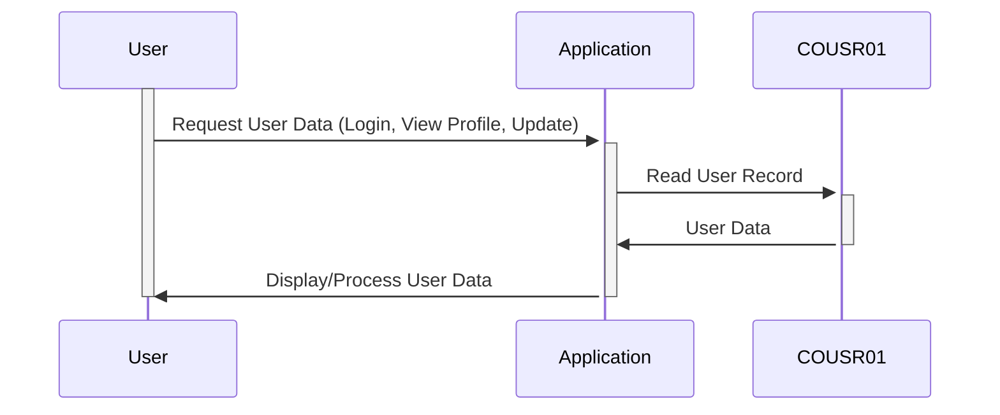

Generated at: 1st October of 2024

# **Title Document:** User Information Management

## **Summary Description:**

This document describes the structure and management of user information within a system, crucial for user logins, displaying profiles, and handling account updates. 

## **User Stories:**

As a system administrator, I need a reliable way to store and manage user information, including their login credentials, so that I can control access to the system and ensure data security.

## **Related Epic:**

6 - **User Management and Security:** Manage user access, roles, and permissions to ensure system security and data confidentiality.

## **Functional Requirements:**

- The system must securely store user information, including first name, last name, user ID, and password.
- The system must be able to retrieve user information by user ID for authentication and profile display.
- The system must be able to update user information, such as a password change.
- The system must handle different user types and their associated permissions.
- The system must log errors related to user data, such as invalid login attempts.

## **Non-Functional Requirements:**

- **Security:** The system must employ strong password hashing algorithms to protect user passwords from unauthorized access.
- **Performance:** User authentication and data retrieval must be efficient to ensure a responsive system.
- **Maintainability:** The code must be well-structured and documented to facilitate future maintenance and updates. 

## **Acceptance Criteria:**

- The system successfully stores and retrieves user information.
- User authentication functions correctly, granting access only to authorized users.
- Password changes are handled securely and effectively.
- The system logs errors related to user data, such as invalid login attempts or data validation failures.

## **Code Improvements:**

- Implement parameterized queries or prepared statements to prevent SQL injection vulnerabilities when interacting with a database.
- Consider using a logging framework for more robust and structured error logging.
- Implement input validation on user-provided data to prevent common vulnerabilities like cross-site scripting (XSS).

## **Security Improvements:**

- Enforce strong password policies, requiring users to have passwords with a minimum length, complexity, and regular expiration. 
- Implement two-factor authentication (2FA) to add an extra layer of security to user accounts.
- Regularly audit the system for security vulnerabilities and ensure that security patches are applied promptly.

## **Conceptual Diagram:**

--Made by "Smart Engineering" (by Compass.UOL)--