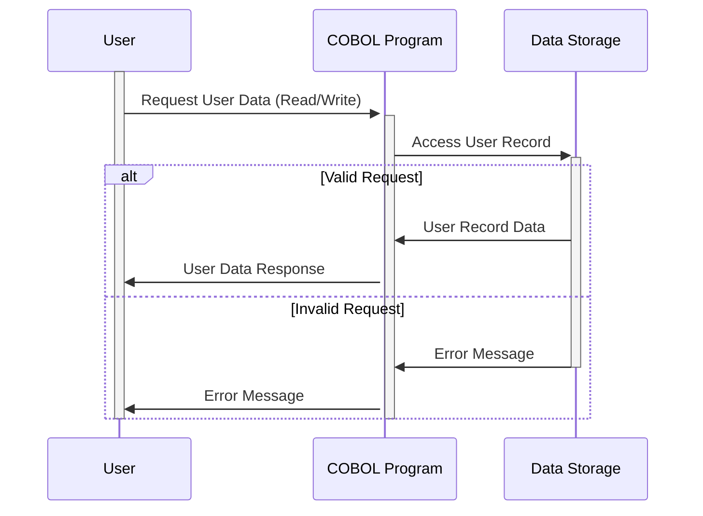

Generated at: 1st October of 2024

**Title Document:** User Account Data Structure Specification

**Summary Description:** This document outlines the structure of user account data within a system, focusing on how this data is organized and stored. It's essentially a blueprint for managing user accounts securely and efficiently.

**User Stories:** As a system administrator, I need a standardized way to store and manage user account information, including login credentials, personal details, and system-related data, to ensure secure access and efficient user administration.

**Related Epic:** 6 - User Management and Security

**Functional Requirements:**
- The system must securely store user IDs and passwords for authentication.
- The system must store basic user information, including first name, last name, and user type.
- The system must record and store system-related information, including transaction names, timestamps (date and time), program names used, and error messages.
- The system must support different character encoding schemes (ASCII, EBCDIC) to ensure compatibility with various systems.

**Non-Functional Requirements:**
- **Security:** The system must prioritize the secure storage of sensitive user data, particularly passwords, using appropriate hashing and encryption methods.
- **Performance:** Data retrieval and storage operations related to user accounts should be efficient to avoid system slowdowns.
- **Reliability:** The system must ensure the accuracy and consistency of user account data over time.
- **Maintainability:** The data structure should be easily understandable and modifiable for future system enhancements.

**Acceptance Criteria:**
- User accounts can be created, modified, and deleted without errors.
- The system correctly authenticates users based on stored credentials.
- System-related information is accurately logged and associated with corresponding user actions.
- The data structure seamlessly integrates with other system components, like authentication and authorization mechanisms.

**Code Improvements:**
- **Password Security:** Implement robust password hashing algorithms (e.g., bcrypt, scrypt) to protect passwords from unauthorized access. Avoid storing passwords in plain text.
- **Data Validation:** Incorporate data validation checks for each field to ensure data integrity and prevent invalid data from being stored.
- **Error Handling:** Implement comprehensive error handling mechanisms to gracefully manage and log any issues encountered during data operations.
- **Code Documentation:** Add clear and concise comments to the code to explain the purpose and functionality of different data fields and sections.

**Security Improvements:**
- **Data Encryption:** Encrypt sensitive user data, both in transit and at rest, to add an extra layer of security.
- **Access Control:** Implement strict access control measures to restrict unauthorized access to user account information. Only authorized personnel should have permission to view, modify, or delete this data.
- **Auditing:** Implement audit trails to track all actions related to user accounts, including who accessed the data, what changes were made, and when those changes occurred.

**Conceptual Diagram:**

--Made by "Smart Engineering" (by Compass.UOL)--