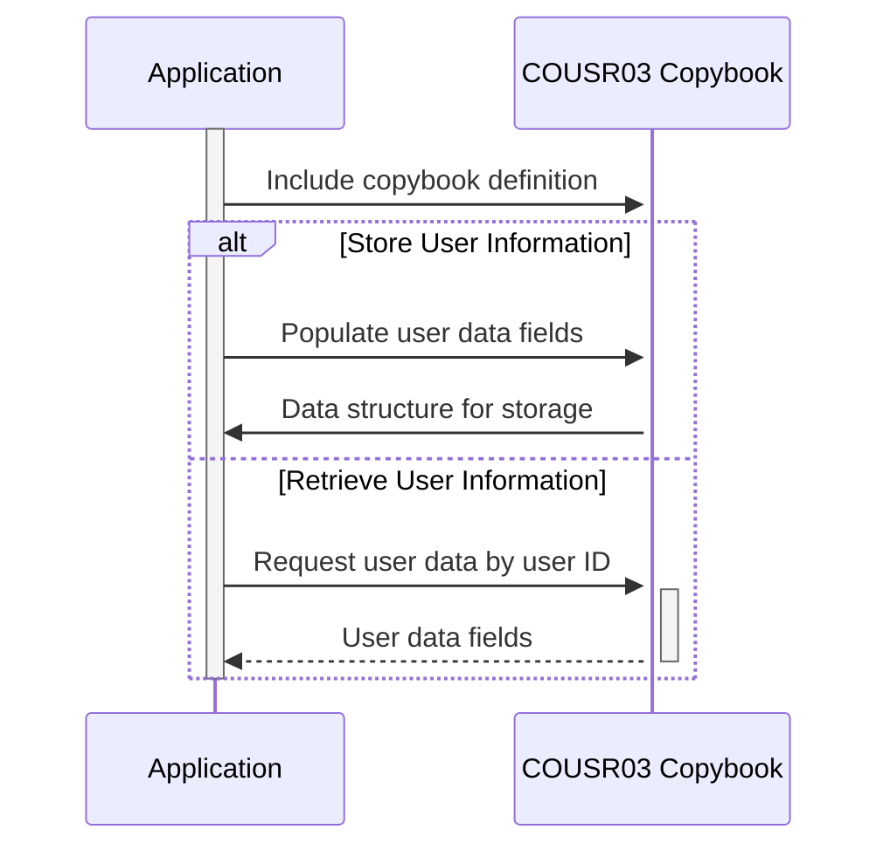

Generated at: 1st October of 2024

# **Title Document:** COUSR03 Copybook - User Information Structure

**Summary Description:**
The COUSR03 copybook defines a standardized format for handling user information within the CardDemo application. It acts as a template for storing and accessing details about each user, such as their ID, name, type (e.g., administrator, regular user), and any system messages intended for them.

**User Stories:**
As a system administrator, I need a way to store and retrieve user information, including their role and system messages, to manage user access and track their activities.

**Related Epic:**
6 - User Management and Security

**Functional Requirements:**
- The copybook should define data structures for storing user information.
- It should include fields for user ID, first name, last name, user type, transaction name, program name, current date, current time, and error messages.
- The data structures should be compatible with the COBOL programming language.

**Non-Functional Requirements:**
- The copybook should be well-documented with clear explanations of each field and its purpose.
- It should be designed for efficient data storage and retrieval.

**Acceptance Criteria:**
- The copybook should compile successfully within the CardDemo application's COBOL environment.
- Programs using the copybook should be able to correctly store and retrieve user information.

**Code Improvements:**
- Consider adding data validation checks within the copybook to ensure data integrity (e.g., checking for valid user types).

**Security Improvements:**
- Access to the copybook and its contents should be restricted to authorized personnel only.
- Sensitive information, such as user passwords, should not be stored in the copybook.

**Conceptual Diagram:**

--Made by "Smart Engineering" (by Compass.UOL)--