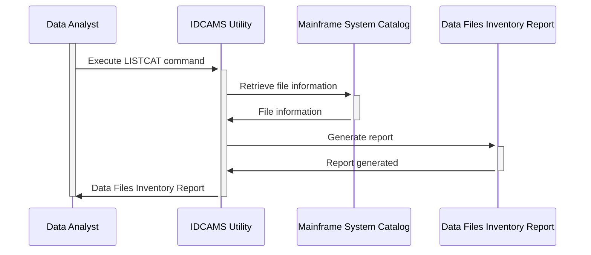

Generated at: 1st October of 2024

**Title Document:** CardDemo Application - Data Files Inventory

**Summary Description:** This document lists the various data files used by the CardDemo application, a mainframe-based system for managing credit card accounts. It details how these files are organized and their storage details.

**User Stories:** As a data analyst, I need to understand how CardDemo's data is organized and stored so I can efficiently access and analyze it.

**Related Epic:** 10 - Data Files Management

**Functional Requirements:**
- The document must list all data files used by the CardDemo application.
- For each file, the document must specify:
    - File name
    - File type (VSAM or non-VSAM)
    - File organization (e.g., KSDS, AIX)
    - Storage location (volume)
    - Creation date
    - Size
    - Record count
- The document should indicate whether each file is active or inactive.
- The document should distinguish between primary data files and backup files.

**Non-Functional Requirements:**
- The document must be clear, concise, and easy to understand.
- The document must be accurate and up-to-date.
- The document must be accessible to authorized personnel.

**Acceptance Criteria:**
- The document accurately lists all data files used by the CardDemo application.
- The document provides all the required information for each file.
- The document is clear, concise, and easy to understand.

**Settings and Constants:** Not applicable

**Code Improvements:** Not applicable

**Security Improvements:** 
- Access to the document should be restricted to authorized personnel.
- The document should not contain sensitive information, such as passwords or encryption keys.

**Conceptual Diagram:**

This diagram illustrates the process of generating a data files inventory for the CardDemo application.

--Made by "Smart Engineering" (by Compass.UOL)--