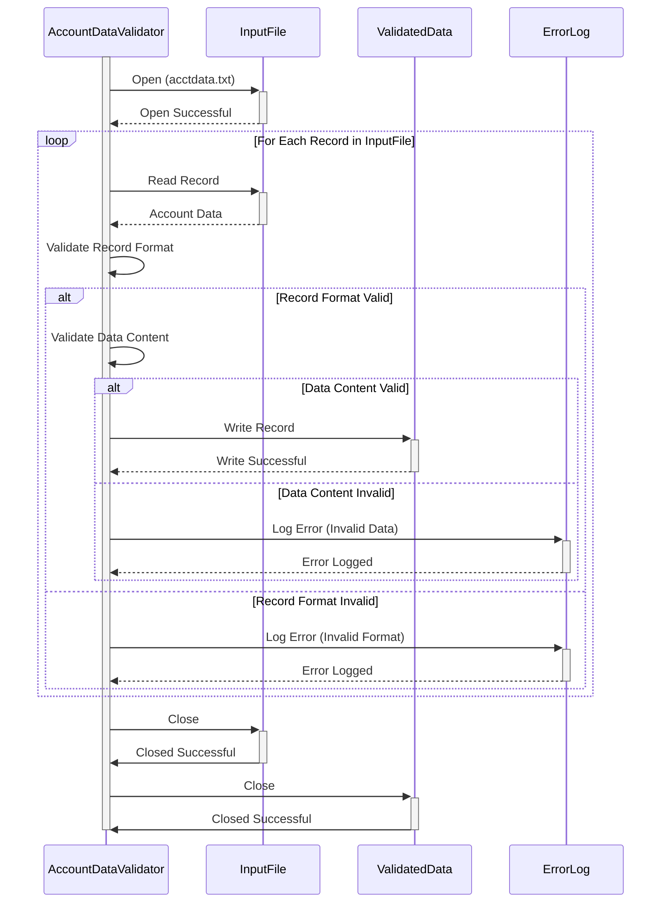

Generated at: 1st October of 2024

# **Title Document:** Account Data File Validator and Processor

## **Summary Description:** 
This program validates customer records from an input file (`acctdata.txt`) based on predefined business rules, primarily focusing on data format and content. Records that pass validation are written to an output file, while invalid records are logged for further investigation and correction. 

## **User Stories:**
As a data analyst, I want to ensure that only valid and correctly formatted account data is used for analysis and reporting. This program will help me by automatically identifying and separating invalid records, saving me time and reducing errors in my analysis.

## **Related Epic:**
10 - Data Files Management

## **Functional Requirements:**
1. **Read Input File:** The program should be able to read customer records from an input file named `acctdata.txt`. 
2. **Validate Record Format:** Each record must adhere to a predefined format (e.g., fixed-width columns, delimited fields). The program should identify and flag any deviations from this format.
     - **Account Number:** 10 digits, numeric only.
     - **Account Type:** 1 character, alphanumeric.
     - **Credit Limit:** 6 digits, numeric only.
     - **Current Balance:** 6 digits, numeric only.
     - **Account Open Date:** YYYY-MM-DD format.
     - **Last Transaction Date:** YYYY-MM-DD format.
     - **Last Statement Date:** YYYY-MM-DD format.
     - **Account Status:** 1 character.
3. **Validate Data Content:** The program should check individual data fields for validity based on business rules. For example:
     - **Credit Limit:** Cannot be negative.
     - **Current Balance:** Cannot exceed the Credit Limit.
     - **Account Status:** Must be one of the allowed status codes (e.g., A - Active, C - Closed, S - Suspended).
4. **Log Invalid Records:** For each record that fails validation, the program should log the following:
     - **Record Number:** The line number from the input file.
     - **Error Code:** A code identifying the specific validation rule that failed.
     - **Error Description:** A brief description of the error.
5. **Write Valid Records:**  Records that pass all validation checks should be written to an output file. 
6. **Error Reporting:** The program should generate a summary report listing all invalid records and their corresponding errors. 

## **Non-Functional Requirements:**
1. **Performance:** The program should be able to process large input files (e.g., millions of records) within a reasonable time frame.
2. **Reliability:** The program must be reliable and produce consistent results. Error handling should be robust to prevent unexpected program termination.
3. **Maintainability:** The code should be well-structured, documented, and easy to understand for future maintenance and enhancements.
4. **Logging:** The program should have a mechanism to log events, errors, and important information for debugging and auditing purposes.

## **Acceptance Criteria:**
1. **Successful Validation and Processing:** The program reads the `acctdata.txt` file, validates each record according to the defined rules, and writes valid records to an output file.
2. **Accurate Error Handling:** Invalid records are identified and logged with specific error codes and descriptions.
3. **Error Report Generation:** A comprehensive error report is generated, listing all invalid records and their associated errors.
4. **Performance and Efficiency:** The program demonstrates acceptable performance in terms of processing time for different file sizes.

## **Code Improvements:**
1. **Modular Design:** Implement the validation rules as separate functions or methods to improve code organization and readability.
2. **Configuration File:** Use a configuration file to store validation rules and parameters, allowing for easier modification without changing the source code. 
3. **Data Structures:** Utilize appropriate data structures (e.g., arrays, structures) to store and manage data efficiently.
4. **Exception Handling:** Implement exception handling to gracefully manage errors and prevent program crashes.
5. **Code Documentation:** Add clear and concise comments to explain the logic and functionality of the code.

## **Security Improvements:**
1. **Input Validation:** Implement strict input validation to prevent the processing of malicious or malformed data that could compromise the system.
2. **Secure File Handling:** Ensure that the program handles files securely, including proper file permissions and secure deletion of sensitive data.
3. **Logging and Auditing:** Log all file operations, validation results, and error conditions for auditing and security analysis.

## **Conceptual Diagram:**

--Made by "Smart Engineering" (by Compass.UOL)--