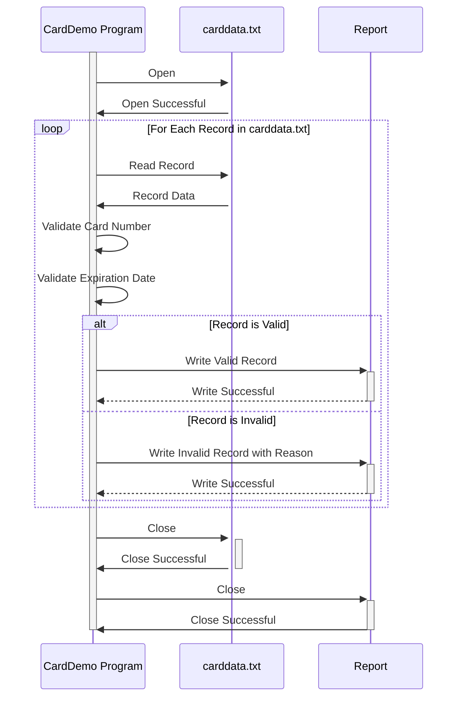

Generated at: 1st October of 2024

**Title Document:** Credit Card Data Validation and Processing Program

**Summary Description:** 
This program validates credit card information from a file named "carddata.txt". It checks if card numbers are valid (using Luhn's Algorithm), expiration dates are in the future, and ensures data is handled securely. A report of valid and invalid records is generated.

**User Stories:** 
As a Data Analyst, I need to be sure that I am using only valid credit card records so that my analysis is accurate and does not contain invalid data.

**Related Epic:** 
3 - Credit Card Management

**Functional Requirements:**
1. **Read data from "carddata.txt" file.**
   - The file contains credit card number, customer name, and expiration date for each customer.
2. **Validate each record:**
   - **Card Number:** 
     - Must be 13-19 digits long.
     - Must pass Luhn's Algorithm check.
   - **Expiration Date:**
     - Format must be YYYY-MM-DD.
     - Date must be in the future.
3. **Generate an output report:**
   - List all valid credit card records.
   - List all invalid records with reason for invalidity (e.g., "Invalid Card Number", "Expired").

**Non-Functional Requirements:**
1. **Security:** 
   - The program should handle credit card information securely following PCI DSS standards.
   - Sensitive data should not be stored in any insecure way.
2. **Performance:** 
   - The program should process the data efficiently.
   - Processing time should be minimized especially for large files.
3. **Maintainability:** 
   - The code should be well-documented and easy to understand for future modifications.

**Acceptance Criteria:**
1. The program successfully reads all records from the "carddata.txt" file.
2. All credit card numbers are validated according to Luhn's Algorithm.
3. All expiration dates are validated for correct format and future date.
4. An output report is generated that:
   - Accurately lists all valid credit card records.
   - Accurately lists all invalid records with specific reasons for invalidity.
5. The program handles errors gracefully and provides informative messages.

**Code Improvements:**
1. Implement logging to record program execution details, errors, and exceptions.
2. Use a structured format for the output report (e.g., CSV, JSON) for easier data analysis.
3. Add error handling for file operations (e.g., file not found, read errors).

**Security Improvements:**
1. Minimize the storage and display of sensitive credit card information. Mask or truncate card numbers where possible.
2. Implement encryption for storing sensitive data if persistence is required.
3. Regularly update validation rules to align with the latest security standards.

**Conceptual Diagram:**

--Made by "Smart Engineering" (by Compass.UOL)--