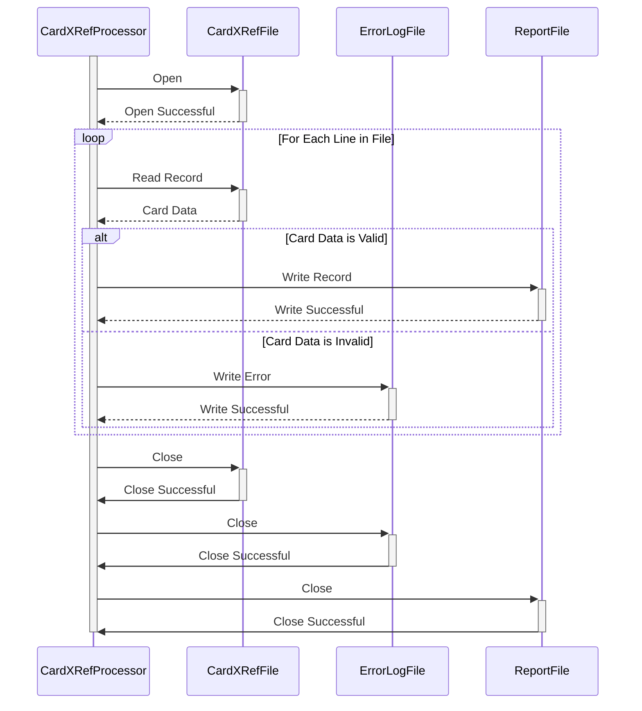

Generated at: 1st October of 2024

# **Title Document:** Card Cross-Reference File Processor

# **Summary Description:** 
This document outlines the specifications for a program designed to process a credit card cross-reference file (`cardxref.txt`).  The program will read the file, validate each record, and generate a report of valid and invalid records.

# **User Stories:** 
As a data analyst, I need to ensure that only valid credit card records are used for analysis and reporting. This program will help me identify and isolate any invalid records in the `cardxref.txt` file.

# **Related Epic:** 
**10 - Data Files Management:** This user story directly relates to the management and integrity of data files used within the CardDemo application.

# **Functional Requirements:**
1. **File Reading:**
    - The program must be able to read the `cardxref.txt` file from a specified directory. 
2. **Record Validation:**
    - Each record in the file must adhere to the following format:
        - **Card Identifier:**  19-digit numeric string.
        - **Counter/Reference:** 2-digit numeric string.
    - The program should validate:
        - **Data Type:**  Ensure both the card identifier and counter/reference are numeric.
        - **Length:** Verify that the card identifier is exactly 19 digits and the counter/reference is 2 digits.
3. **Error Handling:**
    - If a record fails validation, the program should:
        - Write the invalid record to an error log file (`cardxref_errors.log`) along with a description of the error.
        - Skip the invalid record and continue processing the remaining records.
4. **Report Generation:**
    - The program should generate a report (`cardxref_report.txt`) containing:
        - A summary of the processing results (total records, valid records, invalid records).
        - A list of all valid card identifiers and their corresponding counter/reference values.

# **Non-Functional Requirements:**
1. **Performance:**
    - The program should process the `cardxref.txt` file efficiently, especially for large files.
2. **Reliability:**
    - The program should be robust and capable of handling unexpected errors gracefully.
3. **Maintainability:**
    - The program's code should be well-structured, documented, and easy to understand and modify. 

# **Acceptance Criteria:**
1. **Successful File Processing:** The program must be able to read and process the `cardxref.txt` file without errors.
2. **Accurate Validation:** The program should correctly validate each record based on the defined rules.
3. **Comprehensive Reporting:** The generated report should accurately reflect the processing results and list valid and invalid records as expected.
4. **Error Handling:**  The program should gracefully handle invalid records and log errors appropriately. 

# **Code Improvements:**
1. **Modularity:** Break down the program into smaller, reusable functions for improved readability and maintainability.
2. **Data Structures:** Consider using appropriate data structures (e.g., arrays, structs) to store and manage card data efficiently.
3. **Input Validation:** Implement more robust input validation checks, such as verifying the file's existence before attempting to read.
4. **Logging:**  Use a logging library for more structured and informative error messages and debugging information. 

# **Security Improvements:**
1. **File Permissions:** Ensure the program has only the necessary read permissions for the `cardxref.txt` file.
2. **Secure Logging:** If sensitive information is being logged, consider implementing secure logging practices (e.g., log obfuscation, encryption). 

# **Conceptual Diagram:**

--Made by "Smart Engineering" (by Compass.UOL)--