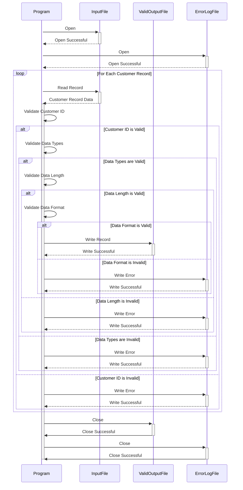

Generated at: 1st October of 2024

**Title Document:** Customer Data Validation and Processing Program

**Summary Description:** 
This program validates customer records from a text file (`custdata.txt`) against predefined business rules. Valid records are written to an output file, while invalid records are logged for review. This ensures that only accurate and consistent customer data is used for analysis and other business operations.

**User Stories:**
As a data analyst, I need to ensure that only valid customer records are used in my analysis to maintain data integrity and generate reliable insights.

**Related Epic:**
8 - Customer Data Management

**Functional Requirements:**
1. **Read Customer Data:** The program must read customer records from the `custdata.txt` file. Each line in the file represents a single customer record, with fields separated by spaces.
2. **Validate Customer ID:**
    - Each Customer ID must be unique.
    - The program should log an error if a duplicate Customer ID is found. 
3. **Validate Data Types:**
    - Customer ID should be numeric.
    - Names (First, Middle, Last) should be alphabetic.
    - Phone numbers should be numeric.
    - Credit card numbers should be numeric.
    - Dates (Credit Card Expiration Date) should follow a specific format (e.g., YYYY-MM-DD). 
    - The program should log an error if a data type mismatch is detected.
4. **Validate Data Length:**
    - Each field should have a maximum length limit.
    - The program should log an error if a field exceeds its maximum length. 
5. **Validate Data Format:**
    - Phone numbers should adhere to a specific format (e.g., (XXX) XXX-XXXX).
    - Credit card numbers should adhere to a specific format (e.g., 16 digits).
    - Dates should adhere to a specific format.
    - The program should log an error if a data format mismatch is detected. 
6. **Handle Invalid Records:**
    - The program should not write invalid records to the output file.
    - Invalid records should be logged to an error log file, including the Customer ID and the reason for the error.
7. **Write Valid Records:**
    - Valid customer records should be written to a new output file (e.g., `valid_custdata.txt`).
    - The output file should maintain the same space-separated format as the input file.

**Non-Functional Requirements:**
1. **Performance:** 
    - The program should process the customer data file efficiently, especially for large files.
    - Consider optimizing for speed and memory usage.
2. **Reliability:**
    - The program should be reliable and produce consistent results.
    - Implement robust error handling to prevent unexpected program termination. 
3. **Maintainability:**
    - The program code should be well-structured, documented, and easy to understand for future maintenance.
    - Use meaningful variable names and comments. 
4. **Security:**
    - The program should handle sensitive data (credit card information) securely.
    - Consider encrypting sensitive data in the output file.
    - Implement appropriate access controls to restrict unauthorized access to the program and data files.

**Acceptance Criteria:**
1. The program successfully reads all customer records from the input file (`custdata.txt`).
2. The program correctly validates each customer record against the defined business rules.
3. All valid customer records are written to the output file (`valid_custdata.txt`) in the correct format.
4. All invalid customer records are logged to an error log file with specific error messages, including the Customer ID and the reason for the validation failure.
5. The program executes without any runtime errors. 

**Code Improvements:**
1. **Error Handling:** Implement a centralized error handling mechanism to gracefully catch and log errors, providing informative messages to the user.
2. **Logging:** Use a logging framework to create detailed logs of program execution, including validation errors, for easier troubleshooting.
3. **Data Structures:**  Use appropriate data structures (e.g., arrays, structs) to store and manage customer data efficiently.
4. **Modularity:**  Break down the program into smaller, well-defined functions for improved code organization and maintainability.
5. **Configuration:** Allow for configurable validation rules (e.g., maximum field lengths, data formats) via an external configuration file.

**Security Improvements:**
1. **Input Sanitization:** Implement input sanitization to prevent vulnerabilities like SQL injection or command injection.
2. **Data Encryption:** Encrypt sensitive data (like credit card numbers) both in transit and at rest.
3. **Secure File Handling:** Ensure secure file handling practices, including proper file permissions and secure deletion of temporary files.
4. **Auditing:** Implement audit trails to track data access and modifications for security and compliance purposes. 

**Conceptual Diagram:**

--Made by "Smart Engineering" (by Compass.UOL)--