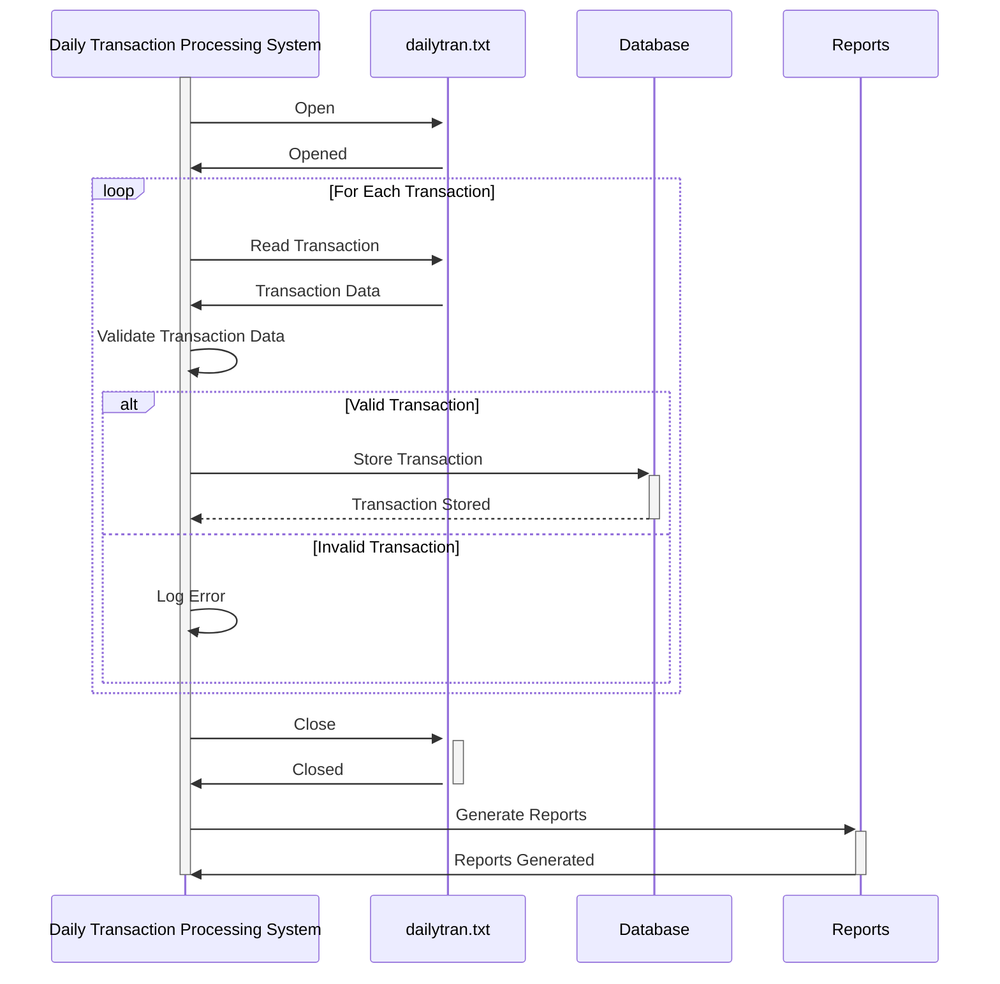

Generated at: 1st October of 2024

**Title Document:** Daily Transaction Processing System

**Summary Description:** 
The Daily Transaction Processing System is designed to process daily transaction logs from retail stores. It analyzes these transactions for sales tracking, inventory management, customer behavior analysis, and operational efficiency.

**User Stories:**
As a data analyst, I need a system to process daily transaction logs so that I can ensure that only valid records are used for analysis and reporting.

**Related Epic:**
4 - Transaction Processing

**Functional Requirements:**
- The system shall read transaction data from a file named `dailytran.txt`.
- The system shall validate the following data fields for each transaction:
    - Transaction Type: Must be either "Purchase" or "Return".
    - Location: Must match a pre-defined list of store locations.
    - Timestamp: Must be in a valid date/time format and in chronological order.
    - Customer Information: If available, must match data in the customer database.
- The system shall apply the following business rules:
    - **Sales Tracking:**
        - Calculate total sales per day.
        - Calculate sales per product per day.
        - Calculate sales per store location per day.
        - Identify sales trends over time.
    - **Inventory Management:**
        - Update inventory levels based on purchases and returns.
        - Generate alerts for low stock levels.
    - **Customer Behavior:**
        - Analyze customer purchase patterns and frequency.
        - Calculate the average transaction value per customer.
    - **Operational Efficiency:**
        - Identify peak hours for each store location.
        - Analyze transaction processing times.
        - Generate reports for staff optimization.
- The system shall store processed transaction data in a database.
- The system shall generate reports on sales, inventory, customer behavior, and operational efficiency.

**Non-Functional Requirements:**
- The system shall be able to process large transaction files efficiently.
- The system shall be reliable and ensure data integrity.
- The system shall be maintainable and easy to update.
- The system shall be secure and protect sensitive data.

**Acceptance Criteria:**
- The system successfully reads and parses transaction data from the `dailytran.txt` file.
- All data validation rules are correctly implemented and enforced.
- Business rules for sales tracking, inventory management, customer behavior analysis, and operational efficiency are correctly applied.
- Processed transaction data is accurately stored in the database.
- Reports are generated and provide meaningful insights.
- The system handles errors gracefully and provides informative error messages.

**Code Improvements:**
- Implement a logging mechanism to track system events and errors.
- Add comprehensive documentation to the code.
- Optimize data processing algorithms for better performance.
- Implement unit tests to ensure code quality and prevent regressions.

**Security Improvements:**
- Secure access to the `dailytran.txt` file with appropriate permissions.
- Encrypt sensitive data stored in the database.
- Implement an audit trail to track data changes and access.

**Conceptual Diagram:**

--Made by "Smart Engineering" (by Compass.UOL)--