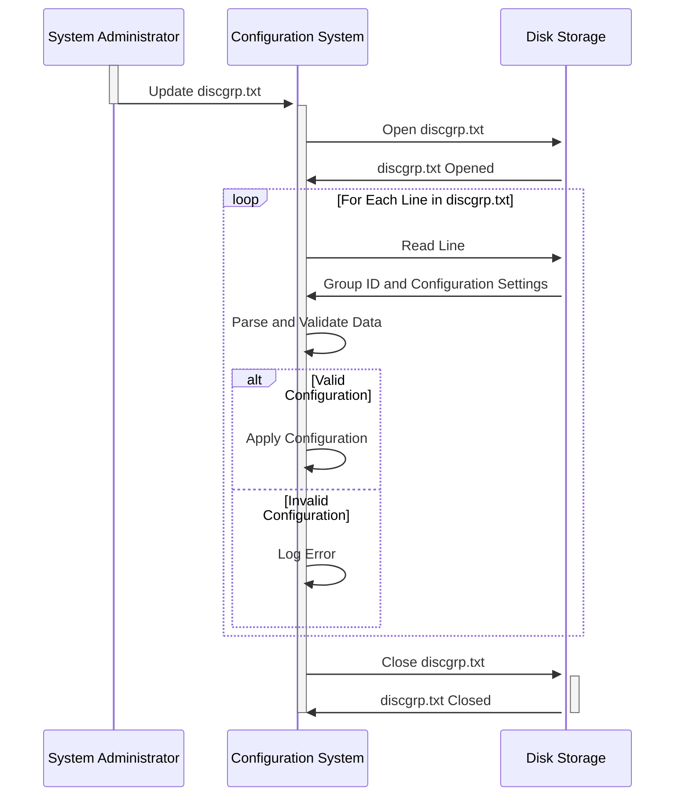

Generated at: 1st October of 2024

**Title Document:** Disk Group Allocation Configuration Parser

**Summary Description:**
This document describes a system responsible for reading and interpreting a configuration file that defines how data should be organized and allocated across different storage groups.  

**User Stories:**
As a system administrator, I need a way to define how data is grouped and stored so that I can optimize performance and manage storage space effectively.

**Related Epic:**
10 - Data Files Management

**Functional Requirements:**
1. **Read Configuration File:** The system must be able to read and parse the contents of the `discgrp.txt` configuration file.
2. **Identify Data Groups:** The system must correctly identify each unique data group listed in the file (e.g., 'A000000000010001', 'ZEROAPR', 'DEFAULT').
3. **Extract Configuration Values:** For each data group, the system must extract the associated configuration values.  
4. **Apply Default Configuration:** If a specific data group does not have a unique configuration, the system should apply a predefined 'DEFAULT' configuration.

**Business Rules:**
* **Unique Group Identifiers:** Each data group is expected to have a unique identifier. The system should handle potential errors if duplicate identifiers are found.
* **Configuration Value Format:** The configuration values are assumed to follow a specific format. The system should include validation to ensure data integrity and prevent issues from incorrectly formatted values.
* **Default Configuration Priority:** The 'DEFAULT' configuration acts as a fallback.  Any specific configuration for a named group overrides these default settings.

**Non-Functional Requirements:**
* **Performance:** The system should be able to read and process the configuration file quickly and efficiently, especially when dealing with large files.
* **Reliability:** The system must be reliable in accurately parsing the configuration file and applying the defined settings. Any errors in reading or interpreting the file could lead to misconfigured storage and potential data issues.
* **Maintainability:** The system should be designed in a modular and understandable way to allow for easy updates and modifications as storage requirements evolve.

**Acceptance Criteria:**
* The system successfully reads and parses the `discgrp.txt` file without errors.
* For each data group identified, the system correctly extracts and stores the associated configuration values.
* The system applies the 'DEFAULT' configuration when appropriate and correctly prioritizes specific group configurations over defaults.
* The system logs any errors encountered during file processing or configuration parsing, providing helpful information for troubleshooting.

**Code Improvements:**
* Implement robust error handling to gracefully manage scenarios like a missing configuration file, invalid file format, or incorrect data types within the configuration values.
* Introduce logging to record the system's actions, including when it starts processing the file, each data group identified, and any errors encountered.
* Add comments to the code to improve readability and understanding, especially around the logic for parsing the configuration values and applying defaults. 

**Security Improvements:**
* **Secure File Storage:** Store the `discgrp.txt` file in a secure location with appropriate access controls to prevent unauthorized modifications.
* **Input Validation:** Implement strict validation on the configuration values read from the file to mitigate risks associated with malicious or malformed data.
* **Auditing:** Log all access and changes made to the configuration file to track any unauthorized modifications or potential security breaches.

**Conceptual Diagram:**

--Made by "Smart Engineering" (by Compass.UOL)--