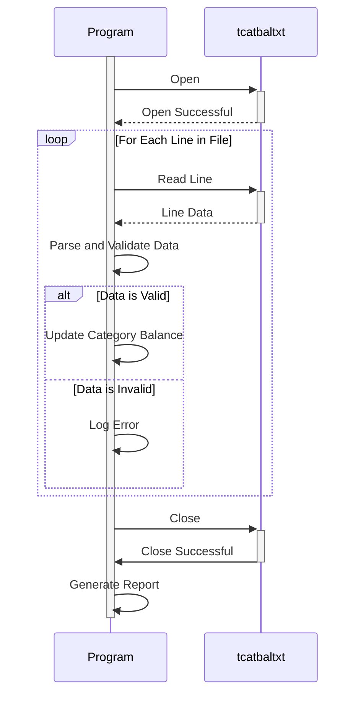

Generated at: 1st October of 2024

**Title Document:** Transaction Category Balance File Processor

**Summary Description:** This program processes a file containing transaction category balances, validates the data, and generates a report summarizing the balances for each category.

**User Stories:** As a data analyst, I need to ensure that only valid transaction category balance records are used for analysis and reporting purposes.

**Related Epic:** 10 - Data Files Management

**Functional Requirements:**

*   The program must read data from a file named "tcatbal.txt."
*   Each line in the file represents a transaction category balance record.
*   The program must parse each record and extract the following fields:
    *   **Category ID:** A 10-digit numeric identifier for the transaction category.
    *   **Unknown Field:** A 4-digit field (always "1000").
    *   **Balance:** A 10-digit numeric value representing the balance for the category (always "1000000000").
    *   **Unknown Data:** A 30-digit field (always a string of "0"s).
*   The program must validate the following:
    *   **File Structure:** The file must adhere to the expected fixed-width format.
    *   **Data Types:** Category ID and Balance must be numeric.
    *   **Business Rule:** If the Category ID is greater than 100, it should be considered invalid.
*   The program must generate a report summarizing the balances for each valid transaction category.

**Non-Functional Requirements:**

*   **Performance:** The program should process the file and generate the report in a timely manner, even for large files.
*   **Reliability:** The program should be reliable and handle errors gracefully without crashing.
*   **Maintainability:** The program should be well-structured, documented, and easy to maintain and modify.

**Acceptance Criteria:**

*   The program successfully reads and parses the transaction category balance file.
*   The program correctly validates the file structure, data types, and business rules.
*   The program generates an accurate report summarizing the balances for each valid transaction category.
*   The program handles errors gracefully and provides informative error messages.

**Code Improvements:**

*   Implement a logging mechanism to record errors, warnings, and other relevant information during program execution.
*   Add error handling to gracefully handle invalid data or file format errors.
*   Create reusable functions for common tasks such as reading the file, parsing records, and validating data.
*   Use a structured data format like JSON or XML for the output report to improve readability and compatibility with other systems.

**Security Improvements:**

*   Implement access control mechanisms to restrict access to the transaction category balance file and the generated report.
*   If the data is sensitive, consider encrypting the file or using a secure storage solution.
*   Regularly audit the program's access logs to detect any unauthorized access attempts.

**Conceptual Diagram:**

--Made by "Smart Engineering" (by Compass.UOL)--