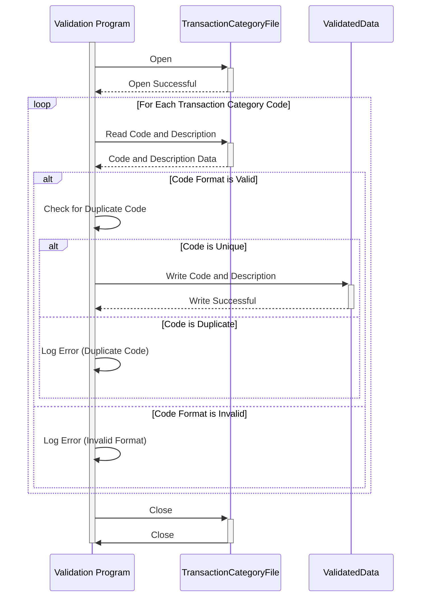

Generated at: 1st October of 2024

# **Title Document:** Credit Card Transaction Category Code Validation and Processing Program

# **Summary Description:**

This program validates and processes credit card transaction category codes from a file ("trancatg.txt"). It ensures each code is unique and adheres to a specific format, then outputs the validated data to a new file or system.

# **User Stories:**

As a financial analyst, I need to ensure that all transaction category codes are valid and correctly formatted to ensure accurate reporting and analysis.

# **Related Epic:**

4 - Transaction Processing

# **Functional Requirements:**

1. **Read Transaction Codes:** The program should read transaction category codes and descriptions from the input file ("trancatg.txt").
2. **Validate Code Format:** Each code should be validated to ensure it follows a specific format (e.g., six digits). If a code violates this format, the program should log an error and skip to the next code.
3. **Validate Code Uniqueness:** The program should check for duplicate transaction codes. If a duplicate code is found, the program should log an error and continue processing other codes.
4. **Output Validated Data:**  The program should output the validated transaction category codes and their descriptions. This output can be directed to a new file or integrated into another system, depending on the specific requirements.

# **Non-Functional Requirements:**

* **Performance:** The program should process the transaction codes efficiently, especially for large input files.
* **Reliability:** The program should be reliable in validating and processing the data, ensuring that all valid codes are captured and errors are properly handled.
* **Maintainability:** The program's code should be well-structured, documented, and easy to understand for future maintenance and updates.
* **Error Handling:** The program should include robust error handling to log and report any invalid data or unexpected situations encountered during processing. 

# **Acceptance Criteria:**

* The program successfully reads and processes all transaction category codes from the input file.
* The program accurately validates the format and uniqueness of each transaction category code.
* The program logs and reports any errors encountered during validation.
* The program generates an output file or data stream containing only valid transaction category codes and their descriptions.

# **Code Improvements:**

* Implement a logging framework to record detailed information about the validation process, including errors and warnings.
* Add unit tests to verify individual program functions and ensure code quality.
* Consider using a database to store the validated transaction category codes for more efficient lookup and management.

# **Security Improvements:**

* Secure the input and output files containing transaction data to prevent unauthorized access or modification.
* Implement appropriate access controls to restrict modification of the validation rules and program logic.

# **Conceptual Diagram:**

--Made by "Smart Engineering" (by Compass.UOL)--