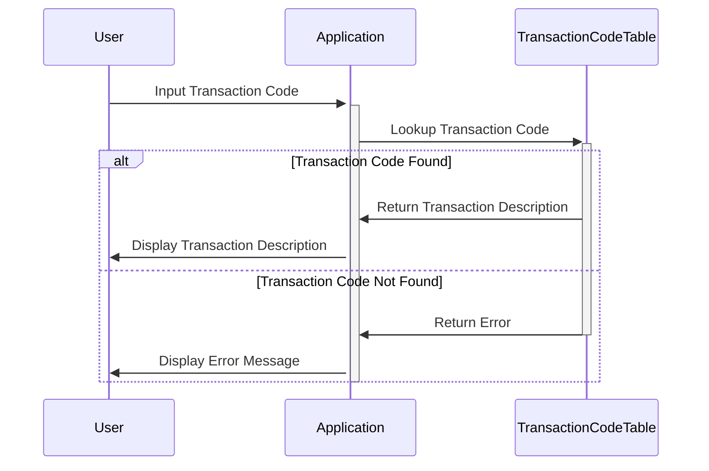

Generated at: 1st October of 2024

# **Title Document:** Transaction Type Code Translator

# **Summary Description:**
This document outlines the functionality of a program designed to translate numerical transaction codes into user-friendly descriptions. This program aims to improve the clarity and transparency of transaction data for various users, including customers, analysts, and customer service representatives.

# **User Stories:**
As a data analyst, I need to be able to understand the meaning of transaction codes so that I can accurately analyze transaction data.

# **Related Epic:**
**4 - Transaction Processing** - This epic aims to process various types of transactions efficiently, accurately, and securely, ensuring data integrity and regulatory compliance.

# **Functional Requirements:**

1.  **Transaction Code Input:** The system shall provide a mechanism to input a transaction code.
2.  **Code Lookup:** The system shall be able to look up the description of a transaction code from a predefined list.
3.  **Description Output:** The system shall display the description associated with the input transaction code.
    *   **Business Rule:** If the input transaction code does not exist in the predefined list, the system shall display an error message.

# **Non-Functional Requirements:**

1.  **Performance:** The system should respond to transaction code lookups quickly (within a defined acceptable time). 
2.  **Availability:** The system should be available during business hours for transaction code translation.
3.  **Maintainability:** The system should be designed in a way that allows for easy updates to the transaction code list.

# **Acceptance Criteria:**

1.  The system accurately translates all defined transaction codes to their corresponding descriptions.
2.  The system displays an appropriate error message for invalid or undefined transaction codes.
3.  The system's response time for code lookup is within acceptable limits.

# **Code Improvements:**

1.  Implement error logging for tracking invalid code lookups or other potential issues.
2.  Add functionality to allow authorized users to update the transaction code list.
3.  Implement a caching mechanism for frequently accessed codes to improve performance.

# **Security Improvements:**

1.  Restrict access to the transaction code list and any modification functions to authorized personnel only.
2.  Implement audit logging to track all access and changes made to the transaction code data.

# **Conceptual Diagram:**

--Made by "Smart Engineering" (by Compass.UOL)--