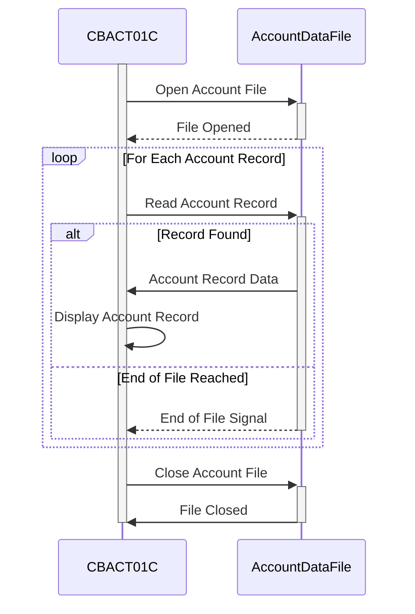

Generated at: 2nd October of 2024

**Title Document:** CardDemo Application - Account Data Batch Processing Program Specification

**Summary Description:**
The CardDemo Account Data Batch Processing program is designed to read and display account information from a secure file. It processes each account record sequentially, presenting a summary of the account details.

**User Stories:**
As a data analyst, I need to ensure that all account records are processed and displayed accurately so that I can use this information for further analysis and reporting.

**Related Epic:**
7 - Batch Processing

**Technical Requirements:**
- **Account File Reading:** Reads account data sequentially from a VSAM KSDS file named `ACCTDAT`.
- **Data Display:** Displays the content of each account record on the system console.

- **Open Account File**: This method opens the account data file for reading and checks for any errors during the process.
  - Input: None
  - Validation: If the file status is `00` (successful), proceed to the next step. If not, log the error, display the file status, and terminate the program.
  - Result: Account file opened successfully or an error is encountered.

- **Read Account Record**: This method reads the next account record from the file and checks for end-of-file or errors.
  - Input: None
  - Validation: If the file status is `00` (successful), move the data to `ACCOUNT-RECORD`. If the status is `10` (end-of-file), set `END-OF-FILE` flag to 'Y'. If any other status, log the error, display the file status, and terminate the program.
  - Result: `ACCOUNT-RECORD` populated with account data or `END-OF-FILE` flag is set or an error is encountered.

- **Display Account Record**: This method formats and displays the account details from the `ACCOUNT-RECORD`.
  - Input: `ACCOUNT-RECORD`
  - Validation: None
  - Result: Account details displayed on the console.

- **Close Account File**: This method closes the account data file and checks for any errors during the process.
  - Input: None
  - Validation: If the file status is not `00` (successful), log the error, display the file status, and terminate the program.
  - Result: Account file closed successfully or an error is encountered.

**Related Models**
- **Account Record:**
  - `ACCT-ID` `PIC 9(11)`: Account identifier.
  - `ACCT-ACTIVE-STATUS`: Account status (e.g., active, closed).
  - `ACCT-CURR-BAL`: Current account balance.
  - `ACCT-CREDIT-LIMIT`: Account credit limit.
  - `ACCT-CASH-CREDIT-LIMIT`: Account cash credit limit.
  - `ACCT-OPEN-DATE`: Account opening date.
  - `ACCT-EXPIRATION-DATE`: Account expiration date.
  - `ACCT-REISSUE-DATE`: Date of the last account reissue.
  - `ACCT-CURR-CYC-CREDIT`: Current cycle credit.
  - `ACCT-CURR-CYC-DEBIT`: Current cycle debit.
  - `ACCT-GROUP-ID`: Account group identifier.

**Configurations:**
- **`CBACT01C.cbl`**
  - `ACCTFILE-FNAME`: `"ACCTDAT"`
	- Description: File name for the account data file.

**Code Improvements:**
- **Error Handling:** Implement a more robust error handling mechanism. Instead of just displaying error messages and abruptly ending the program, consider logging errors to a file, writing them to an error queue, or employing a dedicated error handling routine.
- **Logging:** Incorporate detailed logging throughout the program to track program execution, file operations, and any errors encountered. This will aid in debugging and monitoring the program's activity.
- **Modularity:** Break down the program into smaller, more manageable paragraphs or sections to improve code readability and maintainability. For example, separate paragraphs for opening/closing files, reading records, and processing data can enhance code organization.
- **Output Flexibility:** Provide options for directing the output to destinations other than the console, such as a file or a database table. This allows for greater flexibility in how the processed data is used.
- **Date and Time Handling:** Consider using intrinsic COBOL functions for obtaining and formatting the current date and time instead of relying solely on external utilities or system-dependent methods.

**Security Improvements:**
- **File Access Control:** Implement appropriate file access restrictions to ensure that only authorized users or processes can read the account data file. This may involve setting file permissions at the operating system level or using security software to manage access control lists (ACLs).
- **Data Encryption:**  If the account data file contains sensitive information, consider encrypting the data at rest and in transit. This adds an extra layer of security, making it more difficult for unauthorized individuals to access the data even if they gain access to the file system.
- **Audit Logging:**  Implement audit logging to track all accesses to the account data file, recording user IDs, timestamps, and actions performed. This helps in identifying and investigating any unauthorized access attempts or data breaches.

**Conceptual Diagram:**

--Made by "Smart Engineering" (by Compass.UOL)--