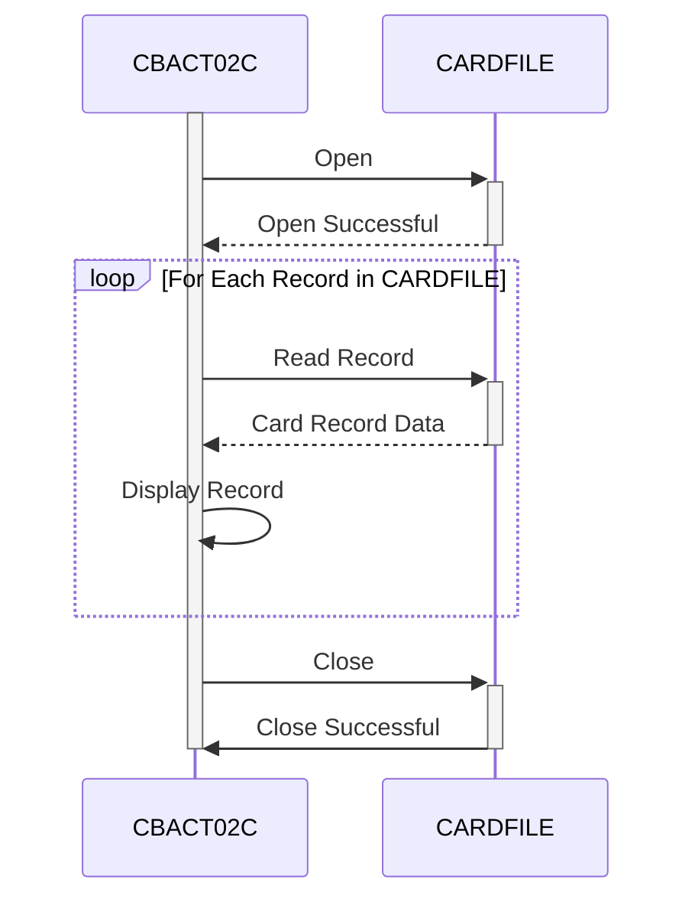

Generated at: 2nd October of 2024

**Title Document:** CardDemo Application - Card Data File Batch Processor Specification

**Summary Description:**
This document outlines the specifications for the "CBACT02C" program, a batch processing component within the CardDemo application. This program is responsible for sequentially reading and displaying credit card information stored in a VSAM KSDS file named "CARDFILE".

**User Stories:**
As a Data Analyst, I need to be able to view the contents of the credit card data file to verify its structure, validate data accuracy, and identify potential data quality issues. This information is crucial for ensuring that only reliable and accurate data is used for analysis and reporting purposes.

**Related Epic:** 7 - Batch Processing

**Technical Requirements:**

- `Read Card File Sequentially`: This method opens the `CARDFILE`, reads each record sequentially, and displays its content.
  - Input: None (reads data from the `CARDFILE`).
  - Processing: Opens the `CARDFILE`, retrieves each record based on the `FD-CARD-NUM` key in a loop until the end of the file is reached.
  - Output: Displays the content of each retrieved record (format not specified, assumed to be a simple display).
- `Open Card File`: This method opens the `CARDFILE` for input.
  - Input: None.
  - Processing: Attempts to open the `CARDFILE` in input mode.
  - Result: `CARDFILE-STATUS` indicates the success (`'00'`) or failure of the operation.
- `Close Card File`: This method closes the `CARDFILE`.
  - Input: None.
  - Processing: Attempts to close the `CARDFILE`.
  - Result: `CARDFILE-STATUS` indicates the success (`'00'`) or failure of the operation.
- `Display I/O Status`: This method displays the file status.
  - Input: `IO-STATUS`.
  - Processing: Formats the `IO-STATUS` into a user-readable format.
  - Output: Displays the formatted file status message.
- `Abend Program`: This method handles abnormal program termination.
  - Input: None.
  - Processing: Sets the abend code to `999` and calls the `CEE3ABD` routine to terminate the program abnormally.
  - Output: None.

**Related Models**

- `CARD-RECORD`
  - `FD-CARD-NUM` `PIC X(16)`: Credit card number (key field).
  - `FD-CARD-DATA` `PIC X(134)`: Remaining credit card data (details not specified in the provided code).

**Configurations:**

- `CBACT02C.cbl`
  - `CARDFILE-FNAME`: `"CARDDAT"`
	- Description:  File name for the card data file.

**Code Improvements:**

- **Error Handling:** Implement a more robust error handling mechanism that includes:
    - Logging errors to a file or database for later analysis.
    - Providing more informative error messages to the user, potentially including the specific error code and a brief description.
    - Implementing a retry mechanism for recoverable errors, such as temporary file system issues.
- **Logging:** Add logging statements to capture key events during program execution, such as:
    - The start and end of the program.
    - The number of records processed.
    - Any errors encountered.
- **Performance:** No significant performance improvements are apparent from the code snippet, as the program's logic is relatively straightforward. However, consider these aspects if performance becomes an issue:
    - Review the file access methods and optimize if possible.
    - If the program processes large volumes of data, explore techniques for optimizing I/O operations.
- **Documentation:** Add comments to the code to explain the purpose of different sections, variables, and logic. This will make the code easier to understand and maintain in the future.

**Security Improvements:**

- **File Access Control:** Implement appropriate access control measures to restrict unauthorized access to the `CARDFILE`. This might involve using operating system level permissions or security software to control who can read or modify the file.
- **Data Encryption:** Consider encrypting sensitive data within the `CARDFILE`, especially if it contains personally identifiable information (PII) or other confidential data.
- **Audit Logging:** Implement audit logging to track who accesses or modifies the `CARDFILE` and when. This information can be invaluable for security incident investigation and compliance reporting.

**Conceptual Diagram:**

--Made by "Smart Engineering" (by Compass.UOL)--