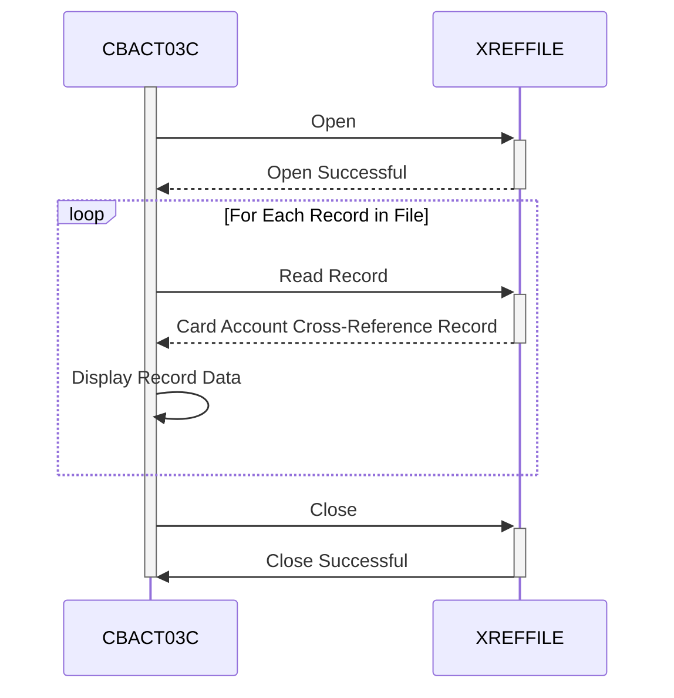

Generated at: 2nd October of 2024

**Title Document:** Card Account Cross-Reference Data File Processor - CBACT03C

**Summary Description:**
This program reads and displays records from an indexed file containing credit card account cross-reference data. It handles file statuses and includes error handling.

**User Stories:**
As a data analyst, I need to be able to view the contents of the card account cross-reference data file to ensure data integrity and accuracy.

**Related Epic:**
3 - Credit Card Management

**Technical Requirements:**

- **Open Cross-Reference File:** This method opens the cross-reference data file for reading.
  - Input: None
  - Validation: Verify if the file exists and can be opened for input using file status codes.
  - Output: None

- **Read Cross-Reference Record:** This method reads one record at a time from the opened cross-reference data file.
  - Input: None
  - Validation: Check for end-of-file (EOF) condition using file status codes. If EOF is reached, set the `END-OF-FILE` flag to `'Y'`.
  - Output: `CARD-XREF-RECORD`:  Contains the data from the read record.

- **Display Record Data:** This method displays the content of a single record read from the cross-reference data file.
  - Input: `CARD-XREF-RECORD`: The record read from the file.
  - Validation: None
  - Output: Displays the content of `CARD-XREF-RECORD` (likely on the console or to a log).

- **Close Cross-Reference File:** This method closes the cross-reference data file.
  - Input: None
  - Validation: Verify if the file was closed successfully using file status codes.
  - Output: None

- **Display File Status:** This method interprets and displays the file status codes in a user-friendly format.
  - Input: `IO-STATUS`: Contains the file status code.
  - Validation: None
  - Output: Displays a formatted error message based on the file status code.

- **Handle Fatal Error:** This method handles severe errors by displaying a message and terminating the program abnormally.
  - Input: None
  - Validation: None
  - Output: Displays an error message and triggers an abend with a specific code.

**Related Models**

- **`CARD-XREF-RECORD`**
  - `FD-XREF-CARD-NUM` `PIC X(16)`: Credit card number.
  - `FD-XREF-DATA` `PIC X(34)`:  Additional cross-reference information.

**Configurations:**

- `CBACT03C.cbl`
  - `XREFFILE-FNAME`: `"CXREF"`
	- Description: File name for the cross reference file.

**Code Improvements:**
- **Error Handling:** Implement a more centralized error-handling routine to reduce code duplication and improve maintainability.
- **Logging:** Instead of just displaying error messages, write them to a log file for better tracking and debugging.
- **Modularity:** Break down the program into smaller, more manageable paragraphs for better code organization.
- **Comments:** Add more in-line comments to explain the logic and purpose of different code sections.

**Security Improvements:**
- **File Access Control:** Implement appropriate file access restrictions to prevent unauthorized access to the cross-reference data file.
- **Data Encryption:** Consider encrypting the sensitive data in the cross-reference file to protect it from unauthorized disclosure.
- **Audit Trail:** Log all file access attempts, including successful and unsuccessful ones, for security auditing purposes.

**Conceptual Diagram:**

--Made by "Smart Engineering" (by Compass.UOL)--