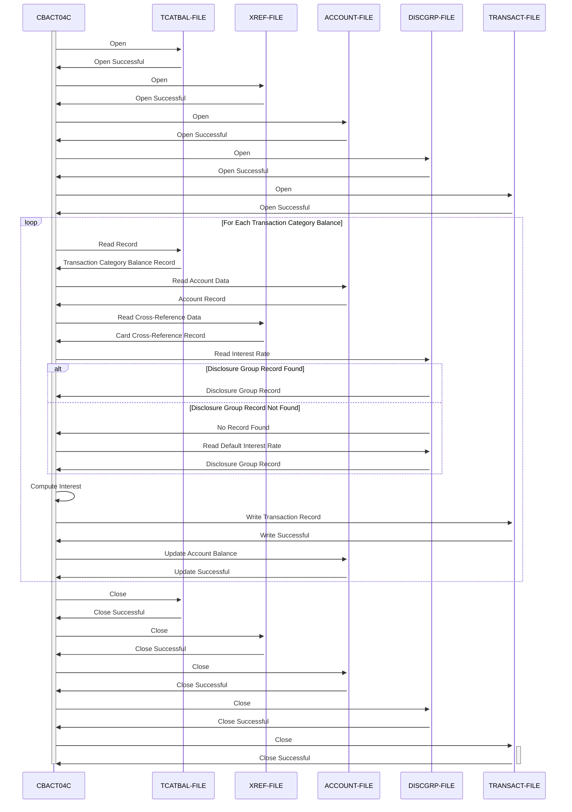

Generated at: 2nd October of 2024

**Title Document:** CardDemo Interest Calculation Module - Batch Processing Specification

**Summary Description:**
The CardDemo Interest Calculation Module is a batch program that calculates and applies monthly interest to customer accounts based on their transaction category balances and predefined interest rates. It reads data from multiple input files, performs calculations, updates the account master file, and generates transaction records for interest applied.

**User Stories:**
As a data analyst, I need to ensure that interest is calculated and applied accurately to customer accounts so that financial reports are correct and customer statements reflect the correct interest charges.

**Related Epic:** 
4 - Transaction Processing

**Technical Requirements:**

- Open Files: Opens the required files for processing: `TCATBAL-FILE` (Transaction Category Balance File), `XREF-FILE` (Cross-Reference File), `DISCGRP-FILE` (Disclosure Group File), `ACCOUNT-FILE` (Account Master File), and `TRANSACT-FILE` (Transaction File).
  - Input: None.
  - Output: None.
- Read Transaction Category Balance: Reads records from the `TCATBAL-FILE`, which contains the balance for each transaction category for each account.
  - Input: None.
  - Output: `TRAN-CAT-BAL-RECORD` (Transaction Category Balance Record) - Contains account ID, transaction type code, transaction category code, and balance.
- Update Account: Updates the account balance in the `ACCOUNT-FILE` by adding the calculated total interest and resets the cycle credit and debit amounts to zero.
  - Input: `WS-TOTAL-INT` (Total Interest) - The total interest calculated for the account.
  - Output: None.
- Get Account Data: Retrieves account data from the `ACCOUNT-FILE` based on the account ID.
  - Input: `FD-ACCT-ID` (Account ID) - The ID of the account to retrieve.
  - Output: `ACCOUNT-RECORD` (Account Record) - Contains all the account details, including the account group ID.
- Get Cross-Reference Data: Retrieves data from the `XREF-FILE` using the account ID as the key.
  - Input: `FD-XREF-ACCT-ID` (Account ID) - The ID of the account to retrieve.
  - Output: `CARD-XREF-RECORD` (Card Cross-Reference Record) - Contains the credit card number associated with the account.
- Get Interest Rate: Retrieves the interest rate from the `DISCGRP-FILE` based on the account group ID, transaction type code, and transaction category code. If no matching record is found, it attempts to retrieve the default interest rate using the group code `'DEFAULT'`.
  - Input: `FD-DIS-ACCT-GROUP-ID` (Account Group ID) - The ID of the account group.
  - Input: `FD-DIS-TRAN-TYPE-CD` (Transaction Type Code) - The code for the transaction type.
  - Input: `FD-DIS-TRAN-CAT-CD` (Transaction Category Code) - The code for the transaction category.
  - Output: `DIS-GROUP-RECORD` (Disclosure Group Record) - Contains the interest rate for the specified account group and transaction category.
- Compute Interest: Calculates the monthly interest based on the transaction category balance and the retrieved interest rate. The formula used is `(TRAN-CAT-BAL * DIS-INT-RATE) / 1200`.
  - Input: `TRAN-CAT-BAL` (Transaction Category Balance) - The balance for the transaction category.
  - Input: `DIS-INT-RATE` (Interest Rate) - The interest rate retrieved from the `DISCGRP-FILE`.
  - Output: `WS-MONTHLY-INT` (Monthly Interest) - The calculated monthly interest.
- Write Transaction: Constructs and writes transaction records to the `TRANSACT-FILE` with details of the calculated interest.
  - Input: `WS-MONTHLY-INT` (Monthly Interest) - The calculated monthly interest.
  - Input: `ACCT-ID` (Account ID) - The ID of the account.
  - Input: `XREF-CARD-NUM` (Credit Card Number) - The credit card number associated with the account.
  - Input: `PARM-DATE` (Execution Date) - The date the program was executed.
  - Output: None.
- Close Files: Closes all the files that were opened during processing.
  - Input: None.
  - Output: None.
- Get DB2 Format Timestamp: Retrieves the current timestamp and formats it in the DB2 timestamp format.
  - Input: None.
  - Output: `DB2-FORMAT-TS` (DB2 Format Timestamp) - The current timestamp in DB2 format.
- Display IO Status: Displays formatted file status information in case of file errors.
  - Input: `IO-STATUS` (IO Status) - The file status code.
  - Output: None.
- Abend Program: Terminates the program abnormally in case of fatal errors.
  - Input: None.
  - Output: None.

**Related Models**

- `TRAN-CAT-BAL-RECORD` (Transaction Category Balance Record)
  - `FD-TRANCAT-ACCT-ID` `Numeric(11)`: Account Identifier
  - `FD-TRANCAT-TYPE-CD` `Alphanumeric(2)`: Transaction Type Code
  - `FD-TRANCAT-CD` `Numeric(4)`: Transaction Code
  - `FD-FD-TRAN-CAT-DATA` `Alphanumeric(33)`: Transaction Category Data
- `CARD-XREF-RECORD` (Card Cross-Reference Record)
  - `FD-XREF-CARD-NUM` `Alphanumeric(16)`: Credit Card Number
  - `FD-XREF-CUST-NUM` `Numeric(9)`: Customer Number
  - `FD-XREF-ACCT-ID` `Numeric(11)`: Account Identifier
  - `FD-XREF-FILLER` `Alphanumeric(14)`: Filler
- `DIS-GROUP-RECORD` (Disclosure Group Record)
  - `FD-DIS-ACCT-GROUP-ID` `Alphanumeric(10)`: Account Group Identifier
  - `FD-DIS-TRAN-TYPE-CD` `Alphanumeric(2)`: Transaction Type Code
  - `FD-DIS-TRAN-CAT-CD` `Numeric(4)`: Transaction Code
  - `FD-DISCGRP-DATA` `Alphanumeric(34)`: Disclosure Group Data
- `ACCOUNT-RECORD` (Account Record)
  - `FD-ACCT-ID` `Numeric(11)`: Account Identifier
  - `FD-ACCT-DATA` `Alphanumeric(289)`: Account Data
- `TRAN-RECORD` (Transaction Record)
  - `FD-TRANS-ID` `Alphanumeric(16)`: Transaction Identifier
  - `FD-ACCT-DATA` `Alphanumeric(334)`: Account Data

**Configurations:**

- File Names
  - `TCATBALF`: `"TCATBAL"`
	- Description: File name for the transaction category balance file.
  - `XREFFILE`: `"CXREF"`
	- Description: File name for the cross reference file.
  - `DISCGRP`: `"DISCGRP"`
	- Description: File name for the disclosure group file.
  - `ACCTFILE`: `"ACCTDAT"`
	- Description: File name for the account file.
  - `TRANSACT`: `"TRANSACT"`
	- Description: File name for the transaction file.
- Constant Values
  - `'DEFAULT'`: `"DEFAULT"`
	- Description: Default account group ID used when a specific disclosure group record is not found.
  - `'01'`: `"01"`
	- Description: Transaction type code for interest.
  - `'05'`: `"05"`
	- Description: Transaction category code for interest.
  - `'System'`: `"System"`
	- Description: Source of the interest transaction.
  - `'Int. for a/c '`: `"Int. for a/c "`
	- Description: Description prefix for the interest transaction.

**Code Improvements:**

- Improve error handling by providing more specific error messages and handling different error scenarios gracefully.
- Add more detailed comments to explain the logic and purpose of different code sections.
- Implement a logging mechanism to record the program's execution flow, errors, and important events.
- Consider using a more structured approach to organizing the code, such as using subprograms or modules for different functionalities.
- Explore performance optimization techniques, such as using more efficient file access methods or data structures.

**Security Improvements:**

- Implement access control mechanisms to restrict unauthorized access to the program and its input/output files.
- Consider encrypting sensitive data, such as account numbers and interest rates, both in storage and during transmission.
- Implement auditing mechanisms to track all data access and modifications for security and compliance purposes.
- Regularly review and update security measures to address potential vulnerabilities.

**Conceptual Diagram:**

--Made by "Smart Engineering" (by Compass.UOL)--