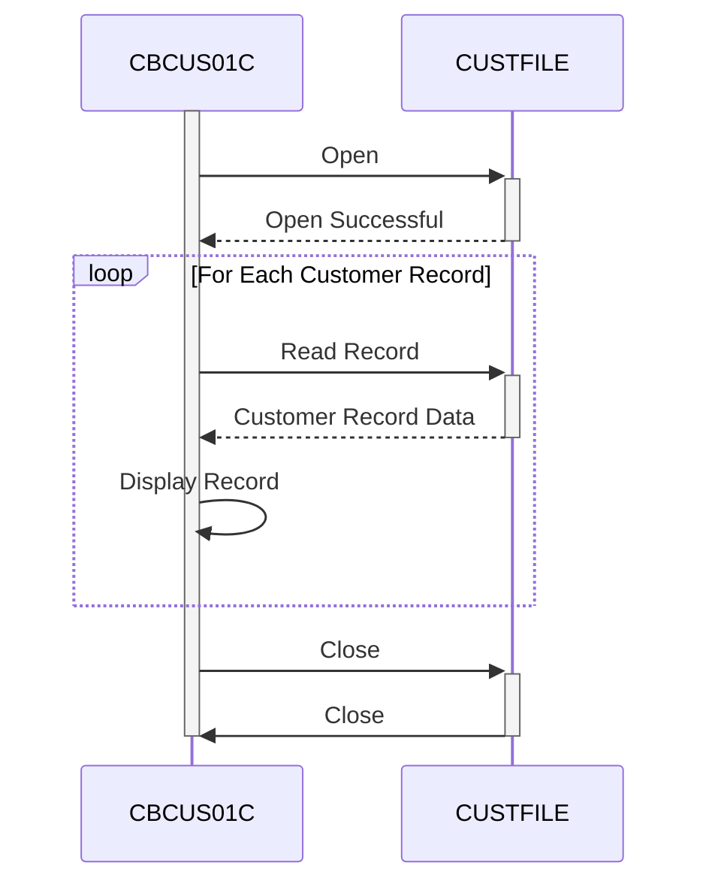

Generated at: 2nd October of 2024

**Title Document: CardDemo Customer Data Extract - Batch Process Specification**

**Summary Description:**
The CardDemo Customer Data Extract is a batch process that sequentially reads customer records from the `CUSTFILE`, displays each record's content, and handles file operation statuses. This process is essential for data analysts to access and view customer information directly from the source file.

**User Stories:**
As a data analyst, I need to be able to extract and view customer data from the mainframe system to perform analysis and generate reports. 

**Related Epic:** 8 - Customer Data Management

**Technical Requirements:**
- **File Open Routine:** Opens the customer file (`CUSTFILE`) for sequential reading.
  - Input: None
  - Result: Opens the customer file or aborts the program if an error occurs.
- **Record Retrieval Routine:** Reads each customer record from the `CUSTFILE`.
  - Input: None
  - Result: Retrieves the next customer record from the file and stores it in the `CUSTOMER-RECORD` data structure. If no more records are found, it sets the `END-OF-FILE` flag.
- **Data Display Routine:** Displays the content of the current customer record on the system console.
  - Input: `CUSTOMER-RECORD`
  - Result: The content of the `CUSTOMER-RECORD` is displayed.
- **File Close Routine:** Closes the `CUSTFILE`.
  - Input: None
  - Result:  Closes the customer file or displays an error message and aborts the program if a problem occurs during closing.
- **Error Handling:** Implements error checks for all file operations and displays specific error messages. If an error occurs during the opening or closing of the file, the program terminates.
  - Input: File Status code
  - Result: Displays a user-friendly error message based on the file status code.

**Related Models**
- **`CUSTOMER-RECORD`:** Represents a customer record.
  - `FD-CUST-ID` `9(09)`: Unique identifier for each customer.                 
  - `FD-CUST-DATA` `X(491)`: Contains all other customer-related information.     

**Configurations:**
- **`CBCUS01C.cbl`**
  - `CUSTFILE-FNAME`: `"CUSTDAT"`
	- Description: File name for the customer data file.

**Code Improvements:**
- **Logging:** Implement a logging mechanism to record successful file operations, errors, and potentially the number of records processed. This will provide an audit trail and assist in debugging.
- **Parameterization:** Consider parameterizing the program to accept the input file name as an argument instead of hardcoding it. This increases flexibility.
- **Data Validation:**  Depending on the nature of the data in `CUSTFILE`, incorporate data validation checks on the extracted customer data to ensure data quality and identify potential inconsistencies.
- **Output Options:** Provide options for outputting the extracted data to different destinations like a different file, a database, or a printer, instead of just displaying it on the console.

**Security Improvements:**
- **Access Control:** Implement access control mechanisms to restrict the execution of this program and access to the `CUSTFILE` to authorized personnel only.
- **Data Masking/Redaction:**  If the `CUSTFILE` contains sensitive customer information, consider masking or redacting certain fields during display or output to protect customer privacy.
- **Secure Logging:** Ensure that logs generated by the program are stored securely and are tamper-proof, especially if they contain sensitive information.

**Conceptual Diagram:**

--Made by "Smart Engineering" (by Compass.UOL)--