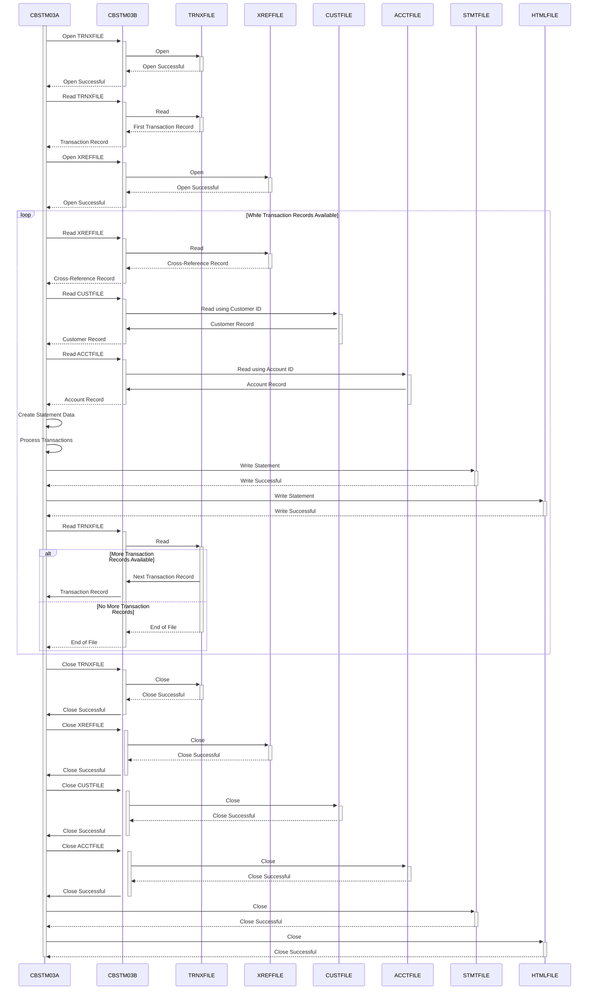

Generated at: 2nd October of 2024

**Title Document:** CardDemo Account Statement Generation - Program Specification

**Summary Description:**
The CardDemo Account Statement Generation program is a batch process that generates account statements for credit card holders. It reads transaction details, customer information, and account data from various input files and produces statements in plain text and HTML formats. 

**User Stories:**
As a data analyst, I need to ensure that all customer records are properly validated and processed to generate accurate account statements that can be used for analysis and reporting purposes. This will allow me to track customer activity, identify trends, and make informed decisions based on reliable data.

**Related Epic:**
5 - Reporting and Analytics

**Technical Requirements:**
- **Retrieve Cross-Reference Record:** Retrieves the next record from the cross-reference file (`XREFFILE`) to obtain the customer ID, account ID, and credit card number.
  - Input: None.
  - Output: `CARD-XREF-RECORD` containing customer ID (`XREF-CUST-ID`), account ID (`XREF-ACCT-ID`), and credit card number (`XREF-CARD-NUM`).
- **Retrieve Customer Record:** Retrieves the customer record from the customer file (`CUSTFILE`) based on the customer ID obtained from the cross-reference record.
  - Input: `XREF-CUST-ID` from the `CARD-XREF-RECORD`.
  - Output: `CUSTOMER-RECORD` containing customer details such as name, address, and credit score.
- **Retrieve Account Record:** Retrieves the account record from the account file (`ACCTFILE`) using the account ID obtained from the cross-reference record.
  - Input: `XREF-ACCT-ID` from the `CARD-XREF-RECORD`.
  - Output: `ACCOUNT-RECORD` containing account details such as account ID and current balance.
- **Create and Populate Statement Data:** Initializes and populates the statement data structures (`STATEMENT-LINES` and `HTML-LINES`) with customer, account, and transaction information.
  - Input: `CUSTOMER-RECORD`, `ACCOUNT-RECORD`.
  - Output: Populated `STATEMENT-LINES` and `HTML-LINES` data structures containing customer information, account details, and transaction summary headers.
- **Retrieve and Process Transactions:** Retrieves and processes transactions from the transaction file (`TRNXFILE`) for a specific credit card number.
  - Input: `XREF-CARD-NUM` from the `CARD-XREF-RECORD`.
  - Output: A list of `TRNX-RECORD` objects, each containing transaction details such as transaction ID, description, and amount.
- **Write Transaction Details:** Writes individual transaction details to the statement data structures (`STATEMENT-LINES` and `HTML-LINES`).
  - Input: `TRNX-RECORD` containing transaction details.
  - Output: Updated `STATEMENT-LINES` and `HTML-LINES` data structures with the transaction details appended to the transaction summary section.

**Related Models**
- `CARD-XREF-RECORD`
  - `XREF-CUST-ID` `String`: Customer ID.
  - `XREF-ACCT-ID` `String`: Account ID.
  - `XREF-CARD-NUM` `String`: Credit Card Number.
- `CUSTOMER-RECORD`
  - `CUST-FIRST-NAME` `String`: Customer's first name.
  - `CUST-MIDDLE-NAME` `String`: Customer's middle name.
  - `CUST-LAST-NAME` `String`: Customer's last name.
  - `CUST-ADDR-LINE-1` `String`: Customer's address line 1.
  - `CUST-ADDR-LINE-2` `String`: Customer's address line 2.
  - `CUST-ADDR-LINE-3` `String`: Customer's address line 3.
  - `CUST-ADDR-STATE-CD` `String`: Customer's state code.
  - `CUST-ADDR-COUNTRY-CD` `String`: Customer's country code.
  - `CUST-ADDR-ZIP` `String`: Customer's zip code.
  - `CUST-FICO-CREDIT-SCORE` `String`: Customer's FICO credit score.
- `ACCOUNT-RECORD`
  - `ACCT-ID` `String`: Account ID.
  - `ACCT-CURR-BAL` `Decimal`: Account current balance.
- `TRNX-RECORD`
  - `TRNX-CARD-NUM` `String`: Card number associated with the transaction.
  - `TRNX-ID` `String`: Transaction ID.
  - `TRNX-REST` `String`: Transaction details.
  - `TRNX-AMT` `Decimal`: Transaction amount.

**Configurations:**
- Constant Values
  - `WS-REPORT-LINES-PER-PAGE`: `55`
	- Description: Number of lines per page in the report, defined in `CBSTM03A.CBL`.

**Code Improvements:**
- **Error Handling:** Implement a more robust error handling mechanism to capture and log errors during file processing, data retrieval, and statement generation. This will improve the program's reliability and make it easier to troubleshoot issues.
- **Modularity:** Break down the program into smaller, more manageable modules or subroutines to improve code readability and maintainability. For example, separate the HTML and plain text statement generation logic into different modules.
- **Data Validation:** Add data validation checks to ensure the integrity and consistency of data retrieved from input files. For example, validate credit card numbers, customer IDs, and transaction amounts.
- **Documentation:** Improve code documentation by adding comments to explain the purpose and functionality of different code sections. This will make it easier for other developers to understand and maintain the code.

**Security Improvements:**
- **Data Encryption:** Implement data encryption for sensitive information, such as credit card numbers and customer data, both in transit and at rest. This will protect the data from unauthorized access and ensure compliance with data privacy regulations.
- **Secure File Handling:** Ensure secure file handling practices, including appropriate file permissions and access controls, to prevent unauthorized access to input and output files.
- **Auditing:** Implement an auditing mechanism to track all data access and modifications, providing a record of all activities performed by the program. This will help in identifying and investigating any security breaches or data manipulation attempts. 

**Conceptual Diagram:**

--Made by "Smart Engineering" (by Compass.UOL)--