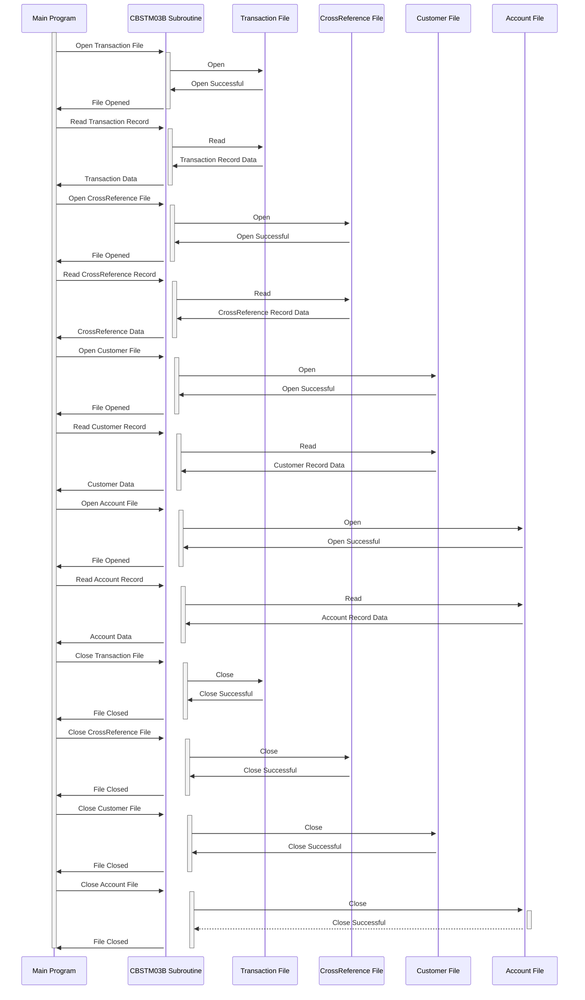

Generated at: 2nd October of 2024

**Title Document: Card Transaction File Processor Subroutine - Technical Specification**

**Summary Description:**
This subroutine manages file operations for four indexed files related to card transactions, acting as a reusable component within a larger batch processing system. It handles reading transaction records, cross-referencing card information, and accessing customer and account details.

**User Stories:**
As a batch processing system, I need to be able to access and process transaction, cross-reference, customer, and account data to accurately update account information based on transaction details.

**Related Epic:**
4 - Transaction Processing

**Technical Requirements:**
- **Transaction File Processing:** This method handles the opening, reading, and closing operations for the transaction file (`TRNX-FILE`). 
  - Input: Request from the main program (`LK-M03B-DD` = `'TRNXFILE'`, `LK-M03B-OPER` = `'O'` for open, `'R'` for read, `'C'` for close).
  - Output:  `LK-M03B-RC` will contain the file status (`TRNXFILE-STATUS`) after the operation.
- **Cross-Reference File Processing:** This method is responsible for opening, reading, and closing the cross-reference file (`XREF-FILE`).
  - Input: Request from the main program (`LK-M03B-DD` = `'XREFFILE'`, `LK-M03B-OPER` = `'O'` for open, `'R'` for read, `'C'` for close).
  - Output: `LK-M03B-RC` will contain the file status (`XREFFILE-STATUS`) after the operation.
- **Customer File Processing:**  This method handles the opening, reading, and closing operations for the customer file (`CUST-FILE`).
  - Input: Request from the main program (`LK-M03B-DD` = `'CUSTFILE'`, `LK-M03B-OPER` = `'O'` for open, `'R'` for read, `'C'` for close, `'K'` for read with key). If `LK-M03B-OPER` is `'K'`, then `LK-M03B-KEY` will contain the customer ID (`FD-CUST-ID`).
  - Output: `LK-M03B-RC` will contain the file status (`CUSTFILE-STATUS`) after the operation. If `LK-M03B-OPER` is `'K'`, then `LK-M03B-FLDT` will contain the customer data (`FD-CUST-DATA`).
- **Account File Processing:** This method is responsible for opening, reading, and closing the account file (`ACCT-FILE`).
  - Input: Request from the main program (`LK-M03B-DD` = `'ACCTFILE'`, `LK-M03B-OPER` = `'O'` for open, `'R'` for read, `'C'` for close, `'K'` for read with key). If `LK-M03B-OPER` is `'K'`, then `LK-M03B-KEY` will contain the account ID (`FD-ACCT-ID`).
  - Output: `LK-M03B-RC` will contain the file status (`ACCTFILE-STATUS`) after the operation. If `LK-M03B-OPER` is `'K'`, then `LK-M03B-FLDT` will contain the account data (`FD-ACCT-DATA`).

**Related Models**
- **Transaction:** Represents a single credit card transaction.
  - `FD-TRNXS-ID` `Alphanumeric`: Unique transaction ID, combination of `FD-TRNX-CARD` and `FD-TRNX-ID`.
  - `FD-TRNX-CARD` `Alphanumeric`: Credit card number associated with the transaction.
  - `FD-TRNX-ID` `Alphanumeric`: Unique identifier for the transaction.
  - `FD-ACCT-DATA` `Alphanumeric`: Account data related to the transaction.
- **CrossReference:** Links a credit card number to an account.
  - `FD-XREF-CARD-NUM` `Alphanumeric`: Credit card number being cross-referenced.
  - `FD-XREF-DATA` `Alphanumeric`: Data associated with the cross-reference, potentially including account ID.
- **Customer:** Contains information about a customer.
  - `FD-CUST-ID` `Alphanumeric`: Unique identifier for the customer.
  - `FD-CUST-DATA` `Alphanumeric`: Data associated with the customer.
- **Account:** Holds information about a credit card account.
  - `FD-ACCT-ID` `Numeric`: Unique identifier for the account.
  - `FD-ACCT-DATA` `Alphanumeric`: Data associated with the account.

**Configurations:**
- **File Names:**
  - `TRNXFILE`:  Transaction file name, externally defined.
  - `XREFFILE`: Cross-reference file name, externally defined.
  - `CUSTFILE`: Customer file name, externally defined.
  - `ACCTFILE`: Account file name, externally defined.

**Code Improvements:**
- **Centralized Error Handling:** Implement a centralized error handling routine to provide a consistent approach to error logging and recovery.
- **Enhanced Documentation:** Improve code comments to clearly explain the purpose and functionality of different code sections.
- **Parameter Validation:** Add validation for input parameters (`LK-M03B-DD`, `LK-M03B-OPER`, `LK-M03B-KEY`) to prevent unexpected behavior.

**Security Improvements:**
- **File Access Control:** Implement appropriate file access restrictions to prevent unauthorized access to sensitive data.
- **Logging and Auditing:** Log all file operations, including user ID and timestamps, to enable auditing and tracking of data access.

**Conceptual Diagram:**

--Made by "Smart Engineering" (by Compass.UOL)--