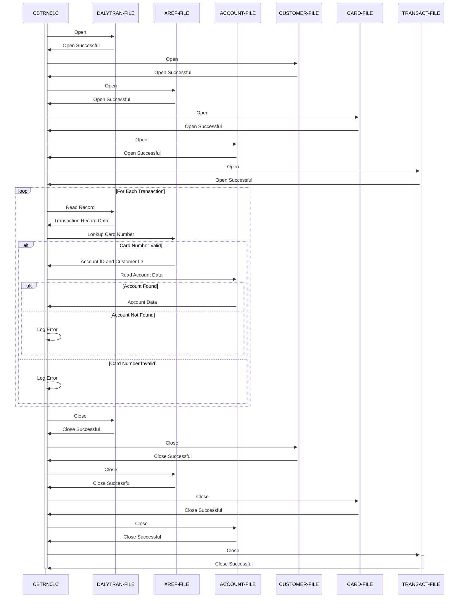

Generated at: 2nd October of 2024

**Title Document:** CardDemo - Daily Transaction Processing - Program Specification

**Summary Description:**
The CardDemo Daily Transaction Processing program is a batch process designed to handle the daily influx of credit card transactions. Its primary function is to ensure that each transaction is validated and accurately reflected in the corresponding customer accounts. This involves checking the validity of the card used, retrieving the associated account information, and preparing the data for updating the transaction records. 

**User Stories:**
As a data analyst, I need to ensure that all daily credit card transactions are validated and accurately processed so that I can perform reliable financial analysis and reporting.

**Related Epic:**
4 - Transaction Processing

**Technical Requirements:**

- Open Files: This method opens all the necessary files for processing.
  - Input: None.
  - Output: Open files `DALYTRAN-FILE`, `CUSTOMER-FILE`, `XREF-FILE`, `CARD-FILE`, `ACCOUNT-FILE`, `TRANSACT-FILE`.
  - Result: `{Boolean}`: Returns `TRUE` if all files are opened successfully, `FALSE` otherwise.
- Read Daily Transaction Record: This method reads a single transaction record from the daily transaction file (`DALYTRAN-FILE`).
  - Input: None.
  - Output: `DALYTRAN-RECORD` `{Record}`: A single transaction record.
  - Result: `{Boolean}`: Returns `TRUE` if a record is read successfully, `FALSE` if end-of-file is reached or an error occurs.
- Lookup Card Number: This method looks up the card number in the cross-reference file (`XREF-FILE`) to retrieve the corresponding account ID and customer ID.
  - Input: `DALYTRAN-CARD-NUM` `{String}`: The card number to look up.
  - Output: `XREF-ACCT-ID` `{String}`: The account ID associated with the card number. `XREF-CUST-ID` `{String}`: The customer ID associated with the card number.
  - Result: `{Boolean}`: Returns `TRUE` if the card number is found in the cross-reference file, `FALSE` otherwise.
- Read Account Data: This method reads the account information from the account file (`ACCOUNT-FILE`) using the provided account ID.
  - Input: `XREF-ACCT-ID` `{String}`: The account ID to read.
  - Output: `ACCOUNT-RECORD` `{Record}`: The account information for the provided account ID.
  - Result: `{Boolean}`: Returns `TRUE` if the account information is read successfully, `FALSE` otherwise.
- Close Files: This method closes all opened files.
  - Input: None.
  - Output: None.
  - Result: `{Boolean}`: Returns `TRUE` if all files are closed successfully, `FALSE` otherwise.
- Abend Program: This method abnormally terminates the program and logs an error.
  - Input: None.
  - Output: None.
  - Result: `{None}`: This method does not return.
- Display IO Status: This method displays the file status information for debugging purposes.
  - Input: `IO-STATUS` `{String}`: The file status to display.
  - Output: None.
  - Result: `{None}`: This method does not return a value.

**Related Models**

- `Daily Transaction`
  - `FD-TRAN-ID` `{String}`: Unique identifier for each transaction.
  - `FD-CUST-DATA` `{String}`: Customer data associated with the transaction.
- `Customer`
  - `FD-CUST-ID` `{String}`: Unique identifier for each customer.
  - `FD-CUST-DATA` `{String}`: Customer data.
- `Card Cross Reference`
  - `FD-XREF-CARD-NUM` `{String}`: Credit card number, used as a key in the cross-reference file.
  - `FD-XREF-DATA` `{String}`: Additional data related to the card cross-reference.
- `Card`
  - `FD-CARD-NUM` `{String}`: Credit card number, used as a key in the card information file.
  - `FD-CARD-DATA` `{String}`: Additional data related to the card.
- `Account`
  - `FD-ACCT-ID` `{String}`: Unique identifier for each account.
  - `FD-ACCT-DATA` `{String}`: Additional data related to the account.
- `Transaction`
  - `FD-TRANS-ID` `{String}`: Unique identifier for each transaction.
  - `FD-ACCT-DATA` `{String}`: Account data associated with the transaction.

**Configurations:**

- Constant Values
  - `APPL-EOF`: `16`
	- Description:  End-of-file status code.
  - `ABCODE`: `999`
	- Description: Abend code for abnormal program termination.

**Code Improvements:**

- **Enhanced Error Handling:** Implement a more comprehensive error handling strategy, capturing and logging specific error codes and messages for easier troubleshooting. Include checks for file status after each read and write operation.
- **Improved Logging:**  Instead of just displaying error messages, implement a logging mechanism that records detailed information about each error, including timestamps, error codes, and relevant data. This will aid in debugging and system monitoring.
- **Modularity:** Break down the program into smaller, more manageable paragraphs or sections for better code organization and readability. For instance, separate the file handling logic (opening, reading, closing) from the core transaction processing logic.
- **Data Validation:** Add validation checks for data read from input files. For example, validate the format and length of card numbers, account IDs, and other critical fields.
- **Documentation:** Add comments explaining the purpose and functionality of each section of the code.  Document the expected input and output data formats for each file.
- **Performance Optimization:** Explore ways to optimize performance, especially if the daily transaction volume is large. This might involve using more efficient file access methods or data structures if possible.

**Security Improvements:**

- **Authentication and Authorization:** Implement security measures to ensure that only authorized users can execute the program and access the sensitive data in the files. This could involve using system-level security features or incorporating user authentication within the program.
- **Data Encryption:** Encrypt sensitive data like card numbers, account details, and customer information both in the files and during processing to protect it from unauthorized access.
- **Audit Trail:** Implement an audit trail to track all actions performed by the program, including who ran it, when it ran, and any errors encountered. This will help in identifying any unauthorized access or data breaches.
- **Secure File Handling:** Ensure that the files containing sensitive data are stored securely with appropriate access permissions.

**Conceptual Diagram:**

--Made by "Smart Engineering" (by Compass.UOL)--