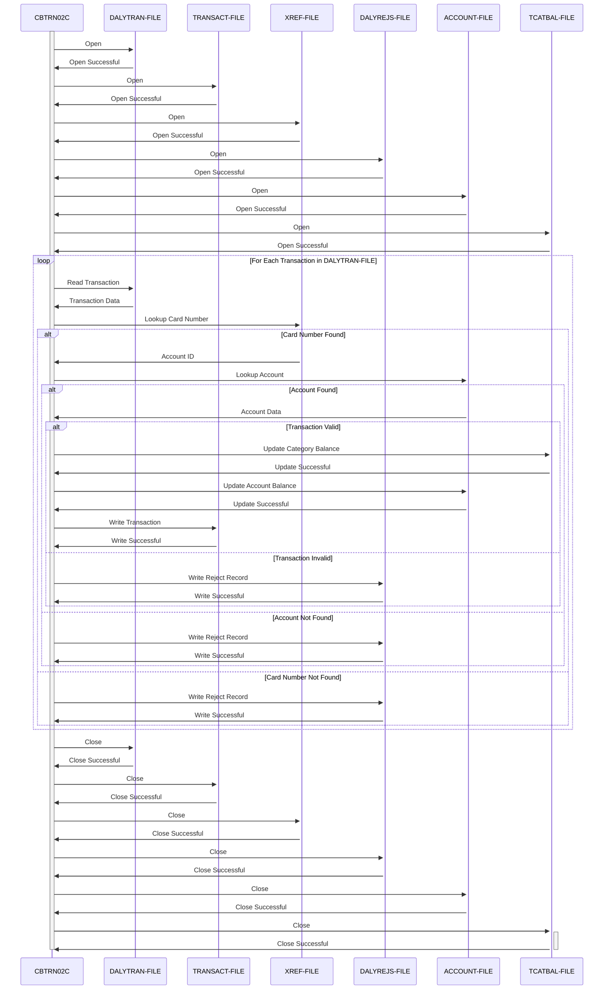

Generated at: 2nd October of 2024

**Title Document: CardDemo - Daily Transaction Processor Specification**

**Summary Description:**
The CardDemo Daily Transaction Processor is a COBOL batch program designed to process daily credit card transactions, validate them against predefined business rules, update account balances, and record transaction details. It ensures that transactions are applied correctly to customer accounts while maintaining data integrity and adhering to business logic.

**User Stories:**
As a data analyst, I need to ensure that only valid credit card transactions are processed and reflected in customer accounts so that my analysis is accurate and reliable.

**Related Epic:**
4 - Transaction Processing

**Technical Requirements:**
This program processes daily transactions from a sequential file (`DALYTRAN-FILE`), performing validations against cross-reference and account data before updating transaction and account balances in indexed files. Rejected transactions are written to a separate file (`DALYREJS-FILE`) with reason codes.

- **Open Daily Transaction File**: Opens the input file containing daily transactions.
  - Input: None.
  - Result `Boolean`: Indicates success or failure of file opening operation. 
- **Open Transaction File**: Opens the output file for storing processed transactions.
  - Input: None.
  - Result `Boolean`: Indicates success or failure of file opening operation. 
- **Open Cross-Reference File**: Opens the file that maps credit card numbers to account IDs.
  - Input: None.
  - Result `Boolean`: Indicates success or failure of file opening operation. 
- **Open Daily Rejects File**: Opens the file for storing rejected transactions.
  - Input: None.
  - Result `Boolean`: Indicates success or failure of file opening operation. 
- **Open Account File**: Opens the file containing customer account information.
  - Input: None.
  - Result `Boolean`: Indicates success or failure of file opening operation. 
- **Open Transaction Category Balance File**: Opens the file for tracking balances by transaction category.
  - Input: None.
  - Result `Boolean`: Indicates success or failure of file opening operation. 
- **Read Daily Transaction**: Reads the next transaction record from the input file.
  - Input: None.
  - Result `{FD-TRAN-RECORD}`: Contains the details of the next transaction or an end-of-file indicator. 
- **Validate Transaction**: Performs a series of checks to ensure the validity of the transaction.
  - Input: `DALYTRAN-RECORD`.
  - Step Name: Lookup Card Number in Cross-Reference File
    - Input: `DALYTRAN-CARD-NUM` from `DALYTRAN-RECORD`.
    - Output: `CARD-XREF-RECORD` if a match is found.
    - Result `Integer`: Sets `WS-VALIDATION-FAIL-REASON` to `100` if no match is found, indicating an invalid card number.
  - Step Name: Lookup Account ID in Account File
    - Input: `XREF-ACCT-ID` from `CARD-XREF-RECORD`.
    - Output: `ACCOUNT-RECORD` if a match is found.
    - Result `Integer`: Sets `WS-VALIDATION-FAIL-REASON` to `101` if no match is found, indicating an invalid account.
    - Business Rule: Credit Limit Check
      - Calculation: Check if `ACCT-CREDIT-LIMIT` is greater than or equal to the sum of `ACCT-CURR-CYC-CREDIT`, minus `ACCT-CURR-CYC-DEBIT`, plus `DALYTRAN-AMT`.
      - Result `Integer`: Sets `WS-VALIDATION-FAIL-REASON` to `102` if the credit limit is exceeded.
    - Business Rule: Account Expiration Check
      - Calculation: Compare `ACCT-EXPIRATION-DATE` to `DALYTRAN-ORIG-TS` (transaction origin timestamp).
      - Result `Integer`: Sets `WS-VALIDATION-FAIL-REASON` to `103` if the account is expired.
  - Result `Integer`: Returns `WS-VALIDATION-FAIL-REASON`, which is `0` if the transaction is valid, or a specific error code if a validation rule is violated. 
- **Post Transaction**: Processes a valid transaction by updating account and category balances and recording the transaction details.
  - Input: `DALYTRAN-RECORD`, `CARD-XREF-RECORD`, `ACCOUNT-RECORD`.
  - Step Name: Update Transaction Category Balance
    - Input: `XREF-ACCT-ID`, `DALYTRAN-TYPE-CD`, `DALYTRAN-CAT-CD`, `DALYTRAN-AMT`.
    - Output: Updates `TRAN-CAT-BAL-RECORD`.
    - Step Name: Create Transaction Category Balance Record
      - Calculation: If a record for the account and transaction category doesn't exist, create a new `TRAN-CAT-BAL-RECORD` and initialize it.
      - Result `TRAN-CAT-BAL-RECORD`: A new record is created with the account ID, transaction type code, transaction category code, and the transaction amount added to the balance.
    - Step Name: Update Transaction Category Balance Record
      - Calculation: If a record exists, add `DALYTRAN-AMT` to the existing `TRAN-CAT-BAL`.
      - Result `TRAN-CAT-BAL-RECORD`: The existing record is updated with the new balance.
  - Step Name: Update Account Record
    - Input: `DALYTRAN-AMT`, `ACCOUNT-RECORD`.
    - Calculation: Add `DALYTRAN-AMT` to `ACCT-CURR-BAL`. If `DALYTRAN-AMT` is positive, add it to `ACCT-CURR-CYC-CREDIT`, otherwise add it to `ACCT-CURR-CYC-DEBIT`.
    - Result `ACCOUNT-RECORD`: The account record is updated with the new balance and cycle totals.
  - Step Name: Write Transaction Record
    - Input: `TRAN-RECORD`.
    - Calculation: Create `TRAN-RECORD` from `DALYTRAN-RECORD`, `XREF-ACCT-ID`, and the current timestamp.
    - Result `TRAN-RECORD`: The transaction record is written to the output file.
- **Write Reject Record**: Writes a rejected transaction record to the output file.
  - Input: `DALYTRAN-RECORD`, `WS-VALIDATION-FAIL-REASON`, `WS-VALIDATION-FAIL-REASON-DESC`.
  - Calculation: Combines `DALYTRAN-RECORD`, the rejection reason code, and the rejection reason description into `REJECT-RECORD`.
  - Result `REJECT-RECORD`: The rejected transaction record is written to the output file. 
- **Close Daily Transaction File**: Closes the input file.
  - Input: None.
  - Result `Boolean`: Indicates success or failure of file closing operation. 
- **Close Transaction File**: Closes the output file for processed transactions.
  - Input: None.
  - Result `Boolean`: Indicates success or failure of file closing operation. 
- **Close Cross-Reference File**: Closes the cross-reference file.
  - Input: None.
  - Result `Boolean`: Indicates success or failure of file closing operation. 
- **Close Daily Rejects File**: Closes the file for rejected transactions.
  - Input: None.
  - Result `Boolean`: Indicates success or failure of file closing operation. 
- **Close Account File**: Closes the customer account file.
  - Input: None.
  - Result `Boolean`: Indicates success or failure of file closing operation. 
- **Close Transaction Category Balance File**: Closes the file for transaction category balances.
  - Input: None.
  - Result `Boolean`: Indicates success or failure of file closing operation. 

**Related Models**
- `DALYTRAN-RECORD`
  - `DALYTRAN-ID` `String`: Unique identifier for each daily transaction.
  - `DALYTRAN-TYPE-CD` `String`: Code indicating the type of transaction (e.g., purchase, payment).
  - `DALYTRAN-CAT-CD` `String`: Code categorizing the transaction (e.g., groceries, fuel, entertainment).
  - `DALYTRAN-SOURCE` `String`: Source of the transaction (e.g., online, POS terminal).
  - `DALYTRAN-DESC` `String`: Description of the transaction.
  - `DALYTRAN-AMT` `Decimal`: Amount of the transaction.
  - `DALYTRAN-MERCHANT-ID` `String`: Unique identifier for the merchant involved in the transaction.
  - `DALYTRAN-MERCHANT-NAME` `String`: Name of the merchant.
  - `DALYTRAN-MERCHANT-CITY` `String`: City of the merchant.
  - `DALYTRAN-MERCHANT-ZIP` `String`: ZIP code of the merchant.
  - `DALYTRAN-CARD-NUM` `String`: Credit card number used for the transaction.
  - `DALYTRAN-ORIG-TS` `String`: Timestamp indicating when the transaction was initiated.
- `TRAN-RECORD`
  - `TRAN-ID` `String`: Unique identifier for the transaction.
  - `TRAN-TYPE-CD` `String`: Code indicating the type of transaction (e.g., purchase, payment).
  - `TRAN-CAT-CD` `String`: Code categorizing the transaction (e.g., groceries, fuel, entertainment).
  - `TRAN-SOURCE` `String`: Source of the transaction (e.g., online, POS terminal).
  - `TRAN-DESC` `String`: Description of the transaction.
  - `TRAN-AMT` `Decimal`: Amount of the transaction.
  - `TRAN-MERCHANT-ID` `String`: Unique identifier for the merchant involved in the transaction.
  - `TRAN-MERCHANT-NAME` `String`: Name of the merchant.
  - `TRAN-MERCHANT-CITY` `String`: City of the merchant.
  - `TRAN-MERCHANT-ZIP` `String`: ZIP code of the merchant.
  - `TRAN-CARD-NUM` `String`: Credit card number used for the transaction.
  - `TRAN-ORIG-TS` `String`: Timestamp indicating when the transaction was initiated.
  - `TRAN-PROC-TS` `String`: Timestamp indicating when the transaction was processed.
- `CARD-XREF-RECORD`
  - `FD-XREF-CARD-NUM` `String`: Credit card number.
  - `FD-XREF-DATA` `String`: Additional data associated with the credit card, including `XREF-ACCT-ID`.
- `ACCOUNT-RECORD`
  - `FD-ACCT-ID` `String`: Unique identifier for the account.
  - `FD-ACCT-DATA` `String`: Additional data associated with the account, including:
    - `ACCT-CURR-BAL` `Decimal`: Current account balance.
    - `ACCT-CURR-CYC-CREDIT` `Decimal`: Total credits in the current cycle.
    - `ACCT-CURR-CYC-DEBIT` `Decimal`: Total debits in the current cycle.
    - `ACCT-CREDIT-LIMIT` `Decimal`: Credit limit of the account.
    - `ACCT-EXPIRATION-DATE` `String`: Expiration date of the credit card.
- `TRAN-CAT-BAL-RECORD`
  - `FD-TRAN-CAT-KEY` `String`: Composite key for the transaction category balance record, including:
    - `FD-TRANCAT-ACCT-ID` `String`: Account ID.
    - `FD-TRANCAT-TYPE-CD` `String`: Transaction type code.
    - `FD-TRANCAT-CD` `String`: Category code.
  - `FD-FD-TRAN-CAT-DATA` `String`: Additional data associated with the transaction category balance, including `TRAN-CAT-BAL`.
- `REJECT-RECORD`
  - `REJECT-TRAN-DATA` `String`: The original transaction record data.
  - `VALIDATION-TRAILER` `String`: Contains `WS-VALIDATION-FAIL-REASON` and `WS-VALIDATION-FAIL-REASON-DESC`.

**Configurations:**
- `CBTRN02C.cbl`
  - `REJECT-REASON-XREF-NOT-FOUND`: `01`
	- Description: Reject reason code for cross-reference not found.
  - `REJECT-REASON-ACCT-NOT-FOUND`: `02`
	- Description: Reject reason code for account not found.
  - `REJECT-REASON-ACCT-EXPIRED`: `03`
	- Description: Reject reason code for account expired.
  - `REJECT-REASON-ACCT-OVERLIMIT`: `04`
	- Description: Reject reason code for account overlimit.

**Code Improvements:**
- **Error Handling:** Implement a centralized and consistent error handling mechanism. Instead of using multiple `IF` statements for file status checks, consider using a dedicated error handling paragraph.
- **Logging:** Enhance logging to include timestamps, specific error messages, and relevant data for easier troubleshooting.
- **Data Validation:** Implement more robust data validation for input fields, such as checking for numeric ranges, valid date formats, and data type consistency.
- **Code Structure:** Refactor the code to improve readability and maintainability. Consider breaking down large paragraphs into smaller, more focused sections.
- **Comments:** Add more detailed comments to explain the purpose and logic of each section of code.

**Security Improvements:**
- **File Permissions:** Ensure that the files accessed by the program have appropriate permissions to prevent unauthorized access or modification.
- **Data Encryption:** Consider encrypting sensitive data, such as credit card numbers and account balances, both in storage and during transmission.
- **Auditing:** Implement an audit trail to track all transaction processing activities, including user IDs, timestamps, and changes made to data.
- **Input Sanitization:** Sanitize all input data to prevent injection attacks, such as SQL injection or cross-site scripting.

**Conceptual Diagram:**

--Made by "Smart Engineering" (by Compass.UOL)--