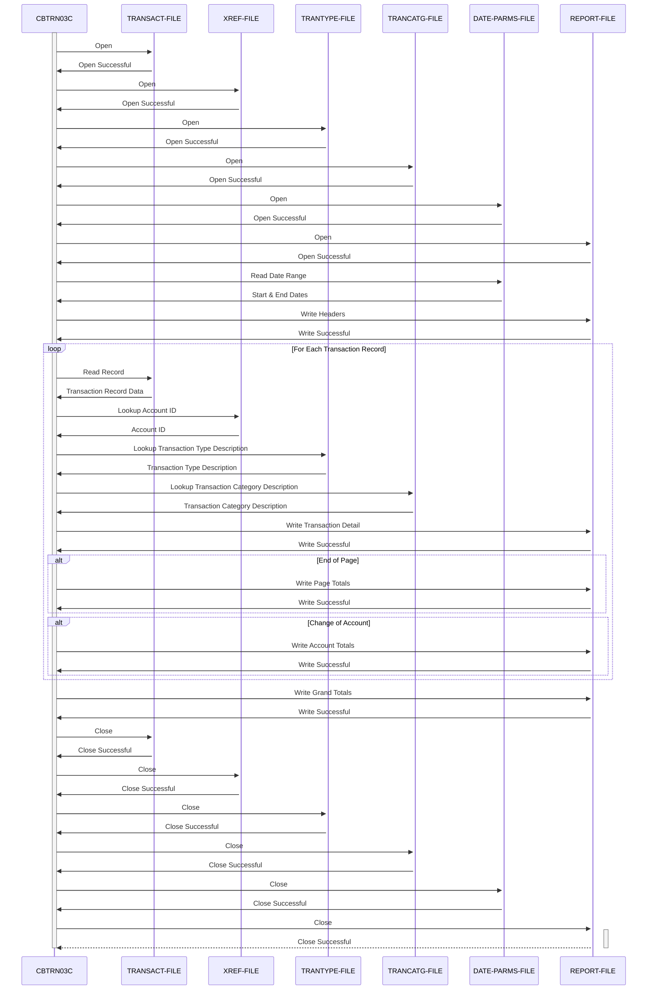

Generated at: 2nd October of 2024

**Title Document:** CardDemo Credit Card Transaction Detail Report Generation - Program Specification

**Summary Description:**
The `CBTRN03C` program is a batch COBOL program that generates a detailed credit card transaction report for a specified date range. It reads transaction data from a sequential file, retrieves related information from indexed files (cross-reference, transaction type, transaction category), and formats the information into a report. The report includes page totals, account totals, and a grand total.

**User Stories:**
As a data analyst, I need a detailed report of credit card transactions so that I can analyze spending patterns, identify trends, and reconcile financial data.

**Related Epic:**
5 - Reporting and Analytics

**Technical Requirements:**
- **Open Files:** This method opens all the necessary files for the report generation process.
  - Input: None.
  - Output:  Open `TRANSACT-FILE`, `XREF-FILE`, `TRANTYPE-FILE`, `TRANCATG-FILE`, `REPORT-FILE` and `DATE-PARMS-FILE` files. 
- **Read Date Parameters:** This method reads the start and end dates for the report from the `DATE-PARMS-FILE`.
  - Input: None.
  - Output: `WS-START-DATE` and `WS-END-DATE` with the date range.
- **Read Transaction Records:** This method reads transaction records from the `TRANSACT-FILE` sequentially.
  - Input: None.
  - Output: `TRAN-RECORD` with transaction data.
- **Lookup Account ID:** This method retrieves the account ID associated with a credit card number using the `XREF-FILE`.
  - Input: `TRAN-CARD-NUM`.
  - Output: `XREF-ACCT-ID`.
- **Lookup Transaction Type Description:** This method retrieves the description for a given transaction type code using the `TRANTYPE-FILE`.
  - Input: `TRAN-TYPE-CD`.
  - Output: `TRAN-TYPE-DESC`.
- **Lookup Transaction Category Description:** This method retrieves the description for a given transaction type and category code combination using the `TRANCATG-FILE`.
  - Input: `TRAN-TYPE-CD` and `TRAN-CAT-CD`.
  - Output: `TRAN-CAT-TYPE-DESC`.
- **Write Transaction Report:**  This method formats and writes transaction details to the report file. It also handles page breaks and calculates page totals.
  - Input: `TRAN-RECORD`, `XREF-ACCT-ID`, `TRAN-TYPE-DESC`, `TRAN-CAT-TYPE-DESC`.
  - Output: Writes transaction details to the `REPORT-FILE`.
- **Write Page Totals:** This method writes the page totals to the `REPORT-FILE` and resets the page total accumulator.
  - Input: `WS-PAGE-TOTAL`.
  - Output: Writes page totals to the `REPORT-FILE` and resets `WS-PAGE-TOTAL` to zero.
- **Write Account Totals:** This method writes the account totals to the `REPORT-FILE` and resets the account total accumulator.
  - Input: `WS-ACCOUNT-TOTAL`.
  - Output: Writes account totals to the `REPORT-FILE` and resets `WS-ACCOUNT-TOTAL` to zero.
- **Write Grand Totals:** This method writes the grand total of all transactions to the `REPORT-FILE`.
  - Input: `WS-GRAND-TOTAL`.
  - Output: Writes grand totals to the `REPORT-FILE`.
- **Write Headers:** This method writes the report headers to the `REPORT-FILE`.
  - Input: `WS-START-DATE` and `WS-END-DATE`.
  - Output: Writes headers to the `REPORT-FILE`.
- **Write Report Record:** This method writes a formatted record to the `REPORT-FILE`.
  - Input: `FD-REPTFILE-REC`.
  - Output: Writes a formatted record to the `REPORT-FILE`.
- **Write Detail:** This method formats and writes a single transaction detail line to the report.
  - Input: `TRAN-RECORD`, `XREF-ACCT-ID`, `TRAN-TYPE-DESC`, `TRAN-CAT-TYPE-DESC`.
  - Output: Writes a formatted transaction detail line to the `REPORT-FILE`.
- **Close Files:** This method closes all the open files used in the report generation process.
  - Input: None.
  - Output: Closes `TRANSACT-FILE`, `XREF-FILE`, `TRANTYPE-FILE`, `TRANCATG-FILE`, `REPORT-FILE` and `DATE-PARMS-FILE` files. 
- **Display I/O Status:** This method displays the file status in case of an I/O error.
  - Input: `IO-STATUS`.
  - Output: Displays the file status.
- **Abend Program:** This method abends the program in case of a fatal error.
  - Input: None.
  - Output: Abends the program.

**Related Models**
- `TRAN-RECORD`
  - `TRAN-CARD-NUM` `String`: The credit card number associated with the transaction.
  - `TRAN-AMT` `Decimal`: The amount of the transaction.
  - `TRAN-TYPE-CD` `String`: The transaction type code (e.g., '01' for purchase, '02' for return).
  - `TRAN-CAT-CD` `String`: The transaction category code (e.g., '1001' for retail).
  - `TRAN-PROC-TS` `String`: The timestamp of when the transaction was processed.
- `CARD-XREF-RECORD`
  - `XREF-CARD-NUM` `String`: The credit card number.
  - `XREF-ACCT-ID` `String`: The account ID associated with the credit card.
- `TRAN-TYPE-RECORD`
  - `TRAN-TYPE` `String`: The transaction type code.
  - `TRAN-TYPE-DESC` `String`: The description of the transaction type.
- `TRAN-CAT-RECORD`
  - `TRAN-TYPE-CD` `String`: The transaction type code.
  - `TRAN-CAT-CD` `String`: The transaction category code.
  - `TRAN-CAT-TYPE-DESC` `String`: The description of the transaction category.

**Configurations:**
- Constant Values
  - `WS-PAGE-SIZE`: `20`
	- Description: Number of transaction details lines per page in the report.
- `CBTRN03C.cbl`
  - `TRANFILE-STATUS`: `"00"`
	- Description: Successful file status for `TRANSACT-FILE`.
  - `CARDXREF-STATUS`: `"00"`
	- Description: Successful file status for `XREF-FILE`.
  - `TRANTYPE-STATUS`: `"00"`
	- Description: Successful file status for `TRANTYPE-FILE`.
  - `TRANCATG-STATUS`: `"00"`
	- Description: Successful file status for `TRANCATG-FILE`.
  - `TRANREPT-STATUS`: `"00"`
	- Description: Successful file status for `REPORT-FILE`.
  - `DATEPARM-STATUS`: `"00"`
	- Description: Successful file status for `DATE-PARMS-FILE`.

**Code Improvements:**
- **Error Handling:** Implement more robust error handling, including specific error messages and logging for better debugging and troubleshooting.
- **Data Validation:** Add data validation checks for transaction data, such as ensuring numeric amounts, valid transaction types and categories, and handling missing data elements.
- **Modularity:** Break down the program into smaller, more manageable modules or subroutines for better organization and maintainability.
- **Documentation:** Add more detailed comments to explain the program's logic, data structures, and variables.
- **Performance Optimization:** Consider optimizing file I/O operations, such as using block reads and writes for sequential files, and using appropriate indexing strategies for indexed files.

**Security Improvements:**
- **Access Control:** Implement access control mechanisms to restrict unauthorized access to the program, input files, and output reports.
- **Data Encryption:** Encrypt sensitive data within the transaction files to protect against unauthorized access, especially if they contain PII or financial details.
- **Audit Logging:** Implement audit logging to track program execution, user access, and data modifications for security and compliance purposes.

**Conceptual Diagram:**

--Made by "Smart Engineering" (by Compass.UOL)--