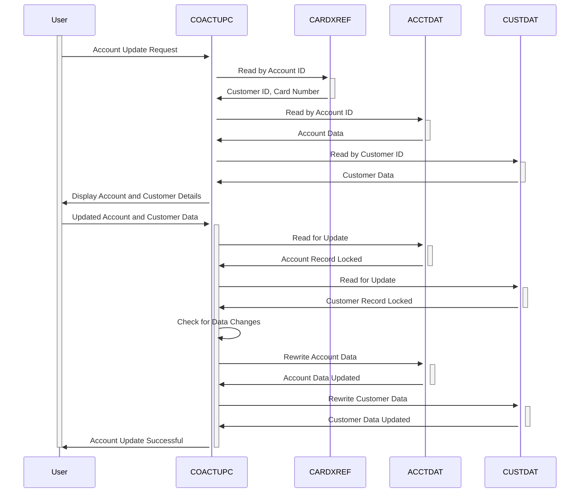

Generated at: 2nd October of 2024

**Title Document: CardDemo Account Update Program Specification**

**Summary Description:**
The CardDemo Account Update Program is a COBOL program that provides a CICS interface for updating customer account information. It interacts with Account Master, Customer Master, and Card Data files. The program allows users to search for an account, view its details, make changes, and commit those changes to the database. The program performs various data validations to ensure data integrity.

**User Stories:**
As a customer service representative, I need to be able to view and update customer account information to assist customers with their inquiries and requests.

**Related Epic:** 2 - Account Management

**Technical Requirements:**
This program provides functionalities for retrieving, displaying, and updating customer account and associated customer data. It interacts with three VSAM files - `ACCTDAT` (Account Master), `CUSTDAT` (Customer Master), and `CARDXREF` (Card Cross Reference).

- **Read Account Data:** This method retrieves account and customer data based on the provided account number.
  - Input: `CC-ACCT-ID` `{Numeric (9,0)}`: Account ID.
  - Step 1: Call `Read Card Cross Reference by Account` to get `CDEMO-CUST-ID` and `CDEMO-CARD-NUM`.
  - Step 2: Call `Read Account Data by Account` to get account data.
  - Step 3: Call `Read Customer Data by Customer` to get customer data.
  - Step 4: Call `Store Fetched Data` to store the retrieved data in the commarea.
  - Result: Account and customer data.

- **Read Card Cross Reference by Account:** This method reads the Card Cross Reference file by account number.
  - Input: `WS-CARD-RID-ACCT-ID` `{Numeric (9,0)}`: Account ID.
  - Process: Read `CARDXREF` file using `WS-CARD-RID-ACCT-ID-X` as key.
  - Output: `CDEMO-CUST-ID` `{Numeric (9,0)}`: Customer ID.
  - Output: `CDEMO-CARD-NUM` `{Alphanumeric (19)}`: Card number.

- **Read Account Data by Account:** This method reads account data from the Account Master file by account number.
  - Input: `WS-CARD-RID-ACCT-ID` `{Numeric (9,0)}`: Account ID.
  - Process: Read `ACCTDAT` file using `WS-CARD-RID-ACCT-ID-X` as key.
  - Output: Account data.

- **Read Customer Data by Customer:** This method reads customer data from the Customer Master file by customer ID.
  - Input: `WS-CARD-RID-CUST-ID` `{Numeric (9,0)}`: Customer ID.
  - Process: Read `CUSTDAT` file using `WS-CARD-RID-CUST-ID-X` as key.
  - Output: Customer data.

- **Store Fetched Data:** This method stores the fetched account and customer data in the commarea.
  - Input: Account data.
  - Input: Customer data.
  - Process: Store the data in the `ACUP-OLD-DETAILS` structure.
  - Output: Updated commarea.

- **Write Processing:** This method handles the update process for both account and customer data.
  - Input: Updated account and customer data.
  - Step 1: Read `ACCTDAT` file for update using `WS-CARD-RID-ACCT-ID-X` as key.
  - Step 2: Read `CUSTDAT` file for update using `WS-CARD-RID-CUST-ID-X` as key.
  - Step 3: Call `Check Change in Record` to verify if the data has been changed by another user.
  - Step 4: Rewrite the `ACCTDAT` file with the updated account data.
  - Step 5: Rewrite the `CUSTDAT` file with the updated customer data.
  - Result: Updated account and customer data in the respective VSAM files.

- **Check Change in Record:** This method checks if the account or customer record has been changed by another user since it was last read.
  - Input: Account and customer data from the files.
  - Input: Original account and customer data from the commarea.
  - Process: Compare the data from files with the data from the commarea.
  - Result: If there is a difference, it means the data has been changed by another user.

**Related Models**

- `ACCOUNT-RECORD`
  - `ACCT-ID` `{Numeric (9,0)}`: Account ID
  - `ACCT-ACTIVE-STATUS` `{Alphanumeric (1)}`: Account status (Active/Inactive)
  - `ACCT-CURR-BAL` `{Numeric (10,2)}`: Current account balance
  - `ACCT-CREDIT-LIMIT` `{Numeric (10,2)}`: Credit limit
  - `ACCT-CASH-CREDIT-LIMIT` `{Numeric (10,2)}`: Cash credit limit
  - `ACCT-OPEN-DATE` `{Alphanumeric (10)}`: Account open date (YYYY-MM-DD)
  - `ACCT-EXPIRAION-DATE` `{Alphanumeric (10)}`: Account expiration date (YYYY-MM-DD)
  - `ACCT-REISSUE-DATE` `{Alphanumeric (10)}`: Account reissue date (YYYY-MM-DD)
  - `ACCT-CURR-CYC-CREDIT` `{Numeric (10,2)}`: Current cycle credit
  - `ACCT-CURR-CYC-DEBIT` `{Numeric (10,2)}`: Current cycle debit
  - `ACCT-GROUP-ID` `{Alphanumeric (10)}`: Account group ID

- `CUSTOMER-RECORD`
  - `CUST-ID` `{Numeric (9,0)}`: Customer ID
  - `CUST-FIRST-NAME` `{Alphanumeric (25)}`: Customer's first name
  - `CUST-MIDDLE-NAME` `{Alphanumeric (25)}`: Customer's middle name
  - `CUST-LAST-NAME` `{Alphanumeric (25)}`: Customer's last name
  - `CUST-ADDR-LINE-1` `{Alphanumeric (50)}`: Customer's address line 1
  - `CUST-ADDR-LINE-2` `{Alphanumeric (50)}`: Customer's address line 2
  - `CUST-ADDR-LINE-3` `{Alphanumeric (50)}`: Customer's address line 3
  - `CUST-ADDR-STATE-CD` `{Alphanumeric (2)}`: Customer's state code
  - `CUST-ADDR-COUNTRY-CD` `{Alphanumeric (3)}`: Customer's country code
  - `CUST-ADDR-ZIP` `{Alphanumeric (10)}`: Customer's zip code
  - `CUST-PHONE-NUM-1` `{Alphanumeric (15)}`: Customer's phone number 1
  - `CUST-PHONE-NUM-2` `{Alphanumeric (15)}`: Customer's phone number 2
  - `CUST-SSN` `{Numeric (9,0)}`: Customer's Social Security Number
  - `CUST-GOVT-ISSUED-ID` `{Alphanumeric (20)}`: Customer's government-issued ID
  - `CUST-DOB-YYYY-MM-DD` `{Alphanumeric (10)}`: Customer's date of birth (YYYY-MM-DD)
  - `CUST-EFT-ACCOUNT-ID` `{Alphanumeric (10)}`: Customer's EFT account ID
  - `CUST-PRI-CARD-HOLDER-IND` `{Alphanumeric (1)}`: Primary card holder indicator
  - `CUST-FICO-CREDIT-SCORE` `{Numeric (3,0)}`: Customer's FICO credit score

- `CARD-XREF-RECORD`
  - `XREF-CARD-NUM` `{Alphanumeric (19)}`: Card number
  - `XREF-CUST-ID` `{Numeric (9,0)}`: Customer ID
  - `XREF-ACCT-ID` `{Numeric (9,0)}`: Account ID

**Configurations:**

- `COACTUPC.cbl`
  - `MAX-ACCTS`: `99999`
	- Description: Maximum number of accounts allowed.
  - `FICO-SCORE-LOW`: `300`
	- Description: Lowest acceptable FICO score.
  - `FICO-SCORE-HIGH`: `850`
	- Description: Highest acceptable FICO score.
- Constant Values
  - `LIT-ACCTFILENAME`: `"ACCTDAT "`
	- Description: Account master file name.
  - `LIT-CUSTFILENAME`: `"CUSTDAT "`
	- Description: Customer master file name.
  - `LIT-CARDFILENAME`: `"CARDDAT "`
	- Description: Card data file name.
  - `LIT-CARDFILENAME-ACCT-PATH`: `"CARDAIX "`
	- Description: Alternate index for `CARDDAT` based on account ID.
  - `LIT-CARDXREFNAME-ACCT-PATH`: `"CXACAIX "`
	- Description: Alternate index for a card cross-reference file based on account ID.

**Code Improvements:**

- **Error Handling:** Implement a more structured approach to error handling, such as using a centralized error handler routine.
- **Logging:** Add comprehensive logging for all data access and update operations, including timestamps, user IDs, and specific actions performed.
- **Data Validation:** Consider adding more robust data validation checks, such as using regular expressions for phone number and email validation.
- **Modularity:** Break down the program into smaller, more manageable modules or subroutines to improve code readability and maintainability.
- **Comments:** Add more detailed comments to explain the logic and purpose of different sections of the code.

**Security Improvements:**

- **Authorization:** Implement a more secure authorization mechanism, such as role-based access control, to restrict access to sensitive account information.
- **Data Encryption:** Encrypt sensitive data, such as customer SSN and financial information, both in transit and at rest.
- **Audit Trail:** Enhance the audit trail to include details of all data access and modification attempts, including successful and unsuccessful attempts.

**Conceptual Diagram:**

--Made by "Smart Engineering" (by Compass.UOL)--