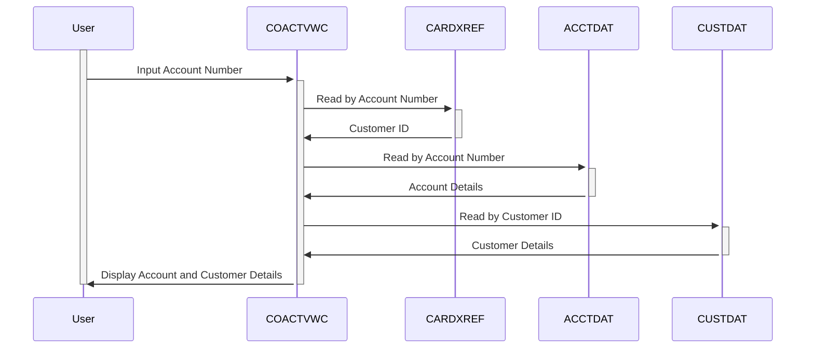

Generated at: 2nd October of 2024

**Title Document:** Credit Card Management System - Account View Functionality Specification

**Summary Description:**
This document outlines the "Account View" functionality within a credit card management system. This functionality allows authorized users, such as customer service representatives, to view detailed information about a specific credit card account using the account number.

**User Stories:**
As a customer service representative, I need to be able to view detailed information about a customer's credit card account so that I can answer their inquiries and provide support.

**Related Epic:**
2 - Account Management

**Technical Requirements:**

- **Account View Process:** This functionality retrieves and displays details of a credit card account based on the input account number.
  - User Input: User enters the account number.
  - `Read Card Cross-Reference File (CARDXREF)`: Read the `CARDXREF` file using the account number as key to get the customer ID.
  - `Read Account Data File (ACCTDAT)`: Read the `ACCTDAT` file using the account number as key to get the account details.
  - `Read Customer Data File (CUSTDAT)`: Read the `CUSTDAT` file using the customer ID retrieved from `CARDXREF` to get customer details.
  - Display Account Details: Display the retrieved account and customer details on the screen.
  - Output: Account details and customer details are displayed on the screen.

**Related Models**

- `Account`
  - `AccountNumber` `String`: Unique identifier for a credit card account.
  - `AccountStatus` `String`: Status of the account (e.g., Active, Closed).
  - `CurrentBalance` `Decimal`: Current balance of the account.
  - `CreditLimit` `Decimal`: Maximum credit limit allowed on the account.
  - `AvailableCredit` `Decimal`: Amount of credit currently available for use.
  - `OpenDate` `Date`: Date when the account was opened.
  - `ExpirationDate` `Date`: Expiration date of the credit card.
- `Customer`
  - `CustomerID` `Integer`: Unique identifier for a customer.
  - `CustomerName` `String`: Full name of the customer.
  - `CustomerAddress` `String`: Customer's billing address.
  - `SSN` `String`: Customer's Social Security Number.
  - `DOB` `Date`: Customer's date of birth.
  - `FICOScore` `Integer`: Customer's FICO credit score.

**Configurations:**

- `COACTVWC.cbl`
  - `LIT-ACCTFILENAME`: `"ACCTDAT "`
	- Description: File name for the account data file.
  - `LIT-CARDXREFNAME-ACCT-PATH`: `"CXACAIX "`
	- Description: File name for the account cross-reference file.
  - `LIT-CUSTFILENAME`: `"CUSTDAT "`
	- Description: File name for the customer data file.

**Code Improvements:**

- Implement a more robust error handling mechanism. The current error handling is basic and relies heavily on hardcoded messages. A more structured approach, such as using a centralized error handling module, would improve code maintainability and readability.
- Introduce a logging framework to capture important events and errors. This would aid in troubleshooting and system monitoring.
- Consider refactoring the code to extract common functionalities into reusable modules. This would reduce code duplication and improve maintainability.
- Add more comprehensive inline comments to explain the logic and purpose of different code sections.

**Security Improvements:**

- The program accesses sensitive financial data, so it's crucial to implement robust security measures.
- **Authentication and Authorization:** Ensure that only authorized users can access the program and its functionalities. Implement a secure authentication mechanism and role-based access control (RBAC) to restrict access based on user roles and privileges.
- **Data Encryption:** Encrypt sensitive data both in transit and at rest to protect it from unauthorized access. Use strong encryption algorithms and secure key management practices.
- **Audit Logging:**  Log all user actions and data access attempts to track system activity and detect potential security breaches.

**Conceptual Diagram:**

--Made by "Smart Engineering" (by Compass.UOL)--