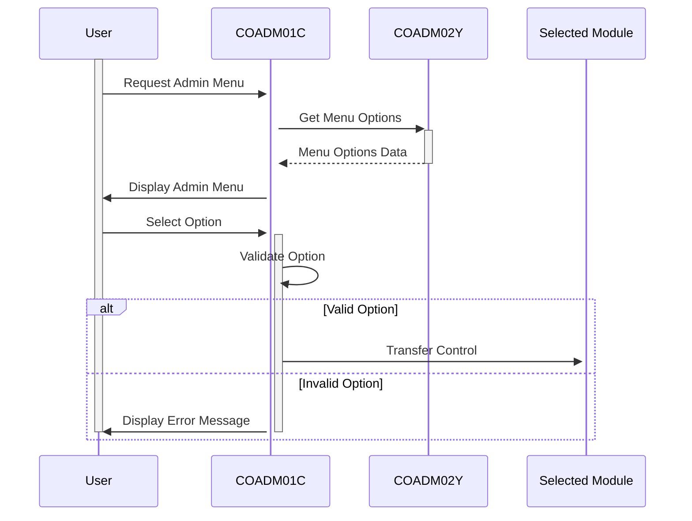

Generated at: 2nd October of 2024

**Title Document:** CardDemo Application - Administrative Menu Specification

**Summary Description:** 
The CardDemo application's Administrative Menu is a central hub designed for authorized personnel, granting access to various administrative functions. This menu streamlines administrative tasks by providing a user-friendly interface for managing users, generating reports, and handling other sensitive operations.

**User Stories:**
As a system administrator, I need a centralized location to access and manage administrative functions, such as user management and report generation, to efficiently maintain the CardDemo application.

**Related Epic:** 6 - User Management and Security

**Technical Requirements:**
- **Display Admin Menu Options:** Displays a dynamically generated menu of administrative options, numbered for easy selection.
  - Input: `CDEMO-ADMIN-OPT-COUNT` (from `COADM02Y.cbl`) determines the number of menu options to display.
  - Processing: Iterates through the `CDEMO-ADMIN-OPT-NAME` array (from `COADM02Y.cbl`) to retrieve the display name of each option.
  - Output: The menu is displayed on the screen with each option numbered and labeled according to the `CDEMO-ADMIN-OPT-NAME` array.
- **Process User Input:**  Receives and processes the user's selected option from the menu.
  - Input: The user inputs their chosen option number.
  - Validation: Verifies if the input is numeric and falls within the valid range of options (1 to `CDEMO-ADMIN-OPT-COUNT`).
  - Result: 
      - If valid, the corresponding program name from `CDEMO-ADMIN-OPT-PGMNAME` (from `COADM02Y.cbl`) is retrieved.
      - If invalid, an error message is displayed, prompting the user to re-enter their choice.
- **Transfer Control to Selected Module:** Transfers control to the administrative module selected by the user.
  - Input: The program name of the selected module from `CDEMO-ADMIN-OPT-PGMNAME` (from `COADM02Y.cbl`).
  - Processing: The program uses the CICS `XCTL` command to transfer control to the specified program.
  - Output: The selected administrative module is loaded and displayed to the user.

**Related Models**

- AdminMenuOptions: Represents an administrative menu option.
  - OptionNumber `Integer`: The sequential number of the option displayed on the menu.
  - OptionName `String`: The descriptive name of the administrative function.
  - ProgramName `String`: The name of the COBOL program responsible for the option's functionality.

**Configurations:**

- `COADM02Y.cbl`
  - `CDEMO-ADMIN-OPT-COUNT`: Represents the total number of administrative menu options.
  - `CDEMO-ADMIN-OPT-PGMNAME`: An array that stores the program names associated with each menu option.
  - `CDEMO-ADMIN-OPT-NAME`: An array that stores the display names of each menu option.

**Code Improvements:**
- **Error Logging:** Implement a centralized error logging mechanism to record details of any errors encountered, including the timestamp, error code, and relevant context information. This would aid in debugging and system monitoring.
- **Input Sanitization:**  While the code checks for numeric input, consider adding more robust input validation and sanitization techniques to prevent potential security vulnerabilities like SQL injection or cross-site scripting, especially if the application evolves to handle external data.
- **Code Modularity:**  Explore refactoring the code by extracting specific tasks (like menu display, input validation, program execution) into separate subroutines. This would enhance code readability and maintainability.
- **Documentation:** Incorporate detailed comments within the code to explain the purpose and functionality of different sections, variables, and logic. This would greatly benefit future developers tasked with understanding or modifying the code.

**Security Improvements:**
- **Authentication and Authorization:** Implement a robust authentication and authorization mechanism to ensure that only authorized personnel can access the Administrative Menu. This could involve multi-factor authentication, role-based access control (RBAC), and secure password storage.
- **Secure Communication:** If the application communicates with other systems or databases, ensure all communication channels are secured using protocols like TLS/SSL to protect sensitive data during transmission.

**Conceptual Diagram:**

--Made by "Smart Engineering" (by Compass.UOL)--