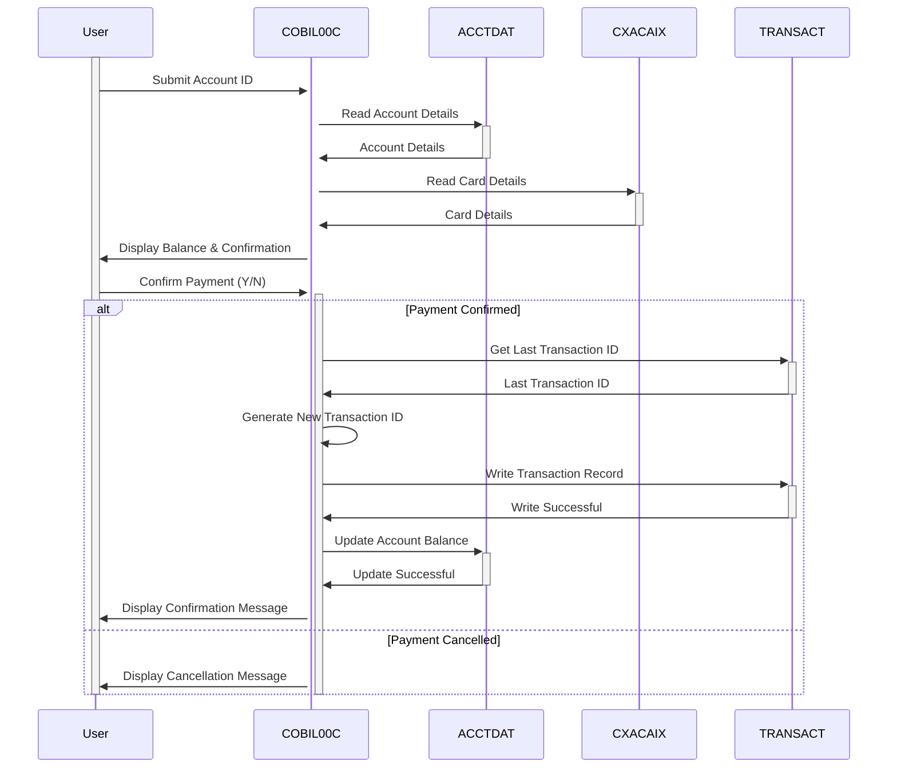

Generated at: 2nd October of 2024

**Title Document:** CardDemo - Online Bill Payment Specification

**Summary Description:**
This document outlines the specifications for the "Online Bill Payment" functionality within the CardDemo application. This functionality enables credit cardholders to conveniently pay their outstanding balance in full through an online interface. This process is seamlessly integrated with the core credit card management system, ensuring accurate balance updates and transaction recording.

**User Stories:**
As a credit cardholder, I want to be able to pay my bill online so that I can conveniently manage my account.

**Related Epic:**
4 - Transaction Processing

**Technical Requirements:**
This program handles online bill payments for credit card accounts. When a customer chooses to pay their bill online, this part of the system comes into action. It involves validating user input, retrieving account information, confirming the payment, processing the transaction, updating account balances, and generating a unique transaction ID for auditing purposes.

- **Account Data Reading**: Retrieves account details, including the current balance, from the `ACCTDAT` file based on the user-provided Account ID.
  - Input: `ACTIDINI` from user input.
  - Validation: The account ID is validated against the `ACCTDAT` file. If the account ID is not found, an error message is displayed to the user.
  - Result `ACCOUNT-RECORD`: Contains the details of the account, such as balance and other relevant information.
- **Cross-Reference Data Reading**: Accesses the `CXACAIX` file to retrieve the card number associated with the provided Account ID.
  - Input: `ACCT-ID` from the `ACCOUNT-RECORD`.
  - Validation: If the account is not found in the `CXACAIX` file, an error message is displayed.
  - Result `CARD-XREF-RECORD`: Contains the card number linked to the account.
- **Transaction ID Generation**: Generates a unique transaction ID by retrieving the last used ID from the `TRANSACT` file and incrementing it.
  - Input: `TRAN-ID` from the last record in the `TRANSACT` file.
  - Calculation: Increments the retrieved `TRAN-ID` by 1 to create a new unique ID.
  - Result `WS-TRAN-ID-NUM`: A new unique transaction ID.
- **Transaction Recording**: Writes the details of the bill payment transaction to the `TRANSACT` file.
  - Input: `TRAN-RECORD` containing transaction details like `TRAN-ID`, `TRAN-TYPE-CD`, `TRAN-AMT`, `TRAN-CARD-NUM`, timestamp, and other relevant information.
  - Validation: Checks for duplicate `TRAN-ID` to prevent errors. If a duplicate is found, an error message is displayed.
  - Output: A new record is written to the `TRANSACT` file with the details of the bill payment.
- **Account Balance Updating**: Updates the account balance in the `ACCTDAT` file to reflect the bill payment.
  - Input: `ACCOUNT-RECORD` with the updated `ACCT-CURR-BAL` after subtracting the payment amount.
  - Validation: If the account is not found, an error message is displayed.
  - Output: The `ACCTDAT` file is updated with the new account balance.
- **Timestamp Retrieval**: Retrieves the current system timestamp to record the time of the transaction.
  - Input: None
  - Calculation: Uses the `ASKTIME` and `FORMATTIME` CICS commands to get the current timestamp.
  - Result `WS-TIMESTAMP`: The current date and time in the specified format.
- **Screen Data Initialization**: Clears the input fields and resets the error message on the screen.
  - Input: None
  - Calculation: Sets the input fields `ACTIDINI`, `CURBALI`, and `CONFIRMI` to their default values and clears the `WS-MESSAGE`.
  - Output: Refreshed screen with cleared input fields and error message.

**Related Models**
- `ACCOUNT-RECORD`
  - `ACCT-ID` `String`: Unique identifier for a customer's account.
  - `ACCT-CURR-BAL` `Decimal`: Current outstanding balance on the account.
- `CARD-XREF-RECORD`
  - `XREF-ACCT-ID` `String`: Account ID used for cross-referencing with the card details.
  - `XREF-CARD-NUM` `String`: Credit card number linked to the Account ID.
- `TRAN-RECORD`
  - `TRAN-ID` `String`: Unique identifier for each transaction.
  - `TRAN-TYPE-CD` `String`: Code specifying the type of transaction (e.g., '02' for Bill Payment).
  - `TRAN-CAT-CD` `Integer`: Code representing the category of the transaction.
  - `TRAN-SOURCE` `String`: Origin of the transaction (e.g., 'POS TERM', 'ONLINE').
  - `TRAN-DESC` `String`: Description of the transaction.
  - `TRAN-AMT` `Decimal`: Amount of the transaction.
  - `TRAN-CARD-NUM` `String`: Credit card number associated with the transaction.
  - `TRAN-MERCHANT-ID` `Integer`: Unique identifier for the merchant involved in the transaction.
  - `TRAN-MERCHANT-NAME` `String`: Name of the merchant associated with the transaction.
  - `TRAN-MERCHANT-CITY` `String`: City of the merchant associated with the transaction.
  - `TRAN-MERCHANT-ZIP` `String`: ZIP code of the merchant associated with the transaction.
  - `TRAN-ORIG-TS` `Timestamp`: Timestamp indicating when the transaction was initiated.
  - `TRAN-PROC-TS` `Timestamp`: Timestamp indicating when the transaction was processed.

**Configurations:**
- Constant Values
  - `WS-TRANSACT-FILE`: `"TRANSACT"`
	- Description: File name for the transaction data file.
  - `WS-ACCTDAT-FILE`: `"ACCTDAT"`
	- Description: File name for the account data file.
  - `WS-CXACAIX-FILE`: `"CXACAIX"`
	- Description: File name for the cross reference data file.
  - `BILLPAY-CONF-MSG`: `"BILL PAYMENT SUCCESSFULLY PROCESSED"`
	- Description: Message displayed when the bill payment is processed successfully.
  - `BILLPAY-ERRMSG-ZERO`: `"ZERO BALANCE - NO PAYMENT PROCESSED"`
	- Description: Error message for a zero balance account during bill payment.
  - `BILLPAY-ERRMSG-ACCT`: `"INVALID ACCOUNT - NO PAYMENT PROCESSED"`
	- Description: Error message displayed when the account is invalid and no payment is processed.
- `COBIL00.CPY`
  - `CB0-ACCT-ID-C`: `4`
	- Description: Color attribute for the account ID field.
  - `CB0-ACCT-ID-P`: `0`
	- Description: Protection attribute for the account ID field.
  - `CB0-ACCT-ID-H`: `0`
	- Description: Hidden attribute for the account ID field.
  - `CB0-ACCT-ID-V`: `0`
	- Description: Validation attribute for the account ID field.
  - `CB0-ACCT-ID-O`: `10`
	- Description: Output position for the account ID field.
  - `CB0-ACCT-BAL-C`: `4`
	- Description: Color attribute for the account balance field.
  - `CB0-ACCT-BAL-P`: `1`
	- Description: Protection attribute for the account balance field.
  - `CB0-ACCT-BAL-H`: `0`
	- Description: Hidden attribute for the account balance field.
  - `CB0-ACCT-BAL-V`: `0`
	- Description: Validation attribute for the account balance field.
  - `CB0-ACCT-BAL-O`: `10`
	- Description: Output position for the account balance field.
  - `CB0-CONFIRM-C`: `4`
	- Description: Color attribute for the confirmation flag field.
  - `CB0-CONFIRM-P`: `0`
	- Description: Protection attribute for the confirmation flag field.
  - `CB0-CONFIRM-H`: `0`
	- Description: Hidden attribute for the confirmation flag field.
  - `CB0-CONFIRM-V`: `0`
	- Description: Validation attribute for the confirmation flag field.
  - `CB0-CONFIRM-O`: `1`
	- Description: Output position for the confirmation flag field.
  - `CB0-ERRMSG-C`: `2`
	- Description: Color attribute for the error message field.
  - `CB0-ERRMSG-P`: `1`
	- Description: Protection attribute for the error message field.
  - `CB0-ERRMSG-H`: `0`
	- Description: Hidden attribute for the error message field.
  - `CB0-ERRMSG-V`: `0`
	- Description: Validation attribute for the error message field.
  - `CB0-ERRMSG-O`: `60`
	- Description: Output position for the error message field.
  - `CB0-FKEYS-C`: `7`
	- Description: Color attribute for the function keys field.
  - `CB0-FKEYS-P`: `1`
	- Description: Protection attribute for the function keys field.
  - `CB0-FKEYS-H`: `0`
	- Description: Hidden attribute for the function keys field.
  - `CB0-FKEYS-V`: `0`
	- Description: Validation attribute for the function keys field.
  - `CB0-FKEYS-O`: `80`
	- Description: Output position for the function keys field.
- `COCOM01Y.cpy`
  - `CDEMO-CB00-TRNID-FIRST`: `""`
	- Description: First Transaction ID in the list.
  - `CDEMO-CB00-TRNID-LAST`: `""`
	- Description: Last Transaction ID in the list.
  - `CDEMO-CB00-PAGE-NUM`: `0`
	- Description: Current page number.
  - `CDEMO-CB00-NEXT-PAGE-FLG`: `"N"`
	- Description: Flag indicating if there is a next page.
  - `CDEMO-CB00-TRN-SEL-FLG`: `""`
	- Description: Flag indicating if a transaction is selected.
  - `CDEMO-CB00-TRN-SELECTED`: `""`
	- Description: Selected Transaction ID.

**Code Improvements:**
- Implement a more robust error handling mechanism that includes logging errors to a file or database for debugging purposes.
- Use a data validation library or framework to simplify and standardize the validation of user inputs, such as account IDs and confirmation flags.
- Consider using a code formatter to improve the readability and consistency of the code.
- Add more detailed comments to explain the logic and purpose of different sections of the code.
- Implement a more user-friendly interface for displaying error messages and confirmation messages, potentially using modal dialogs or visual cues.

**Security Improvements:**
- Encrypt sensitive data, such as account numbers and transaction details, both in transit and at rest.
- Implement access control mechanisms to restrict unauthorized access to the bill payment functionality and sensitive data.
- Regularly audit the system for security vulnerabilities and implement necessary patches or updates.
- Consider using a security testing tool to identify and mitigate potential security risks.
- Implement a strong password policy for user accounts and enforce regular password changes.

**Conceptual Diagram:**

--Made by "Smart Engineering" (by Compass.UOL)--