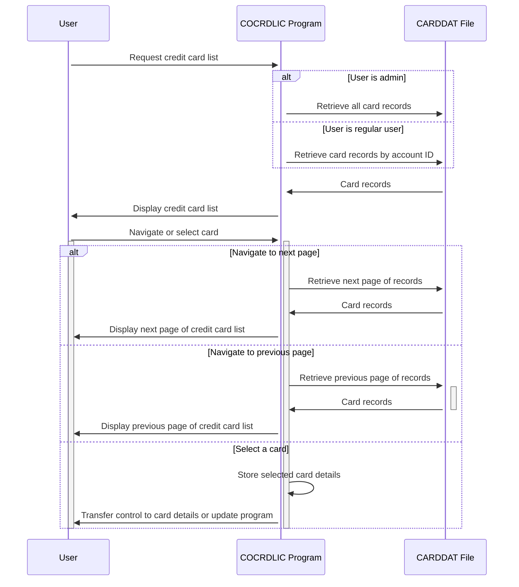

Generated at: 2nd October of 2024

**Title Document:** Credit Card List Display and Navigation Specification

**Summary Description:**
The `COCRDLIC.cbl` program displays a list of credit cards to the user, allowing for navigation and selection of individual cards. The program retrieves data from a VSAM file named `CARDDAT` and presents it in a paginated format. Users can filter the list by account ID and card number, and they can navigate through pages using function keys. 

**User Stories:**
As a credit card administrator, I want to view a list of all credit cards in the system so that I can manage them effectively.
As a regular user, I want to view a list of credit cards associated with my account so that I can review my card details.

**Related Epic:** 3 - Credit Card Management

**Technical Requirements:**

- **Display Credit Card List:** This method displays a list of credit cards based on the user's role and any filters applied.
  - Input: User's role (admin or regular user), account ID (optional), card number (optional)
  - Business Rule: If the user is an admin, display all cards. If the user is a regular user, display only cards associated with the provided account ID.
  - Processing: Retrieve data from the `CARDDAT` file, filtering by account ID and card number if provided.
  - Result `{Array of Card Records}`: Returns an array of credit card records to be displayed on the screen.
  - Output: Display the credit cards in a paginated format, allowing the user to navigate through the pages using function keys `F7` (Previous Page) and `F8` (Next Page).

- **Filter Credit Card Records:** This method filters the credit card records based on the provided account ID and/or card number.
  - Input: `CARD-RECORD` structure, `CC-ACCT-ID`, `CC-CARD-NUM-N`
  - Business Rule: If the account ID is provided, exclude records that do not match the account ID. If the card number is provided, exclude records that do not match the card number.
  - Processing: Compare the account ID and card number from the `CARD-RECORD` with the provided filter values.
  - Result `WS-DONOT-EXCLUDE-THIS-RECORD` `{Boolean}`: Set to `TRUE` if the record should be included, `FALSE` otherwise.

- **Read Credit Card Records Forward:** This method reads credit card records from the `CARDDAT` file in a forward direction, starting from the provided key.
  - Input: `WS-CARD-RID-CARDNUM`
  - Processing: Initiate a browse operation on the `CARDDAT` file using the provided card number as the key. Read records sequentially until the maximum screen size is reached or the end of the file is encountered.
  - Output: Populates the `WS-SCREEN-DATA` array with the retrieved credit card records. Updates the `WS-CA-FIRST-CARD-NUM`, `WS-CA-LAST-CARD-NUM`, `WS-CA-FIRST-CARD-ACCT-ID`, and `WS-CA-LAST-CARD-ACCT-ID` variables to track the displayed records for navigation purposes.

- **Read Credit Card Records Backward:** This method reads credit card records from the `CARDDAT` file in a backward direction, starting from the provided key.
  - Input: `WS-CARD-RID-CARDNUM`
  - Processing: Initiate a browse operation on the `CARDDAT` file using the provided card number as the key. Read records in reverse order until the maximum screen size is reached or the beginning of the file is encountered.
  - Output: Populates the `WS-SCREEN-DATA` array with the retrieved credit card records. Updates the `WS-CA-FIRST-CARD-NUM`, `WS-CA-LAST-CARD-NUM`, `WS-CA-FIRST-CARD-ACCT-ID`, and `WS-CA-LAST-CARD-ACCT-ID` variables to track the displayed records for navigation purposes.

**Related Models**

- `CARD-RECORD`
  - `CARD-NUM` `{String}`: Credit card number.
  - `CARD-ACCT-ID` `{String}`: Account ID associated with the credit card.
  - `CARD-ACTIVE-STATUS` `{String}`: Status of the credit card (Active or Inactive).

**Configurations:**

- `COCRDLIC.cbl`
  - `CARDS-PER-PAGE`: `10`
	- Description: Number of cards displayed per page.
  - `MAX-CARDS`: `9999`
	- Description: Maximum number of credit cards.
- Constant Values
  - `LIT-CARD-FILE`: `"CARDDAT "`
	- Description: Name of the VSAM file containing credit card data.
  - `LIT-CARD-FILE-ACCT-PATH`: `"CARDAIX "`
	- Description: Path to the alternate index for the `CARDDAT` file, likely used for efficient retrieval by account ID.
  - `WS-MAX-SCREEN-LINES`: `7`
	- Description: Maximum number of credit card records displayed on a single page.

**Code Improvements:**

- Implement a more structured approach to error handling, using a centralized error handling routine to manage different error conditions.
- Improve code readability by using meaningful variable names and comments to explain complex logic.
- Consider using a data access layer to abstract the interaction with the VSAM file, improving code maintainability and testability.
- Explore performance optimization techniques, such as using a more efficient sorting algorithm or caching frequently accessed data.

**Security Improvements:**

- Implement input validation to prevent injection attacks and ensure data integrity.
- Encrypt sensitive data, such as credit card numbers, both in storage and during transmission.
- Implement audit logging to track user actions and system events for security and compliance purposes.
- Review and strengthen access control mechanisms to ensure that only authorized personnel can access sensitive data.

**Conceptual Diagram:**

--Made by "Smart Engineering" (by Compass.UOL)--