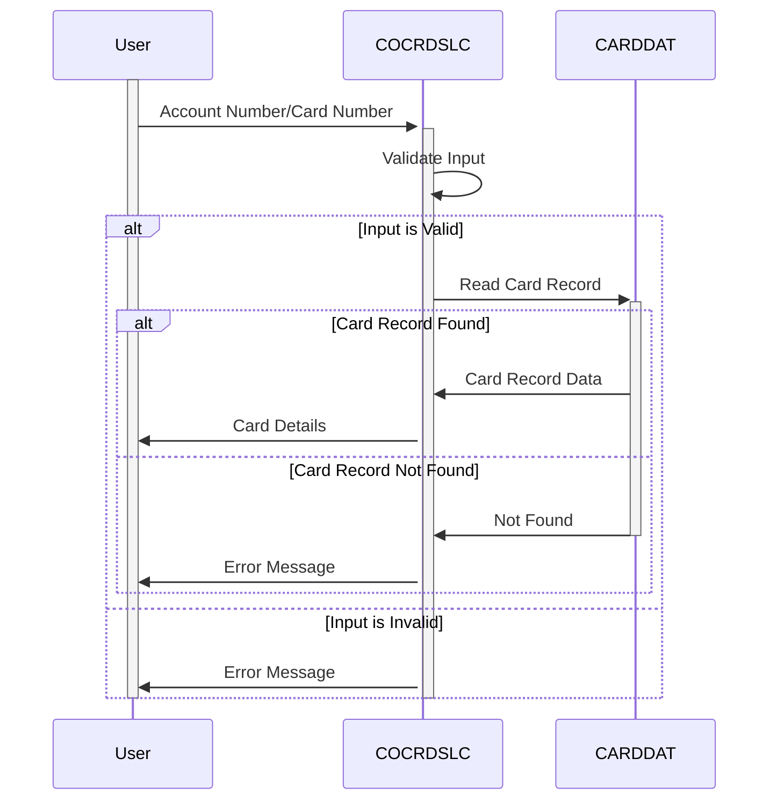

Generated at: 2nd October of 2024

**Title Document:** Credit Card Detail Retrieval Program

**Summary Description:**
The Credit Card Detail Retrieval program allows customer service representatives to access detailed credit card information using either the account number or the card number. It ensures data security by validating user inputs before accessing sensitive information.

**User Stories:**
As a customer service representative, I need to be able to quickly and easily access detailed credit card information for our customers, so I can assist them with their inquiries.

**Related Epic:** 3 - Credit Card Management

**Technical Requirements:**
- **Screen Initialization**: 
  - Step Name: Initialize screen fields.
  - Result: The program initializes the screen fields with default values, such as the title, program name, date, and time.
  - Result `CCRDSLAO`:  Screen data structure with initialized values.
- **Screen Variables Setup**: 
  - Step Name: Set up screen variables based on program context and input data.
  - Result `CCRDSLAO`:  Screen data structure with appropriate values for account number, card number, and other details.
- **Screen Attributes Setup**: 
  - Step Name: Configure screen attributes based on validation results.
  - Result `CCRDSLAI`:  Screen input data structure with the appropriate attributes set (e.g., protection, color, cursor position).
- **Send Screen**: 
  - Step Name: Display the screen to the user.
  - Result: The program sends the `CCRDSLAO` screen map to the user's terminal.
- **Receive Input**: 
  - Step Name: Retrieve user input from the screen.
  - Result: The program receives the user's input from the `CCRDSLAI` screen map.
- **Edit Input**: 
  - Step Name: Validate user input for account and card numbers.
  - Result `WS-RETURN-MSG`:  Error message if validation fails.
- **Account Number Edit**: 
  - Step Name: Check if the account number is valid (numeric and 11 digits).
  - Result `WS-RETURN-MSG`:  Error message if validation fails, for example `Account number must be a non-zero 11-digit number`.
- **Card Number Edit**: 
  - Step Name: Check if the card number is valid (numeric and 16 digits).
  - Result `WS-RETURN-MSG`:  Error message if validation fails, for example `Card number if supplied must be a 16-digit number`.
- **Read Card Data**: 
  - Step Name: Retrieve card data based on account number or card number.
  - Result `CARD-RECORD`:  The program reads the `CARDDAT` file using the card number as the key and retrieves the corresponding card record.
- **Get Card by Account and Card Number**: 
  - Step Name: Search the `CARDDAT` database using the provided card number.
  - Result `CARD-RECORD`:  If a matching record is found, the card details are stored in `CARD-RECORD`. If not found, set `DID-NOT-FIND-ACCTCARD-COMBO` to `TRUE`.
- **Get Card by Account**: 
  - Step Name: This method is not used in the current version. It suggests future functionality to search by account number.
  - Result: Not applicable in the current version.
- **Send Long Text**: 
  - Step Name: Send a long text message to the user (likely for debugging).
  - Result:  The program sends the content of `WS-LONG-MSG` to the user's terminal.
- **Send Plain Text**: 
  - Step Name: Send a plain text message to the user (likely for debugging).
  - Result: The program sends the content of `WS-RETURN-MSG` to the user's terminal.
- **Abnormal Termination Handler**: 
  - Step Name: Handle abnormal program terminations.
  - Result: The program sends an error message to the user, logs the error information, and terminates the program.

**Related Models**
- `WS-CARD-RID`
  - `WS-CARD-RID-CARDNUM` `X(16)`: Credit Card Number (16 characters)
  - `WS-CARD-RID-ACCT-ID` `9(11)`: Account Number (11 digits)
- `CARD-RECORD`
  - `CARD-ACCT-ID-N` `9(11)`: Account Number (11 digits)
  - `CARD-CVV-CD-N` `9(03)`: Card Verification Value (3 digits)
  - `CARD-CARD-NUM-N` `9(16)`: Credit Card Number (16 digits)
  - `CARD-NAME-EMBOSSED-X` `X(50)`: Cardholder's Name (50 characters)
  - `CARD-STATUS-X` `X`: Card Status (1 character)
  - `CARD-EXPIRAION-DATE-N` `9(10)`: Card Expiration Date (10 digits)

**Configurations:**
- Constant Values
  - `LIT-CARDFILENAME`: `"CARDDAT "`
	- Description:  Name of the credit card database file. 
  - `LIT-CARDFILENAME-ACCT-PATH`: `"CARDAIX "`
	- Description:  Name of the alternate index path for searching by account number.
  - `WS-PROMPT-FOR-ACCT`: `"Account number not provided"`
	- Description:  Message displayed when account number is not provided.
  - `WS-PROMPT-FOR-CARD`: `"Card number not provided"`
	- Description:  Message displayed when card number is not provided.
  - `DID-NOT-FIND-ACCTCARD-COMBO`: `"Did not find cards for this search condition"`
	- Description:  Message displayed when no matching card is found for the given account and card number combination.
  - `DID-NOT-FIND-ACCT-IN-CARDXREF`: `"Did not find this account in cards database"`
	- Description:  Message displayed when the account is not found in the card database.
- COCRDSLC.cbl
  - `CARDS-PER-PAGE`: `10`
	- Description:  Number of cards to be displayed per page.

**Code Improvements:**
- Improve Error Handling: The program uses generic error messages in some cases. Implement more specific error messages based on the type of error encountered.
- Code Modularity: Break down the program into smaller, more manageable modules for better readability and maintainability.
- Use Data Structures: Define data structures to represent the input and output data for better organization and clarity.
- Parameterize File Names: Instead of hardcoding file names, use configuration parameters for better flexibility.
- Logging: Implement a logging mechanism to capture important events and errors for debugging and auditing purposes.
- Performance Optimization: Analyze the program's performance and identify areas for optimization, such as reducing I/O operations or improving database access.

**Security Improvements:**
- Input Sanitization: Implement input sanitization to prevent SQL injection and other security vulnerabilities.
- Authentication and Authorization: Integrate with a security system to authenticate users and authorize access to sensitive data.
- Encryption: Encrypt sensitive data, such as card numbers and CVV codes, both in storage and during transmission.
- Secure Logging: Ensure that logs are stored securely and contain only necessary information to prevent sensitive data leakage.
- Regular Security Assessments: Conduct regular security assessments to identify and address potential vulnerabilities.

**Conceptual Diagram:**

--Made by "Smart Engineering" (by Compass.UOL)--