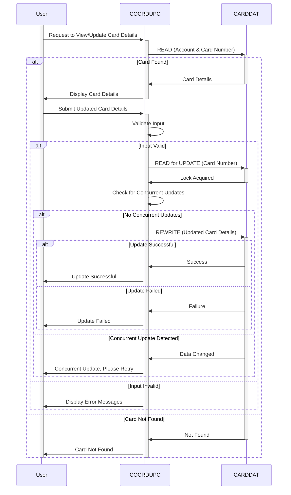

Generated at: 2nd October of 2024

**Title Document:** Credit Card Detail Update Program Specification

**Summary Description:**
This program provides a CICS online interface for updating credit card details. It allows authorized personnel to view and modify credit card information securely. It interacts with a Card Data File, enabling users to retrieve, modify, and save card information, emphasizing data validation and error handling.

**User Stories:**
As an authorized user, I need to be able to view and update credit card details so that I can maintain accurate customer information.

**Related Epic:**
3 - Credit Card Management

**Technical Requirements:**
This program handles user requests, validates data, interacts with the database, ensures changes are applied securely, and provides feedback to the user.

- **Retrieve Card Details**:  Retrieves credit card information from the database based on the provided account and card numbers.
  - Input: `CC-ACCT-ID-N` `{Numeric(11)}` and `CC-CARD-NUM-N` `{Numeric(16)}` from the `CARDDAT` file.
  - Processing: Reads the `CARDDAT` file using the `READ` command with `RIDFLD`  set to `WS-CARD-RID-CARDNUM`, which contains the input card number.
  - Output: Populates the `CARD-RECORD` structure with the retrieved card details if found.
- **Input Validation**: Validates the user's input for errors and inconsistencies.
  - Input: Data from the `CCRDUPAI` map fields (`ACCTSIDI`, `CARDSIDI`, `CRDNAMEI`, `CRDSTCDI`, `EXPDAYI`, `EXPMONI`, `EXPYEARI`).
  - Validation Rules: 
    - Account Number: Must be numeric and 11 digits long.
    - Card Number: Must be numeric and 16 digits long.
    - Cardholder's Name: Can only contain letters and spaces.
    - Expiry Date: Must be a valid date in the future (validated by `VALID-MONTH` and `VALID-YEAR` conditions).
    - Card Status: Must be either 'Y' or 'N' (validated by `FLG-YES-NO-VALID` condition).
  - Output: Sets appropriate flags (`WS-EDIT-ACCT-FLAG`, `WS-EDIT-CARD-FLAG`, `WS-EDIT-CARDNAME-FLAG`, `WS-EDIT-CARDSTATUS-FLAG`, `WS-EDIT-CARDEXPMON-FLAG`, `WS-EDIT-CARDEXPYEAR-FLAG`, `WS-RETURN-FLAG`) and error messages (`WS-RETURN-MSG`) based on validation results.
- **Update Card Details**: Updates the corresponding record in the database if the input is valid.
  - Input: Validated card details from the `CCUP-NEW-DETAILS` structure.
  - Processing: Reads the `CARDDAT` file for update using the `READ` command with the `UPDATE` option.
  - Locking Mechanism: Uses CICS implicit locking during the `READ` with `UPDATE` to prevent concurrent updates.
  - Output: Rewrites the updated `CARD-RECORD` to the `CARDDAT` file using the `REWRITE` command.
- **Confirmation and Feedback**: Provides feedback to the user, confirming whether the update was successful or if any errors occurred.
  - Input: Response codes (`WS-RESP-CD`, `WS-REAS-CD`) from CICS file I/O commands.
  - Processing: Checks the response codes for success (`DFHRESP(NORMAL)`) or specific error conditions (`DFHRESP(NOTFND)`, etc.).
  - Output: Sets appropriate messages (`WS-INFO-MSG`, `WS-RETURN-MSG`) based on the outcome of the update operation. These messages are displayed on the `CCRDUPAO` map.

**Related Models**
- `CARD-RECORD`
  - `CARD-ACCT-ID` `{Numeric(11)}`: Account number associated with the credit card.
  - `CARD-CARD-NUM` `{Numeric(16)}`: Credit card number.
  - `CARD-CVV-CD` `{Numeric(3)}`: Card Verification Value (CVV) code.
  - `CARD-EMBOSSED-NAME` `{Alphanumeric(50)}`: Name of the cardholder as embossed on the card.
  - `CARD-EXPIRAION-DATE` `{Alphanumeric(10)}`: Expiration date of the credit card (MM/YY).
  - `CARD-ACTIVE-STATUS` `{Alphanumeric(1)}`: Status of the card (e.g., 'Y' for active, 'N' for inactive).

**Configurations:**
- Constant Values
  - `LIT-CARDFILENAME`: `"CARDDAT "`
	- Description: File name for the credit card data file.
- `COCRDUP.CPY`
  - `TRNNAMEA`: `"Account Update   "`
	- Description: Screen title for Account Update function.
  - `TITLE01A`: `"Credit Card Detail Update"`
	- Description: Title of the Credit Card Detail Update screen.
  - `PGMNAMEA`: `"COCRDUPC"`
	- Description: Program name for Credit Card Detail Update.
  - `TITLE02A`: `"Enter All Fields"`
	- Description: Instruction for the user to enter all fields.
  - `INFOMSGA`: `"Enter all data and press ENTER"`
	- Description: Message displayed to the user, prompting them to enter data and press Enter.
  - `ERRMSGA`: `"Invalid Input, please re-enter"`
	- Description: Error message displayed to the user in case of invalid input.

**Code Improvements:**
- **Error Handling**: The program's error handling could be more comprehensive. It relies on setting flags and messages, which might not be sufficient for all error conditions. Implement a more robust error handling mechanism that includes logging errors to a file or database for later analysis.
- **Documentation**: The code lacks sufficient comments to explain the logic and purpose of various sections. Add more detailed comments to improve code readability and maintainability.
- **Modularity**: Some sections of the code could be broken down into smaller, more reusable modules. For example, the input validation logic could be separated into individual subroutines for each field, making the code more organized and easier to modify.

**Security Improvements:**
- **Authentication and Authorization**: The program does not explicitly include authentication or authorization checks. It's crucial to integrate security measures to verify user identity and ensure only authorized personnel can access and modify sensitive credit card information.
- **Data Encryption**: Sensitive data, such as credit card numbers and CVV codes, should be encrypted both in storage and during transmission to prevent unauthorized access.

**Conceptual Diagram:**

--Made by "Smart Engineering" (by Compass.UOL)--